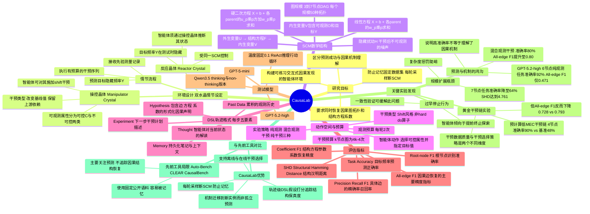

## 一、论文是干什么的？

一个真正厉害的侦探不只靠记忆，而是会主动做实验——调高温度，看频率怎么变；再调低，再观察——从证据里推理出真相。

**CausaLab** 是一个测试平台，专门衡量 AI 大语言模型（比如 GPT-5）能不能像这样"主动做科学实验、发现因果规律"。平台的核心问题是：**AI 答对了题，是因为它真的搞懂了背后的因果机制，还是只是凑巧猜对了？**

这是一个非常深刻的区分。就像一个学生考试得了满分，可能是因为他真的理解了物理原理，也可能只是背住了标准答案。CausaLab 专门区分这两种情况，结果发现：**现有的 AI 模型大多数时候只是"猜对了答案"，并没有真正搞懂背后的因果机制。**

## 二、核心方法与创新

### 实验场景：虚拟晶体实验室

实验室里有两种晶体：
- **操纵器晶体（Manipulator Crystal）：** AI 可以对它做实验，改变辐射值、温度等属性，观察共振频率如何变化
- **反应器晶体（Reactor Crystal）：** 最终预测目标，AI 必须根据从操纵器学到的规律，预测反应器的频率

关键设计：**两颗晶体遵循同一套隐藏规律（数学方程），但属性值各不相同**。AI 不能照抄，只能"迁移"学到的规律。每次关卡随机生成新规律，彻底防止背答案。

### 双重打分机制（最大创新）

以往的测试只看"AI 答对了没有"（最终预测准不准）。CausaLab 同时打两类分：

| 评分维度 | 含义 |
|---------|------|
| **任务准确率** | 预测的频率数值对不对？ |
| **机制恢复分** | AI 画出来的因果关系图和真实答案一致吗？数学方程猜对了吗？ |

这就像同时检查答案和解题过程，而不只看答案对不对。

### DSL 追踪思维过程

每一步，AI 必须用一种结构化的"记录格式"写下当前的假设：哪些变量之间有联系、联系的方程是什么、下一步打算做什么实验。这样研究者可以看到 AI 的"思维轨迹"，找出具体在哪个环节出错。

## 三、使用了哪些模型和计算资源？

**测试的大语言模型：**

| 模型 | 类型 |
|------|------|
| GPT-5.2-high | OpenAI 旗舰级，能力最强 |
| GPT-5-mini | OpenAI 轻量级 |
| Qwen3.5-Thinking | 阿里巴巴，带思维链 |
| Qwen3.5-Non-thinking | 阿里巴巴，不带思维链 |

**计算资源：** 主要通过 API 调用，论文未明确说明 GPU 型号。每个"关卡"包含多轮交互（观测+干预循环），对于 6 节点的图，干预预算为 4×(6-1)=20 次，每种（图大小、模型）组合最多 50 个拓扑。

**具体推理时长：** 暂无相关信息。

## 四、实验结果

### 发现一："答对了"不等于"真的懂了"

最强的 GPT-5.2-high 在 6 节点的关卡里，预测准确率高达 **92%**，看起来很厉害。但它的因果图恢复分（all-edge F₁）只有 **0.471**，也就是说它连因果关系是什么都没搞清楚，只是凑巧答对了。

就像一个同学把公式背得滚瓜烂熟，但让他说清楚为什么是这个公式，他完全说不出来。

### 发现二："边观察边做实验"的策略最好

研究者测试了三种策略：

| 策略 | 预测准确率 | 因果图恢复分 |
|------|---------|-----------|
| 只观察（不做实验） | 高 | 差 |
| 只做实验（不先观察） | 差 | 差 |
| **先观察几次，再有针对性地做实验** | **80%** | **0.80** |

### 发现三：模型越大，提升不均匀

更大的模型在预测准确率上提升明显，但在"把因果图画对"这件事上，进步很有限。即使是最强的 GPT-5.2-high，在 7 节点关卡里，准确率也只剩 **64%**，因果图偏差（SHD）高达 4.761。

### 发现四："过早放弃"是主要失败原因

研究者分析了 AI 的"思维记录"，发现失败的原因不是没有足够多的实验机会，而是 **AI 太快下结论了**——成功和失败的 AI 都有大约一半的实验次数没有用完。失败的 AI 的最终答案，甚至连自己之前观察到的数据都对不上。

**简单补救措施有效：** 强制在提交答案前做一次自我验证（检查假设是否和已有数据矛盾），仅此一步，4 节点关卡准确率从 **48% → 60%**。

## 五、潜在应用与已落地应用

**潜在应用场景：**

- **科学发现自动化：** AI 在药物研发、材料科学、天文物理中主动设计实验、发现因果规律
- **医疗因果推断：** 搞清楚"是这种药真正治好了病，还是碰巧同期其他因素起了作用"
- **政策评估：** 判断某项政策是否真正导致了某种效果，还是只是相关
- **AI 智能体能力评估：** 作为衡量 AI 智能体"主动探索与推理"能力的标准测试平台

**已落地情况：** CausaLab 是一个**研究级测试平台**，代码已开源（[GitHub: DylanZSZ/CausaLab](https://github.com/DylanZSZ/CausaLab)），Apache-2.0 协议，构建在 DiscoveryWorld 的基础上。尚处于学术研究阶段，无已知商业落地。

## 六、网络上的讨论与评价

目前暂无针对该论文的公开讨论或社区评价（2026年5月25日提交，5月28日更新 v2 版）。

## 七、思维导图

**核心学术争议：** 这篇论文触及了 AI 领域一个核心争议——**大语言模型到底是真的会"因果推理"，还是只是"因果鹦鹉"（Causal Parrots）？** Zečević 等人 2023 年的论文专门提出了"Causal Parrots"这一概念，而 CausaLab 的实验结果正好提供了新的实证证据：哪怕是最强的 GPT-5.2-high，在需要"真正做实验、搞懂机制"的任务上也远未达到人类科学家的水平。
