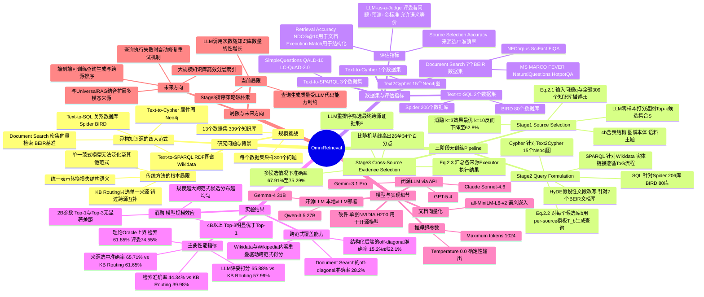

## 一、论文是干什么的？

想象你是一个图书馆员，有人问："哪部由斯皮尔伯格执导的90年代科幻电影，主演是谁？"这个问题的答案可能分散在不同的"书架"上：文字百科、电影数据库表格、演员关系知识图谱……

传统搜索只会用一种方式查，很可能找不到答案。**OmniRetrieval** 就是一个"全能图书管理员"，它能：
1. 理解你用自然语言提出的问题
2. 自动判断去哪些知识库查（数据库、知识图谱、文档库……）
3. 用每种知识库自己的"语言"来查（SQL、SPARQL、Cypher……）
4. 把各处的结果汇总，返回最有用的答案

在包含 **13个数据集、309个知识库** 的大规模测试中，该方法全面超越只会查一种来源的传统方法。

## 二、核心方法与创新

**核心思路：不强求统一，而是"各说各话"**

以往方法会把所有知识"压扁"成同一格式（比如把数据库表格翻译成文字），翻译过程中大量结构细节丢失。OmniRetrieval 让每个知识库保持原样，系统学会"说各种语言"，分三步走：

### 第一步：选知识库（Source Selection）

把你的问题和所有 309 个知识库的"简介"（表结构、图谱本体、语料主题）一起输入大模型，让它挑出 3 个最可能包含答案的来源。

类比：把所有书架的"目录卡"一起给一个博学的顾问看，让他告诉你"去哪几个书架可能找到答案"。

### 第二步：生成原生查询（Query Formulation）

对每个被选中的知识库，自动生成对应的"母语"查询：

| 知识库类型 | 生成的查询语言 |
|---------|-------------|
| 关系数据库 | SQL |
| RDF 知识图谱（Wikidata） | SPARQL |
| 属性图（Neo4j） | Cypher |
| 普通文档 | 自然语言 + 假设性文段改写 |

### 第三步：跨来源筛选（Cross-Source Evidence Selection）

把各库的返回结果放在一起，再让大模型挑出最能回答原始问题的证据。

## 三、使用了哪些模型和计算资源？

**使用的大语言模型（全程只用 LLM，无需额外训练）：**

| 模型 | 类型 |
|------|------|
| GPT-5.4 | OpenAI API |
| Gemini-3.1 Pro | Google API |
| Claude Sonnet 4.6 | Anthropic API |
| Qwen-3.5 (27B) | 本地部署 |
| Gemma-4 (31B) | 本地部署 |

文档检索部分使用 `all-MiniLM-L6-v2` 做语义向量检索。

**GPU：** 开源模型通过单张 **NVIDIA H200** + vLLM 部署；闭源模型走 API，无需本地 GPU。

**训练时间：** OmniRetrieval **无需训练**，直接使用已有预训练模型。每次查询的推理耗时论文未报告。

## 四、实验结果

实验在 13 个数据集（7个文档检索、2个关系数据库、3个知识图谱、1个属性图）、309 个知识库上进行，每类采样 300 个问题。

| 方法 | 来源选中准确率 | 检索准确率 | LLM评委打分 |
|------|--------------|----------|-----------|
| 只查文档 | 21.78% | 13.69% | 39.49% |
| 只查数据库 | 14.73% | 14.48% | 25.65% |
| 只查知识图谱 | 24.84% | 17.83% | 27.99% |
| 路由到单一来源 | 61.65% | 39.98% | 57.99% |
| **OmniRetrieval** | **65.71%** | **44.34%** | **65.88%** |
| 理论上界 | 100% | 61.85% | 74.55% |

同时试多个来源再筛选，在所有指标上全面领先；距离理论上界仅差约 9 个百分点。

## 五、潜在应用与已落地应用

**潜在应用场景：**

- **企业智能问答**：同时查文字报告、ERP数据库、组织知识图谱，一个自然语言界面查询所有来源
- **医疗信息检索**：联合查文献（PubMed）、患者数据库（SQL）、疾病-药物关系图谱
- **学术研究辅助**：跨论文文本、实验数据库、学者合作关系图等多种来源
- **通用 RAG 基础设施**：作为 LLM 的"跨格式外挂记忆"，让模型能够跨越结构化与非结构化知识回答问题

**已落地情况：** 代码已开源（[GitHub](https://github.com/JinheonBaek/OmniRetrieval)），发布时约 16 个 Star，尚无已知产品落地案例。同团队的 UniversalRAG（处理多模态检索）已被 ACL 2026 接收，OmniRetrieval 预计会受到类似关注。

## 六、网络上的讨论与评价

发布于 2026 年 5 月 28 日，发布时间极新，目前网络上几乎没有公开的深度讨论或第三方评价。

从学术定位来看，这是一个具有较强**系统创新性**的工作——它并非提出新模型，而是构建了一个新的"框架范式"（直接使用原生查询语言而非统一表示），解决了现有方法的根本性局限。论文目前挂在 arXiv 预印本，投稿状态暂无公开信息。

## 七、思维导图

