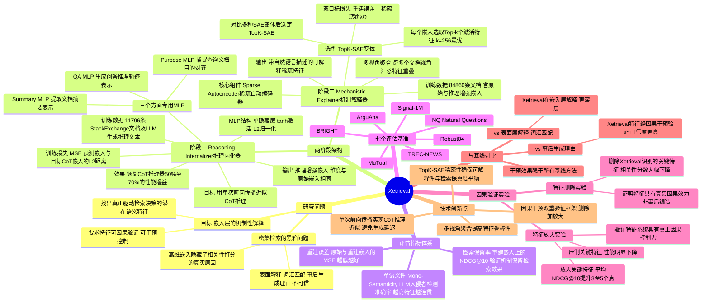

## 一、论文是干什么的？

现代 AI 搜索系统（"密集检索"）把查询词和文档各压缩成一个"数字指纹"，比较指纹相似度来判断相关性。效果不错，但有个大问题——**没人知道它为什么觉得某篇文章相关**。就像学生做对了题但说不出解题过程，只给了个答案。

Xetrieval 的目标就是**给密集检索系统加上"解题过程"**：让 AI 不仅告诉你"这两篇文档相关"，还能解释"它们在哪些具体概念上匹配"，从而让搜索系统变得透明、可审查。

在医疗、法律等高风险场景中，这尤为重要——你需要知道为什么 AI 认为某份病历或判决书是相关的，而不是盲目信任一个黑盒系统。

## 二、核心方法与创新

Xetrieval 由两个核心模块组成：

### 模块一：推理内化器（Reasoning Internalizer）

**问题：** 传统密集检索模型只是给文档做了一个"数字指纹"，没有经过任何"思考"。

**解决方案：** 先用大型语言模型（DeepSeek-V3 等）从三个角度理解文档：

| 角度 | 含义 |
|------|------|
| **摘要（Summary）** | 这篇文章的核心内容是什么？ |
| **用途（Purpose）** | 适合回答哪类问题？ |
| **问答（QA）** | 能提供哪种证据？ |

然后用一个**极轻量的小网络**（一层隐藏层）把这些思考"注入"进原来的向量里。

**关键优势（效率极高）：** 只需一次简单的前向计算（按一下计算器），而非逐词逐词地输出。在1万篇文档的场景下，传统推理方法需要数分钟，Xetrieval 只需几秒钟。

### 模块二：机制解释器（Mechanistic Explainer）

丰富了思考内容的向量，仍然是一串人类看不懂的数字。第二个模块的任务是把它"翻译"成人话。

使用**稀疏自动编码器（Sparse Autoencoder, SAE）** 技术。类比：把一幅数字画分解成"天空""树木""河流"等独立元素——每个元素都有自然语言描述，而且绝大多数元素在某篇特定文档里是"不激活"的（稀疏），只有少数几个最关键的元素被激活。

**解释的逻辑：** 找出查询和文档**共同激活了哪些特征**，这些特征就是"它们为什么相关"的答案。

例如：查询是"递归算法的空间复杂度"，文档激活了"递归""栈溢出""算法效率"等特征，恰好与查询共同激活的是"递归"和"算法效率"，这两个特征就是相关性的解释。

### 整体流程

```
文档 
→ 推理内化器（注入 Summary/Purpose/QA 三角度思考）
→ 丰富的向量
→ 稀疏自动编码器（分解为可解释特征）
→ 与查询特征对比重叠
→ 输出：这对查询-文档因"特征A""特征B"相关
```

## 三、使用了哪些模型和计算资源？

**教师模型（生成训练数据）：** DeepSeek-V3、DeepSeek-V2-Lite、DeepSeek-R1、Qwen3-32B、GPT-OSS-20B/120B

**被解释的检索模型（8个，覆盖不同规模）：**

| 规模 | 模型 |
|------|------|
| 小型（约1亿参数） | e5-small、e5-base、gte-base |
| 中型（约3亿参数） | e5-large、gte-large、Snowflake-Arctic-Embed |
| LLM 级别 | Qwen3-Embedding-0.6B、Qwen3-Embedding-4B |

**推理内化器训练（规模极小）：**
- 训练数据：11,796篇 StackExchange 文档
- 每个角度（Summary/Purpose/QA）训练时间：**仅 1-2 分钟**

**SAE 训练：** 84,860篇 StackExchange 文档，TopK-SAE（k=256）

**GPU：** 论文未披露具体型号和数量，但从训练时间来看计算开销极低。

## 四、实验结果

**测试集：** BRIGHT（推理密集检索）、NQ（开放域问答）、MuTual（多轮对话）、TREC-NEWS、Signal-1M、ArguAna、Robust04（共7个）

**主要成果：**

1. **推理注入有效：** 能恢复大模型 CoT 推理 **60%～80% 的性能提升**，代价极低。以 gte-base 在 BRIGHT 上为例：原始 37.0 → 注入推理后 39.0 → 真正用大模型推理是 43.8。

2. **解释质量真实可信（关键验证）：** 删除 Xetrieval 找到的关键共同特征 → 相关性分数大幅下降；保留这些特征 → 相似度保持最好。说明找到的特征是真正影响相关性的原因，而非事后编造。

3. **可干预性：** 放大被识别为关键的特征，检索性能提升；压制这些特征，性能明显下降。说明这套特征系统具有真正的因果控制力。

## 五、潜在应用与已落地应用

- **搜索引擎透明化：** 告诉用户"推荐这篇是因为在'机器学习效率'和'Python实现'上匹配"
- **高风险场景审查：** 医生/律师可验证 AI 检索依据是否合理
- **调试检索模型偏见：** 找出"为什么短文档总排名靠前"等系统性问题
- **个性化检索控制：** 调整特征权重，引导检索关注不同维度（如更偏重"实用性"而非"学术性"）
- **多语言/多模态扩展：** 论文指出未来可扩展到跨语言和图文混合检索场景

代码已开源（[GitHub: Hihiczx/Xetrieval](https://github.com/Hihiczx/Xetrieval)），尚无已知的产品级部署。

## 六、网络上的讨论与评价

2026 年 5 月 28 日发布，目前暂无第三方评测、博客解读或社交媒体热议。

**背景参照：** "用稀疏自动编码器解释密集检索"这一研究方向已有多篇铺垫论文（如 2024 年11月的"Interpret and Control Dense Retrieval with Sparse Latent Features"，EMNLP 2025 的"Decoding Dense Embeddings"），Xetrieval 在此基础上的创新在于**将链式推理（CoT）也纳入了解释体系**，使解释更贴近人类推理过程。

## 七、思维导图


