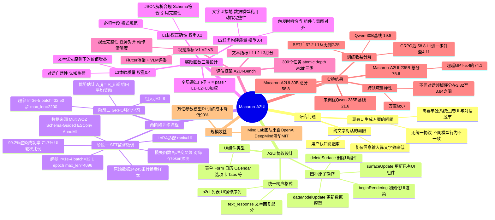

## 一、论文是干什么的？

**生成式 UI（Generative UI）** 让 AI 在对话中**实时生成可交互的界面元素**，而不只是回复文字。

预订机票时，AI 不是问你"出发日期是？"然后等你打字，而是直接弹出一个日历组件让你点击选择。确认订单时，AI 弹出一个确认按钮，而不是让你打"好的"。

这和你平时用的 App 界面有根本区别：
- **传统固定界面**：程序员提前设计好所有按钮和表单，每个用户看到的都一样
- **生成式 UI**：AI 根据当前对话内容，**实时决定**是否需要生成界面，以及生成什么样的界面

纯文字对话的三大痛点：认知负担高（要读很多字）、表达不精确（"预算大概 500 到 800"不如滑动条直观）、效率低（确认操作打字不如点按钮）。

## 二、核心方法与创新

### A2UI 协议

整个系统基于 **A2UI（Agent-to-User Interface）协议** 构建。AI 模型不需要写 HTML，只需输出结构化 JSON 消息，然后客户端负责把这些消息渲染成实际界面。

打个比方：AI 只需说"我要在这里放一个下拉选择框，选项是国航、南航、东航"，App 读懂后自己画出漂亮的下拉菜单。协议支持 **23 种组件**（交互类/展示类/布局类），四种消息类型（beginRendering、surfaceUpdate、dataModelUpdate、deleteSurface）。

### 训练数据

从 MultiWOZ、SGD、ESConv、AnnoMI 四个对话数据集出发，用规则和 LLM 混合标注，构建了 **14,245 条训练样本**，可渲染率达 **99.2%**。其中 71.7% 含界面内容，28.3% 是纯文字回复（刻意保留，因为有时纯文字才是最合适的）。

### A2UI-Bench 评测基准

**300 道测试题**，三维度评分（各 1–5 分）：
- **L1**：协议正确性（JSON 格式是否合法）
- **L2**：任务构建质量（组件选择是否合适，内容和对话是否对齐）
- **L3**：用户体验质量（界面是否真正降低了用户负担）

### 两阶段训练

**第一阶段：LoRA 监督微调（SFT）**
在对话数据上学会基本的"文字 + A2UI"联合生成格式（LoRA 秩=16，1 个 epoch）。

**第二阶段：GRPO 强化学习（RL）**
每道题采样 8 个回答，对比奖励后优化（训练 50 步）。奖励函数：$R = L1 \times 0.2 + L2 \times 0.4 + L3 \times 0.4$，其中 L1 格式错误直接给 0 分。RL 阶段的奖励裁判使用 **GPT-5.1**，32 路并发评分。

### 三个模型规模

用咖啡杯型命名：

| 模型 | 基础模型 | 规模 |
|------|---------|------|
| Piccolo（小杯）| Qwen3-30B-A3B-Instruct-2507 | 30B 总参数，激活 3B（MoE）|
| Grande（中杯）| Qwen3-235B-A22B-Instruct-2507 | 235B 总参数，激活 22B（MoE）|
| Venti（大杯）| GLM-5.1（智谱 AI）| 754B |

## 三、使用了哪些模型和计算资源？

| 项目 | 详情 |
|------|------|
| 基础模型 | Qwen3-30B / 235B-A22B-Instruct-2507（阿里巴巴 MoE 架构），GLM-5.1（智谱 AI）|
| RL 奖励裁判 | GPT-5.1 API（32 路并发）|
| GPU | 暂无相关信息（Mind Lab 历史上曾使用 48× H100）|
| 训练时长 | 暂无相关信息 |

## 四、实验结果

核心结论：**不给任何协议文档的 Macaron-A2UI-Venti，总评分 3.72，超过了给了完整 Schema 的 GPT-5.4（3.54）**。

| 模型 | 是否给 Schema | 总评分 |
|------|------------|-------|
| GPT-5.4 | ✅ 给 | 3.54 |
| DeepSeek-V3.1 | ✅ 给 | 3.13 |
| Qwen3-235B（未微调）| ❌ 不给 | 3.20 |
| **Macaron-A2UI-Grande（235B）** | **❌ 不给** | **3.66** |
| **Macaron-A2UI-Venti（GLM-5.1）** | **❌ 不给** | **3.72** |

30B 模型经 SFT+RL 后从 19.8 分提升到 58.8 分（提升约 **197%**），235B 从 21.6 分提升到 74.2 分（提升约 **244%**）。四个测试数据集（MultiWOZ/SGD/ESConv/AnnoMI）得分差异极小（3.82–3.84），泛化性好。

## 五、潜在应用与已落地应用

**已落地：** Macaron AI App 于 2025 年 8 月 15 日正式上线，覆盖北美（英文）、日本、韩国市场，提供 iOS 版。用户可以说一句话让 AI 生成一个可用的小程序（如健身记录器），生成速度已从最初约 20 分钟优化到约 2 分钟。

**行业标准化：** A2UI 协议已被 Google 推动标准化（v0.9），CopilotKit、Oracle 等公司宣布支持，成为 2026 年 AI 代理开发的六大核心协议之一（与 MCP 等并列）。

Mind Lab 的训练框架已整合进 **NVIDIA NeMo Megatron** 和 **字节跳动 VERL**。

## 六、网络上的讨论与评价

论文于 2026 年 5 月 26 日发布，时间较新，但 Mind Lab 团队（来自 OpenAI、DeepMind、清华、MIT）在此之前的研究已引发广泛关注。X（Twitter）上的 AI 观察者对 Mind Lab 的技术突破（万亿参数 RL 成本降低 90%）评价"令人震惊"。

A2UI 协议本身在开发者社区已有广泛讨论，被列为 2026 年 AI 代理开发的核心标准之一。对于普通用户，这项技术意味着：未来与 AI 聊天时，AI 能在聊天界面里直接弹出表单、日历、选项卡，大幅降低信息输入的麻烦。

## 七、思维导图

