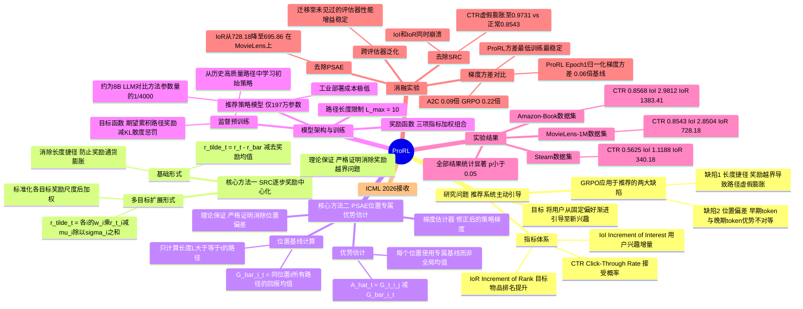

## 一、论文是干什么的？

**普通推荐系统**（被动推荐）的逻辑是：分析用户历史，推送他们可能喜欢的东西——照镜子，始终待在用户舒适圈里，容易造成"信息茧房"。

**主动推荐系统（Proactive Recommender System，PRS）** 的思路完全不同：它设计一条"引导路径"，把用户偏好逐步引向平台的目标内容。

> 例：一个只爱科幻片的用户，通过《WALL-E》（科幻+动画）→《疯狂动物城》（动画+喜剧）→《白日梦想家》（喜剧），被自然引导成愿意看喜剧的用户——每一步都让用户感到自然，整条路径却实现了平滑的偏好迁移。

强化学习天生适合这类"序列决策"问题。然而，直接把标准策略梯度方法用在 PRS 上，训练几百步后模型就开始退化：给所有用户生成几乎一样的、超长路径，完全失去个性化能力。ProRL 正是为了解决这一崩溃现象。

## 二、核心方法与创新

论文诊断出两个根本性缺陷，并各给出了修复方案。

**问题一：路径越长奖励越高（长度捷径）**

每一步奖励的均值是正数，路走得越长总奖励越高。就像快递员发现"按公里数计费"就开始故意绕远路。模型很快"发现"：与其认真选内容，不如直接把路径拉到最大长度。

**修复：步级奖励中心化（Stepwise Reward Centering，SRC）**

在每一步奖励里减去期望的平均奖励，让步数延长带来的期望收益归零。路径延长一步，平均奖励既不增加也不减少，模型再也无法靠"偷懒拉长路径"得分。

**问题二：梯度方差高**

用整条路径的总分来评价第 $t$ 步的动作，包含了与第 $t$ 步无关的大量噪声——后面步骤的运气好坏都混进来了。高方差导致梯度信号嘈杂，模型参数更新方向不稳定。

**修复：位置特定优势估计（Position-Specific Advantage Estimation，PSAE）**

第 $t$ 步的动作只用"从第 $t$ 步到结束的累计奖励"来评价，并减去同批次所有路径在第 $t$ 步的平均累计奖励作为基线。这避免了 GRPO（全路径均值基线）和 A2C（需要额外价值网络且会漂移）的缺点。

ProRL 的优势方差在第一轮训练时只有 REINFORCE 基线的 **0.06 倍**，且全程保持稳定。

## 三、使用了哪些模型和计算资源？

**模型构成：**

| 组件 | 模型 | 说明 |
|------|------|------|
| 推荐主模型 | T5 结构，**仅 197 万参数** | 操作语义 ID 序列，极为轻量 |
| 语义嵌入 | qwen3-embedding-8B | 将物品文本描述映射为向量 |
| 物品描述生成 | GPT-4 API | 数据预处理阶段，一次性调用 |
| 用户模拟评估器 | SASRec、GRU4Rec、BERT4Rec | 计算 CTR、IoI、IoR 等指标 |

**计算资源：** 暂无相关信息（论文附录未公开 GPU 型号和训练时长）。

## 四、实验结果

实验在三个真实数据集上进行（MovieLens-1M、Steam、Amazon-Book），核心指标：
- **CTR**：路径可行性（用户能接受每步推荐）
- **IoI**：引导有效性（目标内容接受概率提升幅度）
- **IoR**：目标内容排名提升幅度

**MovieLens-1M 上的对比（SASRec 评估器）：**

| 方法 | CTR | IoR（引导效果）|
|------|-----|--------------|
| LLM-IPP（Llama-3.1-8B）| 0.614 | 662 |
| T-PRA（LLM+RL）| 0.489 | 355 |
| **ProRL（本文，197万参数）** | **0.854** | **728** |

Steam 和 Amazon-Book 上提升更显著：IoR 分别提升约 **448%** 和 **190%**（vs 次优方法）。

**关键发现：** RL 的作用不是赋予模型新技能，而是把概率质量从低质量路径重新分配到高质量路径——预训练模型在多次采样时已经具备这种能力，RL 让它"稳定地"选对路径。

## 五、潜在应用与已落地应用

- **流媒体平台**：Netflix、Spotify 等推广新版权内容，渐进引导用户品味迁移
- **电商平台**：引导用户从熟悉品类向新品类、自有品牌探索
- **教育平台**：引导学习者从基础课逐步过渡到高阶课程
- **游戏平台**：Steam 等平台帮助新游戏获得曝光

论文的推荐主模型仅 197 万参数，比 LLM-based 对比方法（8B）参数少约 4000 倍，工业部署成本极低。

> 论文在 Impact Statement 中特别指出：需确保主动引导策略符合用户真实利益，避免被滥用于消费操控。

## 六、网络上的讨论与评价

论文于 2026 年 5 月 27 日发布，已被 **ICML 2026（第43届国际机器学习大会）接收**，这是顶级学术认可。由于发布时间较新，网络上的专项讨论目前尚不多见。

论文的优势在于：两个缺陷的诊断都有严格的理论证明，修复方案工程实现简单（SRC 只需减去一个统计量，PSAE 无需额外网络），且在三个数据集上均大幅超越包括 8B LLM 在内的所有基线。主要局限是完全基于离线模拟器验证，暂无在线 A/B 测试数据。

## 七、思维导图

