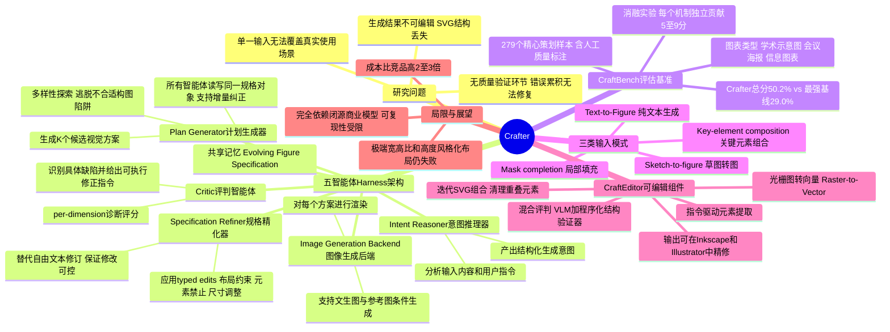

## 一、论文是干什么的？

科研论文配图费时费力——流程图、方法示意图、信息图表，往往需要在Figma、PowerPoint或Illustrator里花几小时乃至几天手工制作。现有的AI自动配图工具有三个硬伤：

1. **只支持单一图表类型**：每个工具只会做一种特定的图；
2. **只接受纯文字输入**：不能处理"补全草图"或"参考已有图片风格"等真实需求；
3. **输出是死图**：PNG/JPG生成后无法编辑，有任何小错误都要从头来过。

Crafter 同时解决了这三个问题，并且首次打通了"生成→可编辑矢量图"的完整流程。

## 二、核心方法与创新

**一句话比喻：Crafter 不是更强的"AI画图手"，而是一个能指挥、审查、纠错的"团队总监"。**

论文的核心思路叫做 **Harness（总控框架）**。由5个协作智能体组成循环流水线：

```
意图推理器 → 方案生成器 → 图像生成器 → 评审员 → 规格修订器
     ↑                                               ↓
     └──────────── 循环最多3轮，保留最佳版本 ───────────┘
```

| 智能体 | 角色 | 职责 |
|--------|------|------|
| 意图推理器 | 理解需求 | 分析输入，生成初始规格说明 |
| 方案生成器 | 出方案 | 并行生成K个候选视觉布局 |
| 图像生成器 | 画图 | 把方案渲染成实际图片 |
| 评审员 | 找问题 | 从6个维度打分，列出具体缺陷 |
| 规格修订器 | 改规格 | 把审查意见转为结构化编辑操作 |

三个关键创新：

**创新1：多方案并行探索** — 不是只生成一个方案，而是同时生成K个风格不同的候选方案，从一开始就规避糟糕的构图。

**创新2：结构化记忆** — 每次修改以"类型化操作"记录，而非往提示词里堆文字，避免指令越积越混乱。

**创新3：先验证再修改** — 审查员给出可操作的具体诊断（"第二列文字溢出边界、箭头端点未对齐"），而非模糊的整体评分，最多修三轮。

**附加系统 CraftEditor**：把生成的光栅图（JPG/PNG）转换成可编辑的SVG矢量图，分三步：提取（清理背景噪声）→ 处理（为每个元素打标注定坐标）→ 合成（迭代组装SVG，混合VLM+程序检查器审核）。

## 三、使用了哪些模型和计算资源？

全部通过 **OpenRouter API调用**，无需本地GPU训练：

| 角色 | 使用的模型 |
|------|-----------|
| 语言推理（LLM） | Anthropic Claude Opus 4.6 |
| 视觉理解（VLM，评审员） | Google Gemini 3.1 Pro Preview |
| 图像生成（主要后端） | Google Gemini 3.0 Pro Image Preview |
| 图像生成（低成本后端） | Google Gemini 3.1 Flash Image Preview |
| CraftEditor | Gemini 3.1 Flash-Lite + GPT-5 + Doubao-Seed-2.0-Pro |
| 评估裁判 | Gemini 3.5 Flash |

**API调用费用：**

| 任务 | 单次费用 |
|------|---------|
| Crafter（低成本后端） | 约 $0.25/张 |
| Crafter（高质量后端） | 约 $0.32/张 |
| CraftEditor（光栅转SVG） | 约 $0.85/次 |
| 整个评测基准（279样本） | 总计不足 $90 |

CraftEditor需要一台带CUDA GPU的服务器（用于SAM3分割服务），主流程无需本地GPU。

## 四、实验结果

评测基准 **CraftBench** 覆盖3种图类、4种输入条件、18个研究领域、279个人工标注样本：

- 比最强竞争对手（PaperBanana、AutoFigure）领先 **16-22个百分点**
- 消融实验证明多方案探索、结构化记忆、先验证再修改三个组件均有独立贡献

## 五、潜在应用场景

- **学术论文配图**：提供论文文字描述，一键生成方法流程图、示意图
- **科学海报制作**：会前几小时快速生成会议海报
- **信息图表制作**：科普工作者将技术内容转化为易读图表
- **图表补全修复**：给定不完整草图，AI自动补全缺失部分
- **可编辑输出**：通过CraftEditor，所有输出均可在Inkscape/Illustrator中进一步精修

## 六、网络上的评价与讨论

论文2026年5月发布，GitHub（HaozheZhao/Crafter）约5星，尚处于早期传播阶段。

**技术亮点：** 首个同时覆盖多种图类+多种输入条件+可编辑输出的端到端流水线；Harness抽象具有方法论意义，可推广到其他生成任务的质量控制。

**主要争议：** 完全依赖闭源商业模型（Claude、Gemini、GPT-5），可复现性受限；成本比竞品高2-3倍，对预算敏感的用户不够友好。对"高度风格化布局"和"极端宽高比"的图形仍会失败。

## 七、思维导图


