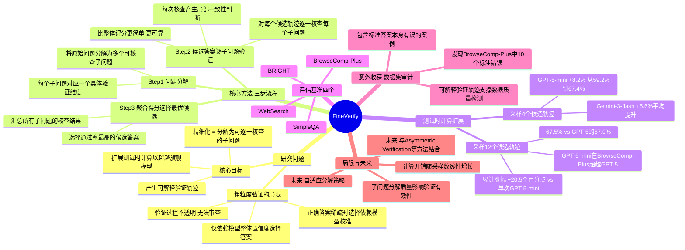

## 一、论文是干什么的？

**智能体搜索**（Agentic Search）是让语言模型像研究员一样主动发起搜索、浏览网页、综合信息来回答复杂问题的技术。例如："1980年代某部动画电影在2023年有篇文章分析它的寓言主题，那篇文章的作者曾获AIA亨利亚当斯奖章，请问那部电影叫什么？"

**Test-Time Compute Scaling（测试时计算扩展）**：让AI多跑几次，从候选答案中挑最好的，可以提升准确率。但问题在于——**现有的"挑最好"方法都不靠谱：**

| 方法 | 问题 |
|------|------|
| 多数投票 | 复杂问题中正确答案反而是少数，多数票选出错误答案 |
| Best-of-N（置信度） | 模型自信≠正确，整体打分掩盖细节错误 |
| 粗粒度整体验证 | 要求模型同时隐式检查很多条件，信号嘈杂 |

FineVerify的核心：把"整体打一个分"改成"逐条核查每个条件"。

## 二、核心方法与创新

### 比喻：海关逐项审查 vs 凭感觉放行

**普通验证** = 海关官员只看护照封面，凭感觉说"这人看起来没问题，放行"。

**FineVerify** = 海关官员逐页检查：签证日期是否有效？目的地是否一致？照片是否匹配？每一条单独打勾，最后综合判断。

### 三步流程

**第一步：问题分解**
把原始问题拆成约8个可独立核查的**子问题**（Checkable Sub-Questions）。同一组子问题用于评判**所有**候选答案，保证标准横向一致。

**第二步：逐条验证**
对每个候选答案，AI检索证据，对每个子问题给出三档判断：
- `supported`（有证据支持）
- `not_found`（找不到证据）
- `contradicted`（有证据反驳）

**第三步：打分、选择与早停**
- 加权平均得0-1分数（supported=1，not_found=0，contradicted=0）
- 选择分数最高的候选答案
- **若某候选答案所有子问题都supported（得分=1），立即提前结束，节省后续采样成本**
- 已验证的答案缓存结果，避免重复验证

## 三、使用了哪些模型和计算资源？

**实验使用商业API模型：**

| 角色 | 模型 |
|------|------|
| 提议者+验证者 | **GPT-5-mini** 或 **Gemini-3-flash-preview** |
| 评估裁判 | GPT-5.4-mini |
| 本地检索嵌入 | Qwen3-Embedding-8B |

提议者和验证者使用**同一个基座模型**，无需额外训练专门的验证模型。

**计算资源：**

| 项目 | 详情 |
|------|------|
| GPU | 1块 NVIDIA H200（仅用于本地FAISS检索） |
| 主流程 | 无需本地GPU，纯API调用 |
| 每题API成本 | 约 **$0.10 ～ $0.80**（含网络搜索费用） |
| 问题分解推理强度 | high（高） |
| 候选生成/验证推理强度 | medium（中） |

## 四、实验结果

**4个候选样本时的平均准确率对比（4个基准的均值）：**

| 方法 | GPT-5-mini | Gemini-3-flash |
|------|-----------|---------------|
| 单次直接回答（Pass@1） | 59.2% | 71.3% |
| 多数投票 | 60.1% | 73.1% |
| Best-of-N | 65.8% | 75.5% |
| Solution Aggregation | 66.3% | 76.8% |
| **FineVerify** | **67.4%（+8.2%）** | **76.9%** |

**关键突破：**
- 使用**12个样本**时，GPT-5-mini的FineVerify版本在BrowseComp-Plus上超越了**前沿旗舰模型GPT-5**的单次表现（67.5% vs 67.0%）
- 累计涨幅达 **+20.5个百分点**（相比单次GPT-5-mini）

**意外收获：** FineVerify在检查BrowseComp-Plus的200个样本时发现了**10个标注错误**（含标准答案本身有误），可用于数据集质量审计。

## 五、潜在应用场景

- **深度研究AI系统**（类OpenAI Deep Research）：作为答案选择模块，提升复杂研究问题的回答质量
- **搜索引擎增强**：对包含多个约束条件的复杂查询提供更可靠的答案排序
- **RAG系统**：用FineVerify的可解释验证轨迹审查检索结果质量
- **基准数据集审计**：自动发现标注错误，用于数据质量检测
- **多约束问答**：任何需要同时满足多个条件的问答场景

## 六、网络上的评价与讨论

论文2026年5月30日发布（发布至本文仅约2天），目前极为新鲜：

- **HuggingFace**：4个点赞，作者James X. Zhao在评论区附上了代码链接
- **Twitter/X、Reddit**：未找到任何相关讨论
- **代码**：已开源于 [github.com/XuZhao0/fineverify](https://github.com/XuZhao0/fineverify)

从技术贡献看，该论文属于2026年"智能体搜索的测试时计算扩展"这一活跃研究方向的代表性工作，与同期Asymmetric Verification、Agentic Aggregation等工作形成互补。方法简单实用，核心创新是把粗粒度整体验证替换为可追溯的精细化子问题核查。

## 七、思维导图

