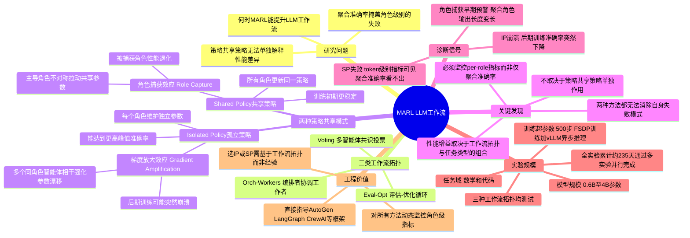

## 一、论文是干什么的？

AutoGen、LangGraph、CrewAI等框架让"多个AI角色协作完成任务"的多智能体系统越来越流行。自然的问题是：**如何训练这些AI让它们协作得更好？**

最流行的训练方式是**强化学习（RL）**——给整个多AI系统一个最终答案的"奖励分"，系统靠这个信号自我改进。但实际中，这种端到端RL训练非常不稳定，有时训练一半突然崩溃（准确率急剧下降），原因不明。

**论文的核心问题：**
1. 在哪些条件下，对多智能体系统做RL训练，会真正带来比单智能体更大的提升？
2. 训练失稳和崩溃的根本机制是什么？

这是该领域**首个系统性对照实验研究**，填补了多智能体RL工程实践的空白。

## 二、核心方法与创新

论文设计了严格的**实验矩阵**：

- **3种工作流拓扑**：Eval-Opt（生成-评估优化）、Voting（并行投票）、Orch-Workers（编排+多工人）
- **3种模型规模**：0.6B、1.7B、4B（均基于Qwen3）
- **2类任务**：数学推理、代码生成
- **2种策略共享方式**：SP（共享策略）vs IP（独立策略）

每个实验格子都配有**单智能体RL基线**，严格分清"多智能体的额外增益"与"RL本身的增益"。

### 两种策略共享方式

**Shared-Policy（SP，共享策略）：**
所有AI角色共用一套参数，像一人身兼数职。简单，但每个角色的梯度互相影响。

**Isolated-Policy（IP，独立策略）：**
每个角色拥有独立LoRA适配器，各自专项训练。分工明确，但同类角色梯度可能叠加。

## 三、核心发现：两种崩溃机制

### 机制一：梯度放大（Gradient Amplification）— IP的失败根源

**场景：** 工作流中有多个同类角色并行（如Voting工作流的3个生成者）。

**问题：** 这3个角色的梯度每次训练步都**叠加累积**到同一个适配器上，导致参数变化速度远超正常水平，最终"过冲"崩溃。

**比喻：** 3个人同时推同一个方向——力量叠加，把系统推出稳定范围。

### 机制二：角色捕获（Role Capture）— SP的失败根源

**场景：** 所有角色共享参数时，产生更多/更长token的角色贡献了更多梯度，"劫持"整个共享策略。

**具体表现：**
- 评估者角色（本应输出简短判断）开始输出完整Python代码块
- 汇总者角色（本应输出简短答案编号）开始输出长篇论证

**比喻：** 团队会议里话最多的人开始主导所有人，其他角色的声音消失了。

### 什么情况下多智能体有用？

| 场景 | 结论 |
|------|------|
| Eval-Opt + 数学 + IP + 4B模型 | 比单智能体RL高 **+8.6%**（最佳情况） |
| Voting + SP + 数学 + 4B模型 | 比单智能体RL低 **-10.3%**（最差情况） |

**总体规律：** 模型规模越大，角色分工效果越明显；工作流中同类角色越多，梯度放大风险越高。

## 四、使用了哪些模型和计算资源？

**基座模型：** Qwen3-0.6B / 1.7B / 4B，使用LoRA适配器（Rank=64，Alpha=32，附加到所有线性层）。

**训练算法：** GRPO（无参考模型的强化学习变体），无显式KL惩罚。

| 项目 | 详情 |
|------|------|
| GPU（4B模型实验） | NVIDIA H100 SXM（80GB） |
| GPU（小模型实验） | NVIDIA L40s（48GB） |
| GPU数量 | 每次训练 **2块（单节点双卡）** |
| 并行策略 | FSDP训练 + vLLM异步推理 |
| 每次训练步数 | 500步 |
| 全实验累计时长 | 约 **235天**（通过wandb统计，多实验并行） |

## 五、对实践的指导意义

直接面向AutoGen / LangGraph / CrewAI等框架的工程师：

**选IP还是SP，取决于工作流拓扑：**
- 如果工作流有多个同类角色并行（如多个Worker），用IP时要警惕梯度放大
- 如果工作流中聚合类角色（汇总者、裁判者）比例高，用SP时要监控角色捕获

**必须监控角色级指标：**
- 仅看整体准确率可能掩盖问题（SP的失败只在token级别指标上可见）
- 聚合角色输出长度变长，是"角色捕获"的早期预警信号

**应用场景：**
- 代码审查自动化系统（生成者+检查者协作）
- 数学解题多步验证
- 多Agent搜索与研究助手

## 六、网络上的评价与讨论

论文2026年5月22日提交，第一作者为俄勒冈州立大学博士生，团队包含AG2AI（AutoGen继承者）成员。

**GitHub**（XHMY/marl-llm-workflows）：代码完整开源，1533个commits，支持命令行一键配置工作流类型、模型规模和策略共享方式。

## 七、思维导图

**学术定位：** 不提出新训练算法，而是做系统性对照实验并揭示机制。与同期的Dr. MAS、MAGRPO、MARTI等工作互补。在多智能体RL领域属于少见的严格实证研究。

由于发布时间较新，Twitter/Reddit目前无大规模讨论。
