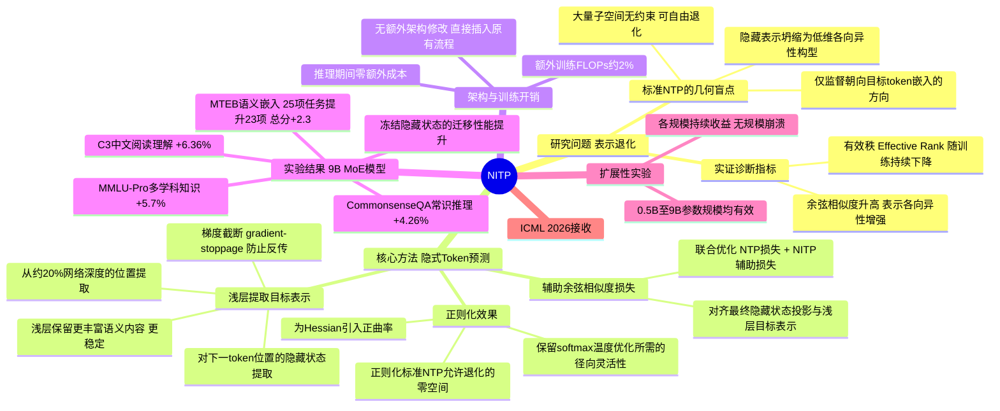

## 一、论文是干什么的？

ChatGPT、DeepSeek、Llama等大语言模型的预训练几乎都用同一套逻辑——**Next Token Prediction（NTP，预测下一个Token）**：给模型看一段文字，让它预测下一个词，通过海量语料反复训练。这套方法极其成功，但论文作者发现它有一个根本性的**几何盲点**。

**问题：NTP对隐藏层表示的监督太弱**

NTP只通过最终输出层（"词典投票"这一步）来监督模型，梯度信号只沿着"目标词方向"传播。而模型内部的**隐藏层表示空间**（中间状态、"思维草稿"）几乎没有被直接约束。

**后果：表示退化（Representation Degeneration）**

论文通过实验证实，在标准NTP训练下：

1. **有效秩快速下降**：模型隐藏层的表示只用到了一个低维子空间，就像所有词语的"内心想法"都被压缩进了同一个狭窄的锥形空间
2. **余弦相似度急剧上升**：不同Token的隐藏表示越来越相似，失去区分度

这种几何退化直接导致模型的下游泛化能力受损。

## 二、核心方法与创新

### 比喻：老师考核方式的区别

**普通NTP训练（只看最终答案）：**
> 老师出题："根据上下文，下一个词是什么？" 只看学生的最终答案，完全不管思考过程。

**NITP训练（加入中间过程审查）：**
> 老师多加了一道附加题："你的内心状态（深层隐藏表示），要能预测下一个词的语义本质（浅层语义向量）。"

这迫使学生的思维过程必须保持丰富、结构化，不能走捷径。

### 技术实现

NITP在原有NTP损失之外，新增一个辅助预训练目标：

1. **提取隐式Token**：从模型自身的**浅层（约第4-5层，占总层数约20%）**取出下一个词的语义向量 $z_{t+1}$，作为监督目标。浅层保留的语义信息最丰富，深层越来越专注于做"最终判断"。

2. **用余弦相似度损失对齐**：要求模型最深层的隐藏状态 $h_t$，通过一个轻量级投影头（SwiGLU MLP）后，在方向上与 $z_{t+1}$ 对齐。

3. **止梯度（stop-gradient）**：目标 $z_{t+1}$ 不参与反向传播，确保训练稳定。

总损失：$\mathcal{L}_{\text{total}} = \mathcal{L}_{\text{NTP}} + \lambda \cdot \mathcal{L}_{\text{NITP}}$（λ 约 0.6-1.0）

**关键优势：** 投影头**只在训练时使用，推理时直接丢弃**，推理阶段零额外成本。

### 与其他方法的区别

| 方法 | 监督空间 | 外部资源 | 推理开销 |
|------|---------|---------|---------|
| 标准NTP | 离散token（词典） | 无 | 无 |
| 多Token预测（MTP） | 离散token（多个位置） | 无 | 有 |
| 知识蒸馏 | 表示空间 | 需要教师模型 | 无 |
| **NITP（本文）** | **连续表示空间** | **无（自监督）** | **零** |

## 三、使用了哪些模型和计算资源？

**实验规模：**

| 架构 | 规模（总参数） | 训练数据量 |
|------|-------------|----------|
| DeepSeek-V2风格MoE | 1.9B、3B、**9B（主实验）**、45B | 330B tokens |
| 标准Dense Transformer | 0.5B、2B、3B | 验证通用性 |

训练数据涵盖英文、中文、代码、数学、推理，上下文长度8192 tokens。资金来源：教育部青年教师科研项目 + 小红书赞助。

**额外计算开销：**

| 项目 | 开销 |
|------|------|
| 额外FLOPs | 约 **+2%**（9B MoE实测+2.3%） |
| 额外训练时间 | 约 **+1.8%** |
| 推理阶段额外开销 | **零**（投影头训练后丢弃） |

GPU型号和具体数量论文未公开。

## 四、实验结果

**主要下游任务提升（9B MoE）：**

| 任务 | 提升 |
|------|------|
| MMLU-Pro（多学科知识） | **+5.7%** |
| C3（中文阅读理解） | **+6.4%** |
| CommonsenseQA（常识推理） | **+4.3%** |
| MTEB语义嵌入（25项任务） | 提升23项，总分 **+2.3** |

## 五、潜在应用场景

- **Drop-in替换**：任何需要从头预训练LLM的场景，只需在原有NTP目标上加一行辅助损失，即可获得持续收益，无推理成本增加
- **继续预训练**：工业界用自有数据做二次预训练时，NITP提供几乎免费的表示质量提升
- **语义检索**：NITP预训练的模型作为编码器，在MTEB基准上表现更优，适用于语义搜索、文本聚类、相似度计算
- **中文NLP**：C3数据集提升6.4%，对中文任务有明显增益

## 六、网络上的评价与讨论

已被 **ICML 2026（第43届国际机器学习大会）接收**，是顶级学术认可。

第一作者（上交大博士生）在X上公告："超越了Next Token Prediction的纯离散监督，增加了隐式语义监督来修复表示退化。"

**社区评价：** 方法简洁（只加一个辅助损失），效果显著（+5.7% MMLU-Pro），无推理成本，技术路线务实可复现。已被 Awesome-Multi-Token-Prediction 列表收录。

## 七、思维导图

**GitHub状态**（aHapBean/NITP）：23星，代码"即将开源"，目前尚无可运行代码。Reddit/Twitter尚无大规模讨论。
