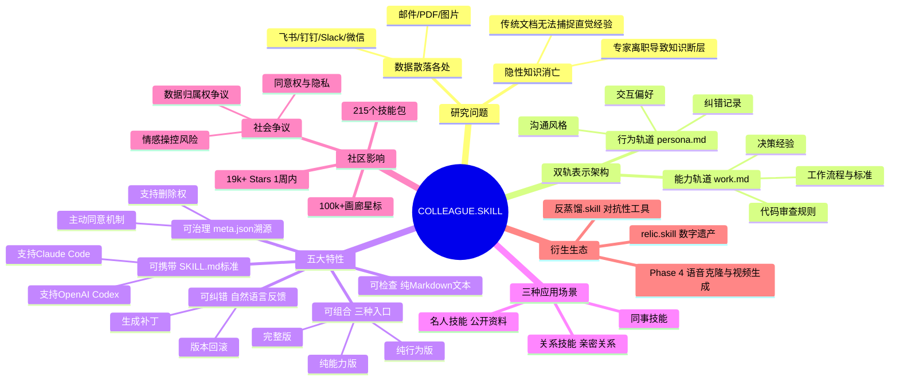

## 一、论文是干什么的？

公司里最厉害的工程师离职了，五年积累的知识——哪个模块最容易出 bug、如何审查 N+1 查询问题、故障排查思路——不会写在任何文档里，散落在飞书消息、代码评论、设计文档、邮件里。这篇论文要解决：如何把一个人散落各处的"隐性知识"，自动整理成 AI Agent 能直接使用的技能包？

传统的知识管理方法依赖人工整理文档，不仅耗时，而且很难捕捉那些"只可意会，不可言传"的经验直觉。COLLEAGUE.SKILL 提出了一套自动化流水线，输入一个人产生的各种数字足迹，输出一个结构化的 SKILL.md 文件，让 AI Agent 能像这位专家一样思考和行事。

## 二、核心方法与创新

**双轨表示**

系统的核心设计是把一个人的知识分成两条轨道并行记录：

- **能力轨道（work.md）**：记录"能做什么"——工作流程、代码审查标准、决策经验。比如"在 PR 中总是先检查数据库查询次数"这类可操作的规则。
- **行为轨道（persona.md）**：记录"怎么做事"——沟通风格、交互规则、纠错记录。比如"喜欢用类比来解释复杂概念"或"遇到需求模糊时会先反问澄清目标"。

**支持的异构数据源**

系统能摄入来自多种平台的数据，包括：飞书、钉钉、Slack、微信、邮件、PDF 文档、图片（含 OCR 识别）。这意味着无论一个人的工作痕迹分散在哪里，都可以被统一处理。

**五大特性**

1. **可携带**：输出遵循 Agent Skills 标准，生成 SKILL.md 文件，原生支持 Claude Code、OpenAI Codex 等主流 AI 编程工具。
2. **可检查**：输出是普通的 Markdown 文本，人类可以直接阅读、审查和修改，不存在黑盒。
3. **可组合**：提供三种入口——完整版（能力+行为）、纯能力版（只有 work.md）、纯行为版（只有 persona.md），按需引用。
4. **可纠错**：用自然语言反馈即可修正技能包——系统接收反馈后生成补丁、归档旧版本、支持版本回滚，像给代码打补丁一样简单。
5. **可治理**：meta.json 记录每条知识的来源，公共画廊要求主动同意才能上传，支持随时删除。

**三种应用场景**

- **同事技能**：蒸馏在职或离职同事的专业知识，让团队知识不随人才流失而消亡。
- **名人技能**：基于公开信息（著作、演讲、访谈）重建名人的决策风格，如 Tim Cook 的产品直觉、Warren Buffett 的投资框架。
- **关系技能**：记录亲密关系中的互动模式，如伴侣或父母的沟通偏好。

**工作流四层架构**

1. **输入层**：接入各平台数据，统一格式化。
2. **分析层**：提取行为模式、决策逻辑、专业偏好。
3. **生成层**：分别生成 work.md 和 persona.md，并合并为 SKILL.md。
4. **输出层**：版本管理、画廊发布、API 接口。

## 三、使用了哪些模型和计算资源？

这是一篇系统论文，**不训练任何模型**，完全通过 Prompt 工程调用现有的大语言模型 API。系统设计为 Host-Agnostic（宿主无关），理论上可以对接任何支持工具调用的 LLM。

最广泛的使用方式是通过 Claude（Anthropic）调用，因为 SKILL.md 格式与 Claude Code 的 Agent Skills 规范原生兼容。

普通个人电脑即可运行，**无需 GPU**，成本约等于调用 API 的费用。

GitHub 仓库地址：titanwings/colleague-skill（截至综述日期已获 19,100+ Stars，1,900+ Forks）。

## 四、实验结果

论文没有量化实验数据，作者明确声明"不声称生成的技能能忠实复现一个人"，因此刻意回避了可能引发误解的精确度评测。

唯一的"指标"是社区采用统计，从另一个维度说明了系统的实际价值：

| 指标 | 数值 |
|------|------|
| GitHub Stars | 19,100+ |
| GitHub Forks | 1,900+ |
| 社区画廊技能数 | 215 个 |
| 元技能数量 | 55 个 |
| 社区贡献者 | 165 人 |
| 画廊累计星标 | 100,000+ |

## 五、潜在应用场景

**企业知识沉淀**

核心价值在于让关键员工的隐性知识可传承。传统交接靠文档和 one-on-one，COLLEAGUE.SKILL 将这一过程自动化并结构化，生成的技能包可以直接被新入职员工或 AI 助手使用。

**社区画廊中的真实技能包（示例）**

- **字节跳动 L2-1 后端工程师.skill**：能精准识别 N+1 查询问题，自动生成 SQL 优化建议。
- **Tim Cook.skill / Elon Musk.skill / Warren Buffett.skill**：基于公开材料重建决策风格，用于辅助商业判断。
- **前任.skill / 父母.skill**：记录亲密关系中的沟通模式，用于情感支持场景。

**衍生生态**

项目触发的衍生创作显示了其广泛的想象空间：

- **反蒸馏.skill**：对抗性工具，专门生成误导性假技能包，保护隐私。
- **relic.skill**：定位为"万物永生"引擎，探索数字遗产和记忆存档。
- **Phase 4 路线图**：规划中包含语音克隆和视频生成，向更完整的数字人方向演进。

## 六、网络上的评价与讨论

**爆红过程**

项目于 2026 年 3 月上线，5 天内获得 6,600+ Stars，一周内突破 9,500+ Stars。热度从程序员社区迅速蔓延到微博、小红书、知乎等大众平台，"我的 Skill 已上传"成为职场流行语。

**知乎上的伦理争议**

知乎上围绕以下问题展开了激烈讨论：

- **数据归属权**：离职员工在飞书/钉钉上的聊天记录，到底属于员工本人还是公司资产？
- **同意权**：在未征得本人同意的情况下，用他人的数字足迹生成 AI 分身，是否构成侵权？
- **情感操控风险**："前任.skill"和"父母.skill"是否会被用于操控或欺骗脆弱的人群？

**社区黑色幽默**

有网友建议将项目改名为"Colleague Kill（同事杀手）"，调侃 AI 正在系统性地替代人类的不可替代性。

**Twitter 上的反应**

知名创业者 @andreasklinger 转发评论："这太离谱了……还出现了反蒸馏技能。💀💀"

**36Kr 深度报道**

36Kr 发表深度分析文章，指出更值得警惕的不是个人自愿上传技能包，而是 Meta 等大公司正在系统性地采集员工的鼠标移动轨迹和键盘输入数据，这才是真正规模化的隐性知识提取行为。

## 七、思维导图

