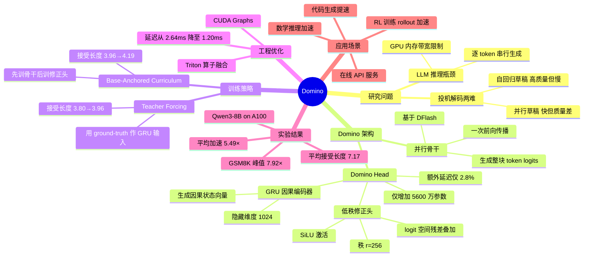

## 一、论文是干什么的？

大语言模型（LLM）生成文字时必须逐 token 顺序计算，最大的瓶颈不是算力，而是 GPU 内存带宽——每生成一个 token，都要把几十亿参数从显存搬一遍。

**投机解码（Speculative Decoding）** 是目前最主流的无损加速方案：先让一个"快嘴但不太准"的小草稿模型猜出多个 token，再让大目标模型一次性并行验证，如果猜对了就全部接受，猜错了就丢掉重来。关键在于：输出的概率分布与原始模型完全一致，没有任何精度损失。

草稿模型的设计存在两条路线的两难困境：

- **自回归草稿（如 EAGLE 系列）**：每个 token 依赖上一个，因果建模准确，接受率高，但串行生成速度慢；
- **并行草稿（如 DFlash）**：一次前向传播生成整块 token，速度极快，但忽略了 token 间的因果关系，质量较差。

Domino 的目标就是**两者兼得**——既要并行草稿的速度，又要自回归草稿的质量。

## 二、核心方法与创新

Domino 的核心思路是把草稿过程**解耦为两步**，分别处理"速度"和"质量"：

**第一步：并行骨干**

基于 DFlash 架构，一次前向传播生成整块（block size=16）token 的初始 logits。这一步完全并行，速度极快，但忽略了 token 之间的因果依赖。

**第二步：Domino Head（因果修正头）**

这是论文的核心创新。Domino Head 是一个轻量级模块，负责在并行骨干的基础上注入因果依赖：

- **GRU 因果编码器**：隐藏维度 1024，顺序读取前各位置的草稿嵌入，生成因果状态向量 S_{i-1}，捕捉历史上下文信息；
- **低秩修正头**：秩 r=256，使用 SiLU 激活函数，直接在 logit 空间做残差修正：

  ```
  L_final = L_base + W2 · σ(W1 · [H_i; S_{i-1}])
  ```

  这里完全跳过了昂贵的 LM head 重计算，只做轻量的残差叠加。

整个 Domino Head 仅增加约 **5600 万参数**（相对基础模型 +5.3%），额外推理延迟仅 **2.8%**，代价极低。

**两大训练策略**

1. **Teacher Forcing**：训练时始终用 ground-truth token 作为 GRU 的输入（而非模型自己的预测），避免误差累积。这一策略将平均接受长度从 3.80 提升到 3.96（+4.2%）。

2. **Base-Anchored Curriculum（基础锚定课程学习）**：训练初期只优化并行骨干，待骨干稳定后再引入 Domino Head 的训练，防止骨干在修正头的干扰下退化。这一策略进一步将接受长度从 3.96 提升到 4.19（+5.8%）。

**工程优化**

- 使用 **Triton 算子融合** 将 GRU 与低秩修正头合并为单一 kernel；
- 结合 **CUDA Graphs** 消除 kernel 启动开销；
- 最终 Domino Head 的推理延迟从 2.64ms 降至 **1.20ms**（降低 54.5%）。

## 三、使用了哪些模型和计算资源？

**目标模型（推理时冻结，不参与训练）：**
- Qwen3-4B
- Qwen3-8B

**训练数据：**
- `mlabonne/open-perfectblend`，共 142 万样本，涵盖对话、数学、代码三类任务。

**训练配置：**
- GPU：8× NVIDIA A100-SXM4-80GB
- 训练轮次：3 个 epoch
- 序列长度：3072
- 草稿块大小：16 token
- 批大小：16
- 优化器：AdamW + 余弦学习率调度
- 精度：bfloat16 + FSDP（全分片数据并行）

**开源模型权重：**
- `Huang2020/Qwen3-4B-Domino-b16`
- `Huang2020/Qwen3-8B-Domino-b16`

## 四、实验结果

以下为 Qwen3-8B 在 A100 上的端到端加速比对比（× 表示相对原始自回归解码的速度倍数）：

| 测试集 | Domino | DFlash | EAGLE-3(60) |
|--------|--------|--------|-------------|
| GSM8K | 7.92× | 5.21× | 2.56× |
| MATH-500 | 7.38× | 6.18× | 2.42× |
| HumanEval | 5.89× | 5.21× | 2.50× |
| 平均 | 5.49× | 4.66× | 2.26× |

**平均接受长度**：Domino 7.17 vs DFlash 6.06，提升 **+16.6%**。

值得注意的是，Domino 仅使用 16 token 的草稿块，却超越了使用 60 token 块的 EAGLE-3 和 DART，充分说明因果建模质量的提升比单纯扩大块大小更有效。

在 SGLang 推理框架下，低并发场景（batch size=1）下吞吐提升达 **5.1×**。

## 五、潜在应用场景

- **数学推理加速**：GSM8K 峰值 7.92× 加速，适合数学题求解、科学计算等高频推理场景；
- **代码生成提速**：HumanEval 5.89× 加速，可直接降低 GitHub Copilot 类产品的推理成本；
- **在线 API 服务**：在 SGLang 低并发场景下 5.1× 吞吐提升，有效降低 API 服务的 GPU 成本；
- **强化学习 rollout 加速**：LLM 训练中 rollout 生成是主要耗时，投机解码可大幅缩短 RL 训练周期；
- **边缘部署**：轻量 Domino Head（+5.3% 参数）对内存敏感场景友好。

项目已开源：[GitHub jianuo-huang/Domino](https://github.com/jianuo-huang/Domino)（53 星）。

## 六、网络上的评价与讨论

论文发布约 10 天，GitHub 仓库积累 53 星，处于早期关注积累阶段，尚未引发大规模讨论，但在投机解码研究圈内获得了一定关注。

**技术层面的关注点：**

- 当前投机解码领域竞争极为激烈，技术迭代路径清晰：EAGLE-3 → DFlash → Domino，并行草稿路线正逐渐成为主流方向；
- GSM8K 上 7.92× 的极高加速比是最受关注的数字，不少人好奇这一数字的边界条件；
- **公平性说明**：Domino 的实验使用 A100，而 DFlash 原论文的实验使用 H200。论文作者在相同的 A100 硬件上对 DFlash 进行了重测，确保对比的公平性，这一点值得肯定；
- Domino Head 的因果注入思路（GRU + 低秩残差）被认为是简洁且有效的工程设计，理论上可移植到其他并行草稿框架。

## 七、思维导图


