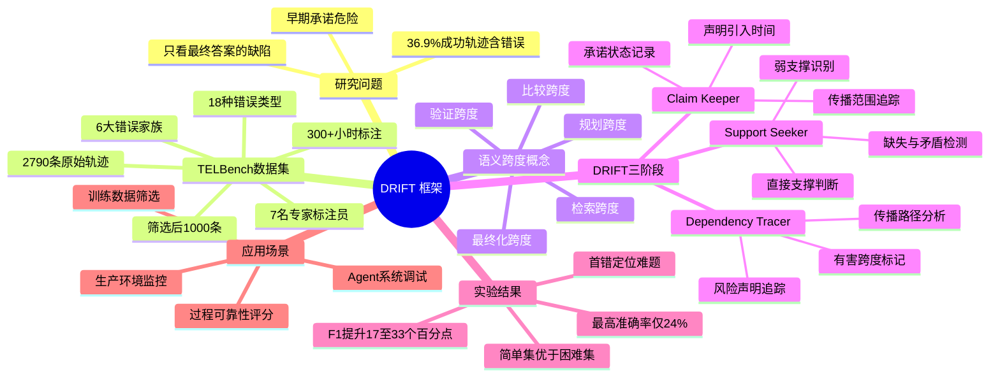

## 一、论文是干什么的？

深度研究 Agent（如 OpenAI Deep Research、Google Gemini Deep Research）能自主上网检索、阅读文献、综合信息、生成研究报告。现有评测只看最终答案对不对。核心问题：在最终答案正确的轨迹中，仍有 36.9% 包含至少一个错误跨度——Agent 可以"蒙对答案"，但过程已经靠不住。

类比：法官判案不能只看判决书通顺不通顺，要审查每一条证据链有没有漏洞，结论看起来对不代表推理过程可靠。

"早期承诺"（Early Commitment）危险：Agent 在轨迹早期对某个事实做出未经验证的承诺，把它当"既定事实"传递给后续所有步骤，后续不断叠加推理，错误被放大固化，回头很难找到最初那个"始作俑者"。

## 二、核心方法与创新

**语义跨度（Semantic Span）**：把原始杂乱日志规范化为有序语义跨度序列，每个跨度围绕一个局部连贯目标（规划/检索/验证/比较/最终化），比单步细、比整体粗，是"恰到好处"的分析单元。

**TELBench 数据集构建**：MiroFlow + OAgent 两个 Agent 框架，GPT-5 + Gemini-2.5-Pro + Claude-Sonnet-4.5 三个骨干，在 GAIA-val/XBench/BrowseComp 三个基准上执行，共 2790 条轨迹，经规范化筛选后 1000 条。7 名专家标注员，每条双人独立验证，有争议进入裁定，耗时超过 300 小时。错误分类：18 种原始错误、6 大家族（约束处理/搜索检索/证据接地/实体映射/信息处理/过程控制）。600 条简单 + 400 条困难。

**DRIFT 框架三阶段**：

- ①声明台账（Claim Keeper）——记录每个声明的引入时间、传播范围、承诺状态，最大贡献
- ②支撑寻找（Support Seeker）——判断每条关键声明是直接支撑/弱支撑/缺失/矛盾
- ③依赖追踪（Dependency Tracer）——追踪风险声明在答案路径中引入→传播→最终化，精确标记有害错误跨度

类比：侦探复盘案件，不只看最后判决，逐条列出证人证词，检查每条有没有实物证据，追查哪条不实证词最先影响了推理链。

## 三、使用了哪些模型和计算资源？

**生成轨迹骨干**：GPT-5、Gemini-2.5-Pro、Claude-Sonnet-4.5。

**DRIFT 评测骨干**：DeepSeek-V3.2、GPT-5.4、Claude-Sonnet-4.6、Gemini-2.5-Pro。

**人工标注**：7 名专家，超过 300 小时。

**DRIFT 每条轨迹 token 消耗**：DeepSeek-V3.2 约 17,812 / Claude-Sonnet-4.6 约 22,643 / Gemini-2.5-Pro 约 53,043（使用扩展思考 tokens，显著偏高）。

**开源**：代码 https://github.com/NJU-LINK/DRIFT，数据集 https://huggingface.co/datasets/NJU-LINK/TELBench。

## 四、实验结果

**DRIFT vs Bare LLM F1（宏平均）**：

| 模型 | Bare LLM F1 | DRIFT F1 | 提升 |
|------|------------|----------|------|
| DeepSeek-V3.2 | 22.5% | 50.5% | +28 pp |
| GPT-5.4 | 33.9% | 52.5% | +18.6 pp |
| Claude-Sonnet-4.6 | 21.9% | 54.9% | +33 pp |
| Gemini-2.5-Pro | 31.0% | 48.4% | +17.4 pp |

**首错定位准确率**（精确指出"第一个出错步骤"）：最高仅 24.1%（DeepSeek 配 DRIFT），困难集上更低——这是本领域最大的开放性难题。

简单实例 F1 提升幅度约是困难实例的两倍。

## 五、潜在应用场景

- **Agent 系统调试与诊断**：精确定位"第7个跨度的无支撑承诺"，而非模糊的"Agent不行"
- **生产环境实时监控**：医疗/法律/金融高风险场景，在输出被人使用前自动审计
- **训练数据质量控制**：只用过程可靠的轨迹进行 RL 训练，避免"蒙对答案但过程混乱"的轨迹作为正样本
- **可信度评分**：从"答案对/错"升级为"过程可靠性连续评分"

## 六、网络上的评价与讨论

论文发表仅 6 天，HuggingFace 数据集页面 157 次下载，已产生 v1 和 v2 两个版本（v2 在次日即更新，作者积极维护）。"36.9% 看似成功的轨迹实际包含错误"这一发现预期将引发 AI 安全研究者重视，与 AI 安全领域对 Agent 可解释性和可审计性的关切高度一致。VoltAgent/awesome-ai-agent-papers 将"深度研究 Agent 评测"方向视为核心板块之一。

同期相关工作：TRACE（轨迹感知综合评测）、DeepFact（深度研究事实性）、From Fluent to Verifiable（声明级可审计性）。

## 七、思维导图

