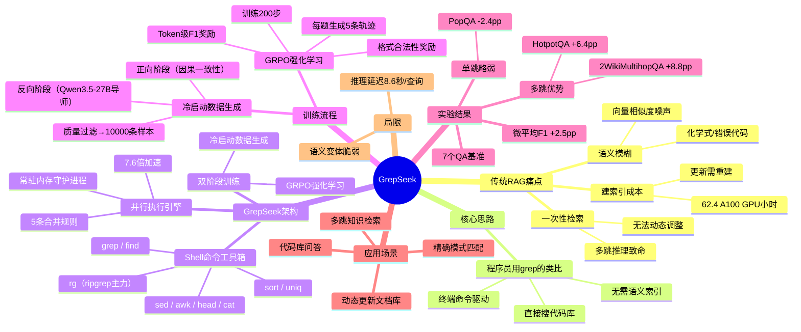

## 一、论文是干什么的？

传统 RAG 三大痛点：①信息漏斗——一次性取回固定文段，无法动态调整策略，多跳推理致命；②语义模糊——化学式/错误代码等需精确匹配的查询，向量相似度引入噪声；③建索引成本高——Qwen3-4B 嵌入模型建索引需 62.4 个 A100 GPU 小时，且每次更新都要重建。灵感：程序员不给代码库建语义索引，直接打终端用 grep -r "def calculate_loss" . 搜索。GrepSeek 要训练大模型也这样搜索文档。

## 二、核心方法与创新

工具箱：rg（ripgrep，主力）、grep、find、sed、awk、head、cat、sort、uniq 等，实践中最常用 rg + head 组合。两阶段训练：①冷启动——双角色数据生成：反向阶段（导师模型 Qwen3.5-27B 从已知答案倒推搜索轨迹，最多 5 轮迭代精炼）+ 正向阶段（从零开始推理确保因果一致性），质量过滤后得到 10,000 条训练样本；②GRPO 强化学习——对同一问题生成 5 条轨迹，按质量相对排名打奖励（格式合法性 × Token级F1），训练 200 步。语义保持并行执行引擎（7.6倍加速）：把大语料库切成分片多核并行执行 Shell 命令，5 条合并规则（无状态管道直接拼接/head-n 截断/wc-l 计数求和/sort-uniq-head 多路归并/复杂管道回退顺序执行），保证逐字节完全一致，常驻内存守护进程减少启动开销，平均延迟约 8.6 秒/查询。

## 三、使用了哪些模型和计算资源？

基座模型：Qwen3.5-9B（目标训练模型）；数据生成导师：Qwen3.5-27B。GPU：单张 NVIDIA A100（80GB），32核 CPU，32GB RAM。SFT 训练：10,000 条样本，1 个 epoch；RL 训练：200 步。完全无需建索引，节省竞争基线的 3.2~62.4 A100 GPU 小时。公开资源：代码（Apache-2.0）alireza7/GrepSeek-Qwen3.5-9B-GRPO + SFT 版本 + 冷启动数据集，全部在 HuggingFace 发布；Demo Notebook 支持 Google Colab。

## 四、实验结果（7 个 QA 基准，Token-Level F1）

原文 Table 1 汇报各方法 Token-Level F1，下表取 Search-R1 + Qwen3-4B（最强基线）与 GrepSeek 对比，差值为绝对百分点差（pp）：

| 数据集 | GrepSeek | 最强基线 Search-R1 | 差值 (pp) |
|--------|----------|--------------------|-----------|
| HotpotQA | 0.623 | 0.559 | **+6.4** |
| 2WikiMultihopQA | 0.518 | 0.430 | **+8.8** |
| NQ | 0.522 | 0.507 | +1.6 |
| MuSiQue | 0.301 | 0.288 | +1.3 |
| TriviaQA | 0.767 | 0.769 | -0.2 |
| PopQA | 0.486 | 0.510 | -2.4 |
| 微平均 F1 | 0.569 | 0.544 | **+2.5** |

多跳推理优势显著（HotpotQA +6.4 pp、2Wiki +8.8 pp），单跳/语义改写型略弱（PopQA -2.4 pp）。

## 五、潜在应用场景

Anthropic Claude Code 官方已放弃向量 RAG，改用"glob+grep+read"方式；Cursor、Codex、Devin 等代码 AI 均采用 grep 风格代码搜索。多跳知识检索（企业股权结构/人物关系图谱）；精确模式匹配（化学分子式/法规条文编号）；代码库问答；动态更新文档库（法律法规/医疗指南）。

## 六、网络上的评价与讨论

DCI 前导论文（arXiv 2605.05242）在 HuggingFace 获 122 个点赞，荣登当日最热论文第一名。VentureBeat 文章《你的 AI 智能体需要的是终端，而不只是向量数据库》。关联工作"Is Grep All You Need?"（arXiv 2605.15184）独立评测结论："逐行 grep 在每一对架构-模型组合上都超过了向量检索"。LlamaIndex 独立测试：Grep 风格正确率 8.4/10 vs 向量检索 6.4/10。GrepSeek 仓库 37 星，处于早期增长阶段。

## 七、思维导图

