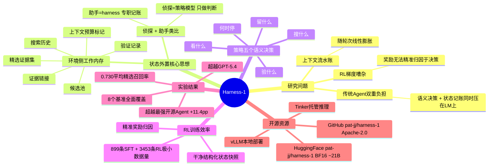

## 一、论文是干什么的？

搜索 Agent 能自主执行多步骤网络信息检索来回答复杂问题（如"某专利的最新法律状态及竞争对手财务情况"）。传统搜索 Agent 的语言模型既要做决策（搜什么、读什么）又要记账（已找到哪些候选文档？哪些证据被确认了？），两件事互相干扰，上下文随轮次增加变成不断增长的流水账，RL 训练梯度信号嘈杂，学习效率极低。类比：传统搜索 Agent 像一个侦探，调查案件时既要思考"下一步查谁"，又要把所有线索、走访记录全部记在脑子里——既低效又容易出错。

## 二、核心方法与创新

状态外置（State Externalization）：把"记账"从模型身上剥离，交给环境（harness）来维护，语言模型只负责高层语义决策。类比：给侦探配了一个专职助手（harness），助手维护"案情板"——所有线索、证人证词、待核实事项的便利贴随时更新。侦探只需看一眼案情板，思考"下一步查什么"。环境侧维护的结构化工作内存：候选池（检索到的候选文档集合）/精选证据集（经判断的核心证据片段）/证据链接（证据与来源的紧凑对应，支持溯源）/验证记录（关键声明的核查历史）/搜索历史（去重压缩后的查询记录，避免重复检索）/上下文预算标记（感知剩余窗口，动态调整渲染策略）。策略只负责五个语义决策：搜什么→看什么→留什么→验什么→何时停。这五个是真正需要"理解"的语义判断，机械性的记录/去重/格式化全由 harness 接管。RL 为何更高效：状态外置后模型每步看到干净结构化状态快照，RL 奖励信号能精准归因于语义决策，仅用 899 条 SFT + 3,453 条 RL 查询实现强泛化——极小数据量本身证明了学习效率提升。论文核心论点："模型不是完整的学习系统——harness 的内存布局、动作空间、筛选接口、验证记录和上下文渲染方式，本身就是 RL 学习的对象。"

## 三、使用了哪些模型和计算资源？

基座模型：OpenAI gpt-oss-20b（约21B参数，开源权重，BF16 safetensors），与 Chroma Context-1 使用同一基座形成直接可比对照。训练基础设施：Tinker API 提供。向量数据库支持：Chroma 提供。推理建议：H100 级别 GPU。具体 GPU 型号和训练时长论文未公开披露。公开资源：代码 GitHub pat-jj/harness-1（Apache-2.0 开源）；模型权重 HuggingFace pat-jj/harness-1（BF16，~21B）；支持 vLLM 本地部署 + Tinker 托管推理（HARNESS1_HF_MODEL=pat-jj/harness-1）。

## 四、实验结果（8个基准，平均精选召回率）

总体：0.730 平均精选召回率，横跨网页检索/金融/专利/多跳QA（BrowseComp+/FRAMES/HotpotQA/LongSeal 等）。

| 对比对象 | 差值 |
|----------|------|
| 下一名最强开源搜索 Agent | +11.4 pp |
| Context-1（同系基准）| +7.9 召回点 |
| Context-1（迁移基准 held-out）| +17.0 召回点 |
| GPT-5.4（前沿闭源）| 超越 |
| Claude Opus 4.6（前沿闭源）| 相当（以20B规模实现旗舰级表现）|

成本维持在 Context-1 量级，远低于 GPT-5.4 或 Claude Opus 4.6。

## 五、潜在应用场景

复杂多跳文献研究（学术/法律/专利）；金融情报收集与核实；竞争对手分析 Agent；企业知识库深度检索子 Agent。完全开源（Apache-2.0），代码库结构完整（harness/training/inference/datagen/docs 各模块）。

## 六、网络上的评价与讨论

X（Twitter）相关帖子获得 133,900 次浏览、1,800 次点赞、2,200 次书签，正面评价率 94.4%。@asteris_ai："搜索 Agent 不只需要更好的检索器。Harness-1 给了它们外部状态来存储记忆、证据和验证信息——这更接近一个仔细的人类研究者的实际工作方式。"@_reachsumit 总结："一个20B搜索Agent，在有状态harness内用RL训练，将记账工作外包给环境。" 核心共识：架构分工比模型规模更重要——"把记账外包给环境"这个思路被认为有广泛推广价值。Agent 工程社区关注：极小数据量（899+3453）实现强泛化；20B 规模匹配旗舰模型带来的成本意义。

## 七、思维导图

