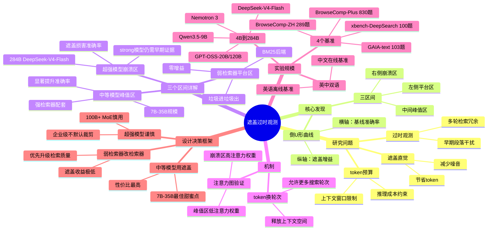

## 一、论文是干什么的？

搜索 Agent 在多轮检索中，早期轮次返回的文本段落（"观测"）会随搜索深入变得冗余甚至有害。遮盖过时信息听起来合理（节省token/减少干扰/换更多搜索轮次），但这篇论文揭示：这件事只在特定条件下有效，超出边界就会适得其反。

## 二、核心方法与创新

遮盖操作：维护滑动窗口，只保留最近若干轮观测在上下文中，更早期的观测被替换为占位符，极为简洁（最小干预）。

核心发现——不对称的倒U形曲线：横轴是"无遮盖时的基线准确率"（代表模型能力），纵轴是"遮盖带来的准确率提升"。三个区间：

- ①左侧平台区——弱检索器+任意规模模型，遮盖无明显帮助（"垃圾进垃圾出"）；
- ②中间峰值区（甜蜜点）——强检索器+中等能力模型，遮盖显著提升准确率（模型能力不足以自主过滤噪音，遮盖帮它"清理桌面"）；
- ③右侧崩溃区——强检索器+超强模型（饱和状态），遮盖反而损害准确率（强模型原本就能在长上下文中找关键证据，遮盖把需要的证据也删掉了）。

类比：新手员工桌面乱会找不到重点，帮他整理大有裨益；经验丰富的高手自己知道哪些文件重要，你帮他"整理"掉某份文件，他刚好需要那份——弄巧成拙。

机制：「token换轮次」——遮盖旧观测=释放上下文空间=允许更多搜索轮次；中间区间好处（新轮次找到关键信息）；崩溃区坏处（被遮盖内容恰好是强模型需要的证据）。

注意力图（attention maps）直接验证：崩溃区强模型对早期观测仍有显著注意力权重（还在用这些内容）；峰值区中等模型对早期观测注意力权重已极低（遮盖几乎无损）。

4 种检索后端：BM25（弱）、Qwen3-Embedding-8B（强密集）、Serper、AgentIR。

## 三、使用了哪些模型和计算资源？

模型范围（4B→284B）：Qwen3.5-9B（~9B）、Qwen3.5/3.6-35B-A3B（~35B，MoE激活3B）、GPT-OSS-20B/120B（MoE，5.1B激活/token）、NVIDIA Nemotron 3（30B-A3B变体，混合Mamba-Transformer MoE）、DeepSeek-V4-Flash（284B总参数/13B激活，代表"饱和"强模型）。

离线基准（BrowseComp-Plus，本地BM25）：单节点 8× A100 80GB，CUDA 12.2+，Ubuntu 22.04。在线基准（GAIA/xbench/BrowseComp-ZH）：依赖 Serper API。

代码、轨迹数据、评估日志已在 GitHub（i-DeepSearch/observation-masking）和 HuggingFace（i-DeepSearch/observation-masking-eval-logs）公开。

## 四、实验结果

4 个基准（英文+中文，离线+在线）：BrowseComp-Plus（830题，英语，本地检索）、GAIA-text（103题，英语，Serper）、xbench-DeepSearch（100题，中文，Serper）、BrowseComp-ZH（289题，中文，Serper）。

核心定性结论：

- 强检索器×中等模型带来最大收益；
- DeepSeek-V4-Flash（284B）配强检索器时准确率显著下滑（sharp collapse）；
- BM25弱检索器条件下，所有规模模型的遮盖效果均处于平台区（接近零增益）。

参照关联工作数字：简单遮盖（滚动窗口M=10轮）节省约52%推理成本；Qwen3-Coder-480B场景下遮盖达到54.8%解决率（LLM摘要策略53.8%），每500个实例节省约15美元。

## 五、潜在应用场景（实际设计决策框架）

- 弱检索器→优先改进检索器，上下文管理收益极低；
- 强检索器+中等模型（7B-35B）→遮盖性价比最高；
- 强检索器+超强模型（100B+ MoE）→谨慎使用激进裁剪；
- 企业级（GPT-4级+高质量检索）→不应默认开启激进上下文裁剪。

研究发布于 2026 年中，正值深度研究 Agent 工业界大规模部署高峰期（OpenAI/Google/Anthropic 均有产品），"上下文预算效率"已是工程核心约束。

## 六、网络上的评价与讨论

HuggingFace 社区 61 个 upvote，62 个独立用户关注（发布不足2周，热度较高）；GitHub 仓库 15 星持续增长。论文作者在 HuggingFace 评论区发布了补充注意力图可视化材料。

使用了真实工业级模型（DeepSeek-V4-Flash 284B、GPT-OSS 系列、Nemotron 3）而非纯学术小模型，增加了结论的实践参考价值。

与关联工作"The Complexity Trap"（arXiv:2508.21433，NeurIPS 2025 DL4Code Workshop）形成互补：后者证明简单遮盖在代码Agent任务上能媲美复杂LLM摘要。

## 七、思维导图

