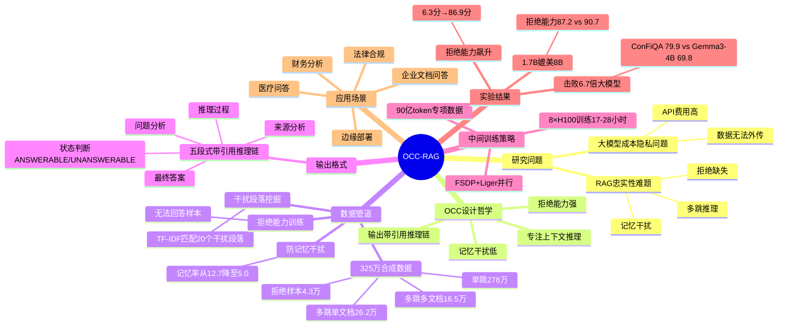

## 一、论文是干什么的？

RAG（检索增强生成）是让 AI"先查资料、再作答"的技术。但忠实回答（Faithful QA）有三大难题：①记忆干扰——模型自身知识可能覆盖文中内容；②多跳推理——需在多个段落间跳跃找线索；③该拒绝时不拒绝——资料不足时应说"不知道"，但大多数模型会编造答案。大模型（GPT-4o 等）成本高、有隐私风险，企业合同/病历等不能上传外部 API。OCC-RAG 提供能本地部署的极小型忠实 QA 模型。

## 二、核心方法与创新

OCC（Optimal Cognitive Core）设计哲学：小模型不需要知道所有事，但需要精通"从给定资料中找答案"。与普通 LLM 的区别：专注上下文推理/记忆干扰低/拒绝能力强/输出带引用推理链。325万条合成数据（单跳278万/多跳单文档26.2万/多跳多文档16.5万/拒绝4.3万，共约90亿token）：从维基百科抓取段落，用 gpt-oss-120B 生成10个问答对，用 TF-IDF 为每个正确段落匹配20个干扰段落，LLM 质量过滤；防止记忆干扰——答案完全可从提供段落推导，训练后记忆率从12.7降至5.0；4.3万"无法回答"样本训练拒绝能力。结构化推理链（带原文引用的五段式输出：问题分析→来源分析→推理过程→状态判断ANSWERABLE/UNANSWERABLE→最终答案），类比法庭律师陈述。中间训练策略（Mid-training）：用90亿token专项数据做大规模中间训练，而非传统微调。

## 三、使用了哪些模型和计算资源？

基座模型：Qwen3-0.6B-Base 和 Qwen3-1.7B-Base（阿里通义）。数据生成：gpt-oss-120B（OpenAI 1200亿参数开放权重模型）。GPU：8× NVIDIA H100（80GB，共640GB）。0.6B 训练时长：17小时；1.7B 训练时长：28小时。并行策略：FSDP + Liger 融合交叉熵。学习率1×10⁻⁴，余弦衰减，批大小32/16，最大序列长度6144，训练1个epoch，总计算量约136-224 GPU·小时（学术界可复现规模）。

## 四、实验结果（5个基准）

| 模型 | 参数 | HotpotQA | MuSiQue | TAT-QA | ConFiQA | 拒绝能力 |
|------|------|----------|---------|--------|---------|---------|
| OCC-RAG-0.6B | 0.6B | 57.6 | 36.6 | 75.0 | 79.9 | 86.9 |
| OCC-RAG-1.7B | 1.7B | 60.9 | 38.2 | 81.0 | 81.4 | 87.2 |
| Qwen3-0.6B（基座）| 0.6B | 34.8 | 13.2 | 62.5 | 59.7 | 6.3 |
| Qwen3-4B | 4B | 60.6 | 33.1 | 76.9 | 69.7 | 64.1 |
| Qwen3-8B | 8B | 68.7 | 39.3 | 72.9 | 75.9 | 90.7 |
| Gemma3-4B | 4B | 55.8 | 30.1 | 65.3 | 69.8 | 55.8 |

亮点：OCC-RAG-0.6B 在 ConFiQA 忠实性上 79.9 超越 6.7 倍大的 Gemma3-4B（69.8）；拒绝能力从基座 6.3 飙升至 86.9（+80.6分）；OCC-RAG-1.7B 拒绝能力（87.2）与 4.7 倍大的 Qwen3-8B（90.7）持平。

## 五、潜在应用场景

企业文档问答（合同/规章制度本地部署，无隐私风险）；法律合规（论文直接引用 RAGulator 系统作为落地案例，每条结论必须有原文依据）；财务分析（TAT-QA 基准模拟财务报告场景，F1=81.0 领先所有对比模型）；医疗问答（病历/临床指南）；边缘部署（0.6B 可在消费级 GPU 甚至 CPU 上推理）。

## 六、网络上的评价与讨论

论文 2026 年 5 月底发布，属极新预印本，HuggingFace 有专属收录，Twitter/Reddit 专项讨论尚在早期积累。核心贡献（极小模型在 RAG 忠实性上击败更大模型）与 LocalLLaMA 社区关注的"隐私本地部署"高度契合，预计会引发该社区关注。第一作者 Ivan Oseledets 是张量分解领域知名研究者，其团队在 AI 研究领域保持活跃。

## 七、思维导图

