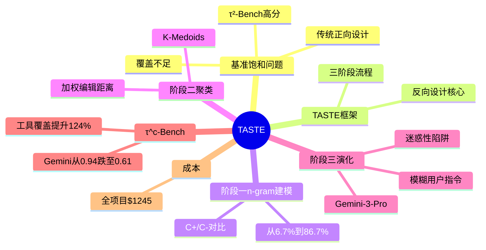

## 一、论文是干什么的？

Agent 基准（考卷）用于测试 AI 能否依次调用多个工具完成复杂任务（如修改机票、处理退款）。"基准饱和"：考卷太简单，顶级 AI 接近满分就失去区分能力——就像用小学算术考大学生，人人100分，看不出谁更强。当前最主流的 Agent 基准 τ²-Bench 上，Gemini-3-Flash 已能得到 0.82-0.94 的高分，接近刷穿。危害：AI 公司拿着饱和基准的高分做宣传，但不代表真实能力；测试题只覆盖少数工具组合，大量真实复杂场景没被测到。

## 二、核心方法与创新

TASTE 的核心颠覆：传统正向（先想故事→推工具），TASTE 反向（先探索工具序列→推用户故事）。类比：正向是"先想菜再买菜"（脑子里菜谱就那几道）；反向是"先看仓库原料组合再想菜"（发现大量意想不到的食谱）。三阶段：①自适应对比 n-gram 建模——维护 C+（合理序列n-gram）和 C-（不合理序列n-gram）两张计数表，采样概率正比于 C+/C- 对比比率，迭代更新，有效率从 6.7% 提升到 86.7%（提升约13倍），使用 trigram（n=3），训练 3000 轮；②K-Medoids 聚类——从 2000 条候选序列用加权编辑距离（功能相似工具替换成本 0.33/同类型 0.66/跨类型 1.0）聚类，选出 K 条代表性序列；③任务实例化+迭代难度演化——LLM 生成场景+数据库初始状态，Verifier Agent 验证（精确率1.0，召回率0.75-0.83），用 Gemini-3-Pro 三步演化：识别容易引发混淆的写操作→插入迷惑性"陷阱"记录→把清晰指令改写为更模糊版本。评测了 11 个 Agent/LLM 对（6个Agent LLM × 2个用户模拟器）：Gemini-3-Flash/2.5-Flash、GPT-5.2、Qwen-32B、DeepSeek-3.1、Claude-Sonnet-4.6。

## 三、使用了哪些模型和计算资源？

数据生成/验证：Gemini-3-Flash（n-gram 训练时的序列验证）；难度演化：Gemini-3-Pro；评测 Agent LLM：Gemini-3-Flash、Gemini-2.5-Flash、GPT-5.2、Qwen-32B、DeepSeek-3.1、Claude-Sonnet-4.6。全部通过 API 调用，无需 GPU 集群。成本明细：n-gram 训练+聚类约 $30；任务生成+演化+验证约 $2.50/任务；τ^c-Bench 总生成成本 $725；评测 11 个 Agent 对 $520；全项目总成本约 $1,245。

## 四、实验结果

τ^c-Bench vs τ²-Bench 对比（部分关键数据，pass@1，GPT-5.2 用户）：

| Agent | τBV（原基准）| τ^c（新基准）| 下降 |
|-------|-------------|-------------|------|
| Gemini-3-Flash（电信）| 0.94 | 0.61 | -35% |
| Gemini-2.5-Flash（航空）| 0.66 | 0.36 | -45% |
| GPT-5.2（零售）| 0.69 | 0.61 | -12% |
| Qwen-32B（航空）| 0.36 | 0.10 | -72% |

最稳健：Claude-Sonnet-4.6 和 DeepSeek-3.1（下降幅度最小）。覆盖度提升：WED 最高提升 124%（航空域），TTR 最高提升 111%（航空域），工具频率熵提升 35%。

## 五、潜在应用场景

持续基准刷新（旧基准饱和后 $725 自动生成新题）；企业定制评测（针对自己业务 API 生成测试集）；训练数据生成（论文提及的未来方向）；非对话场景推广（代码执行评测等）。

## 六、网络上的评价与讨论

HuggingFace 社区 63 个 upvote，作者 Tomer Keren 在评论区说明："我们不从写故事开始，而是从工具序列开始"。用户质疑：LLM 判断偏差是否影响 n-gram 采样（合理质疑，消融实验有部分回应）。基准饱和话题在 AI 社区高度关注：2026年4月 HackerNews 上关于 SWE-bench 饱和（93.9%）的讨论热度极高，AI 社区普遍认同"静态基准平均寿命越来越短"，TASTE 的出现时机极佳。代码和 τ^c-Bench 数据已在 GitHub 开源（目前4星，早期阶段）。

## 七、思维导图

