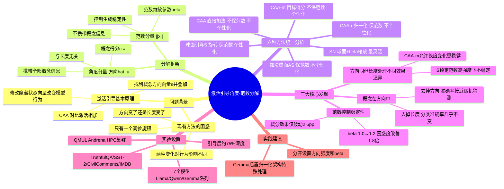

## 一、论文是干什么的？

**激活引导（Activation Steering）**是一种在不重新训练模型的情况下，直接修改大语言模型内部隐藏状态向量、从而改变模型输出行为的技术。通过找到代表某概念（如"诚实"、"友善"、"低毒性"）的方向向量，在推理时叠加到激活值上，可以实时"引导"模型的行为倾向。

**核心问题**：把引导向量加到隐藏状态时，到底是向量"方向"变了，还是"长度"变了，还是两者都变了？这两种变化各自对模型行为有什么影响？此前没有人系统研究，研究者只能靠经验调参，效果时好时坏。

本文用一个统一的几何框架回答了这个问题。

## 二、核心方法与创新

**角度-范数分解框架**

将任意隐藏状态向量 $x$ 分解为：

$$x = \|x\| \cdot \hat{u}$$

其中 $\|x\|$ 是范数（长度），$\hat{u}$ 是单位方向向量。引入**概念得分（concept score）**：

$$c = \langle \hat{u}, s \rangle$$

即方向向量与引导方向 $s$ 的内积，衡量"当前向量和目标概念方向有多对齐"。这个得分完全由方向决定，与长度无关。

**六种引导方法的统一比较：**

| 方法 | 保持范数 | 针对每个token个性化 |
|------|---------|-------------------|
| CAA | 否 | 否 |
| CAA-r | 是 | 否 |
| CAA-m | 否 | 是 |
| 球面引导 S | 是 | 是 |
| 加法球面 AS | 是 | 否 |
| SN（球面+范数缩放）| 可调（$\beta$） | 是 |

**三大核心发现：**

**发现一：概念藏在方向里，不藏在长度里。** 训练线性分类器区分"积极情绪"激活：用完整向量，准确率高；只用方向（归一化），准确率几乎相同；只用长度（去掉方向），准确率接近随机猜测（50%）。

**发现二：长度控制稳定性，不是摆设。** 高强度引导时，把引导后向量长度微调（$\beta$ 从1.0→1.2），模型困惑度（perplexity）改善约 **1.8倍**，而概念引导效果（任务得分）只波动约2.5个百分点。

**发现三：方向相同但长度处理不同，效果天壤之别。** 球面引导 S 和 CAA-m 的方向对齐程度相同，但 S 严格锁定长度——高强度引导下 S 的困惑度大幅上升、模型能力明显下降；CAA-m 更稳健。

**实践指导**：调激活引导时，应分开设置"方向强度"（概念旋钮）和"范数缩放 $\beta$"（稳定性旋钮），而不是只调一个笼统的加法系数。

## 三、使用了哪些模型和计算资源？

**测试模型（7个）：**
- Llama-3.1-8B-Instruct、Llama-3.1-8B、Llama-3.2-1B-Instruct
- Llama-3.1-70B-Instruct
- Qwen2.5-7B-Instruct、Qwen2.5-3B-Instruct
- Gemma-2-9B-it

引导层：模型深度约75%处（如 Llama-3.1-70B 对应第60层）

**实验概念数据集**：TruthfulQA（真实性）、SST-2（情感分类）、CivilComments（毒性检测）、IMDB（情感分析）

**计算资源**：玛丽女王大学（QMUL）Andrena HPC 计算集群；获 Google DeepMind 博士奖学金和 EPSRC 支持；**GPU 型号/数量/时长论文未提及**（分析性工作，只做推理，无需训练）

## 四、实验结果

| 方法 | 高强度引导下的困惑度 | 概念任务准确率 |
|------|-------------------|-------------|
| CAA | 中等 | 中等 |
| 球面引导 S | **高（不稳定）** | 与 CAA-m 相近 |
| CAA-m | 低（稳定） | 与 S 相近 |
| SN（$\beta=1.2$）| **最低（最稳定）** | 接近 CAA-m |

Gemma-2（后置归一化架构）的激活向量长度变异系数（17%–88%）远大于 Llama/Qwen（5%–14%），说明不同架构需要区别对待。

## 五、潜在应用与已落地应用

1. **AI 对齐与安全**：精确控制模型诚实度、友善度、拒绝有害请求倾向，不破坏基础能力
2. **毒性抑制**：不重训练即可通过引导向量降低有害输出概率
3. **个性化对话**：推理时动态切换语气/风格，无需重训练
4. **红队测试**：通过引导向量快速测试特定行为倾向下的模型表现
5. **可解释性研究**：诊断引导方法失效原因（方向没对齐？还是范数破坏稳定？）

## 六、网络上的讨论与评价

2026年6月4日发布，目前尚无大量专题讨论。同期活跃的相关工作：Spherical Steering（arXiv:2602.08169）、Angular Steering（arXiv:2510.26243）、Manifold Steering（arXiv:2605.05115）。本文独特价值在于：这些工作大多从某一角度提出"更好的方法"，而本文是**分析性/统一性工作**，用一个框架解释所有方法的优劣机制，在可解释性和 AI 安全社区中通常受到较高评价。激活引导从业者指南博客（subhadipmitra.com）已收录相关讨论。

## 七、思维导图

