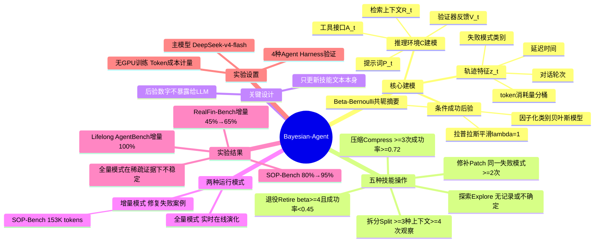

## 一、论文是干什么的？

LLM 智能体系统依赖"技能库"（SOP/技能文本）来指导任务执行。随着任务积累，技能库越来越大，但缺乏科学机制来判断：哪个技能是可靠的？哪个技能在什么情况下会失效？什么时候该修补、什么时候该放弃？

传统做法只是简单记录失败次数，无法区分"偶发失败"和"系统性缺陷"。Bayesian-Agent 的方案是：**给每个技能维护一个基于贝叶斯推断的可靠性置信度，每次任务后用证据更新这个置信度，再根据置信度智能决定技能命运**。

核心公式：将 LLM 推理建模为 $P(X | \theta, C)$，其中 $C$ 是推理环境（提示词 $P_t$、检索上下文 $R_t$、工具接口 $A_t$、验证器反馈 $V_t$）。优化 $C$（即优化技能库）就是提升智能体能力的核心路径。

## 二、核心方法与创新

**贝叶斯证据模型**

为每个技能 $h_k$ 维护条件成功概率的后验估计：

$$p_{k,t} = P(y_t = 1 | M_\theta, C_t, h_k, z_t)$$

其中 $z_t$ 是从执行轨迹提取的特征（token 消耗量分桶、对话轮次、延迟时间、失败模式类别）。

采用带拉普拉斯平滑（$\lambda=1$）的**因子化类别贝叶斯模型**，额外维护 **Beta-Bernoulli 共轭摘要**（初始超参数 $\alpha_0=\beta_0=1$）用于失败主导性检验。

**五种后验驱动的技能操作（有序决策规则）：**

| 操作 | 触发条件 | 含义 |
|------|---------|------|
| **探索 Explore** | 无观察记录或后验不确定 | 先用着看 |
| **修补 Patch** | 同一失败模式出现 $\geq 2$ 次 | 同一个坑踩了两次，加护栏 |
| **拆分 Split** | $\geq 3$ 种上下文 + $\geq 4$ 次观察，场景异质 | 拆成两个针对性流程 |
| **压缩 Compress** | $\geq 3$ 次观察 + 成功率 $\geq 0.72$ | 删冗余，精简 |
| **退役 Retire** | $\beta_k \geq 4$ 且成功率 $< 0.45$ | 彻底扔掉 |

**关键设计**：后验数字（成功率等）**永远不直接暴露给 LLM**，只更新技能文本本身——避免 LLM 对统计数字的错误推理。

**两种运行模式：**
- **全量模式**：从空技能库出发，在任务过程中实时在线演化
- **增量模式**：输入已有运行记录，仅修复失败案例，SOP-Bench 仅需约153,000 tokens

## 三、使用了哪些模型和计算资源？

- **主要实验模型**：DeepSeek-v4-flash（主要）、DeepSeek-v4-pro
- **对比 backend**：Claude Sonnet 4.6（跨 harness 验证）
- **验证的4种 Agent Harness**：Bayesian-Agent 原生、GenericAgent、mini-swe-agent、Claude Code
- **计算资源**：以 Token 消耗衡量（不修改权重，无GPU训练）
  - SOP-Bench 增量修复：约153,000 tokens
  - RealFin-Bench 增量修复（flash 模型）：约2,020,000 tokens
- **GPU 型号/数量/训练时长**：论文未提及（推理时优化，无训练）

## 四、实验结果

| 基准测试 | 基线 | 全量模式 | 增量模式 |
|---------|------|---------|---------|
| SOP-Bench（工业SOP） | 80% | 95% | 95% |
| Lifelong AgentBench | 90% | 85% ⚠️ | **100%** |
| RealFin-Bench（金融推理） | 45% | 52% | **65%** |

**注意**：Lifelong AgentBench 全量模式（85%）低于基线（90%）——这是论文诚实披露的重要发现：证据稀疏时，在线持续更新会引入噪音。这恰恰证明了贝叶斯方法"证据充分时才决策"的价值。

## 五、潜在应用与已落地应用

1. **工业流程自动化**：客服系统、供应链管理、医疗审批流程——任何依赖 SOP 的重复性业务流程
2. **终身学习型助手**：对话机器人、个人助理，跨会话积累经验、复用历史技能
3. **金融/法律等专业领域推理**：追踪哪些技能在哪种数据质量下失效
4. **合规可审计的企业级 AI**：后验摘要（成功率、失败模式、证据计数）全程可查

## 六、网络上的讨论与评价

HuggingFace Papers 获19个赞，2026年6月6日发布，尚无大量专题讨论。学界对"将贝叶斯统计引入 Agent 技能管理"方向给予正面评价：五种离散操作设计简洁实用，增量模式可直接插入现有系统。主要局限性（作者自承）：只在4种 harness 上测试；使用因子化贝叶斯模型，忽略特征间交互效应；全量在线模式在稀疏证据下不稳定。同期相关工作（SkillMAS、SkillRevise、OpenSkill）密集涌现，说明"智能体技能管理"是2026年上半年热点方向。

## 七、思维导图

