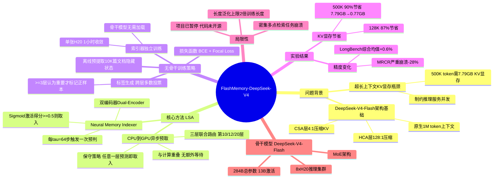

## 一、论文是干什么的？

处理50万字的超长文档时，大语言模型需要把所有历史 token 的键值缓存（KV Cache）保存在 GPU 显存中。在 8×H20 GPU 服务器上，处理50万 token 时标准方法需要约7.79 GB 的 KV 显存，严重制约了推理服务的并发能力和成本效率。

FlashMemory 的核心思路是：**提前预判接下来最可能用到哪些历史片段，只把那部分搬到 GPU 显存，其余保存在 CPU 内存**。就像一位聪明助手提前把明天要用的文件夹放到桌面，而不是把整个档案室都搬进办公室。

## 二、核心方法与创新

**Lookahead Sparse Attention（LSA）——前瞻稀疏注意力**

DeepSeek-V4-Flash 已将历史 KV 缓存按4:1比例压缩成"压缩块"存储于 CPU。LSA 在此基础上增加一个神经记忆索引器（Neural Memory Indexer）：

每隔 $\tau=64$ 个解码步触发一次预判：
1. 取当前隐藏状态，通过轻量级双编码器（Dual-Encoder）神经网络，预测接下来64步最需要哪些历史压缩块
2. 得分 $\geq 0.5$ 的块被标记为"即将需要"，从 CPU 异步搬入 GPU（与计算重叠，无额外等待）
3. 采用三层联合路由（第10、12、20层），任意一层预测需要则取入（保守策略）

**工程亮点——无骨干训练（Backbone-Free Decoupled Training）：**
- 离线预提取约1万篇文档的隐藏状态到磁盘
- 索引器训练完全不需要加载284B骨干模型
- **单张H20 GPU，1小时内收敛**，一周可完成500+次实验迭代

**训练标签——跨层多数投票：** 统计有多少层的注意力分数认为某历史块重要，$\geq 3$ 层才标记为正样本，过滤单层噪声。损失函数为二元交叉熵 + Focal Loss降噪。

## 三、使用了哪些模型和计算资源？

- **骨干模型**：DeepSeek-V4-Flash（284B参数，13B激活，MoE架构，原生1M token上下文）
- **推理/测试集群**：8 × NVIDIA H20 GPU
- **索引器训练**：单张 H20，约1小时收敛
- **训练数据**：约10,000篇长文档，上下文长度16K–512K
- **推理延迟/吞吐**：论文未提供（仅报告显存节省，未提供TTFT或解码速度）

## 四、实验结果

**KV 缓存节省（核心指标）：**

| 上下文长度 | 基线显存 | FlashMemory | 节省比例 |
|-----------|---------|-------------|---------|
| 128K | 1.95 GB | 0.26 GB | 87% |
| 256K | 3.90 GB | 0.35 GB | 91% |
| 500K | 7.79 GB | 0.77 GB | **90%** |

平均将 KV 显存压缩到基线的 **13.5%**（节省86.5%）。

**任务精度（LongBench-v2 等主流基准）：**

| 基准测试 | 基线 | FlashMemory | 变化 |
|---------|------|-------------|------|
| LongBench-v2-L（493K） | 68.1% | 70.0% | +1.9% |
| LongMemEval-M（500K） | 39.3% | 40.2% | +0.9% |
| RULER（512K） | 88.3% | 89.6% | +1.3% |
| **综合平均** | **76.9%** | **77.5%** | **+0.6%** |

**严重失败案例**：MRCR（密集多点检索）任务从76.0%骤降至**48.0%**（-28%）——稀疏索引无法处理需要全局密集记忆的场景。

## 五、潜在应用与已落地应用

1. **超长文档问答/摘要**：处理书籍、法律合同、科研报告（16K–512K token），节省90% KV 显存
2. **长会话聊天助手**：记住超长对话历史，同时大幅降低服务器显存成本
3. **代码库理解**：对大型代码仓库进行问答和生成
4. **低资源部署**：在显存受限的服务器上提供百万 token 级别服务

**⚠️ 项目状态特别说明**：论文末尾明确写明"由于组织调整，项目负责人已离职腾讯，项目暂停，正在寻求计算资源赞助或研究合作"。代码尚未完整开源，工程落地不明朗。

## 六、网络上的讨论与评价

HuggingFace Papers 收录当日33个赞，2条评论。由于针对 DeepSeek-V4-Flash（2026年4月发布）这一较新模型，且聚焦推理工程优化而非新模型发布，中文社区（知乎、腾讯云开发者社区）讨论主要集中在 DeepSeek-V4 本身，FlashMemory 作为下游论文讨论量较少。同期相关工作：SparDA（arXiv:2606.04511）同样使用预取机制在8B模型上提速1.7×；StreamIndex（arXiv:2605.02568）专门优化 DeepSeek-V4 的 CSA 层内存管理。

## 七、思维导图

