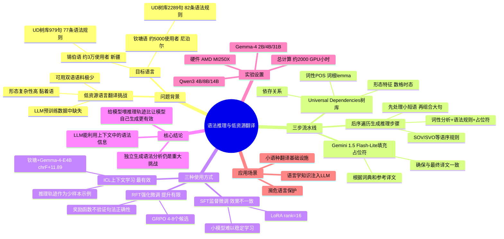

## 一、论文是干什么的？

全球约7,000种语言中，绝大多数是**低资源语言**——没有足够的电子文本和双语对照语料，即使是 GPT-4 这样的顶级模型在这些语言上也常束手无策。本文聚焦**极低资源翻译**场景：可用双语对照句仅几百至几千句，且这些语言未进入主流模型预训练数据。

**核心洞察：** 语言学家为很多小语种撰写了详细的语法书（Universal Dependencies 树库），记录了每个词的词性、形态特征、句法依存关系。这些知识能否帮助 LLM 翻译？本文通过自动生成"推理轨迹"的方式，系统验证了这个问题。

## 二、核心方法与创新

**三步自动化流水线——合成推理轨迹：**

**第一步：利用 Universal Dependencies（UD）树库**
UD 是跨语言统一的句法标注体系，覆盖150+语言，提供：词性（POS）、词根（lemma）、形态特征（数、格、时态、人称）、依存关系。

**第二步：后序遍历生成推理步骤**
用**后序遍历**（post-order traversal）遍历句法树——先处理小子树（短语），再把它们组合成大句子。每步包含：词的词性和形态分析、触发适用的语法规则、为词义插入占位符。

示例推理步骤（钦塘语）：
```
"phaktaba" 是动词（过去时、第三人称单数）
根据SOV语序规则，动词置于句末
占位符：[动词=走了]
组合：[主语=他] + [宾语=市场] + [动词=走了]
```

**第三步：用 Gemini 1.5 Flash-Lite 填充占位符**
根据词典条目和参考译文，填充具体词义和短语翻译，确保中间步骤与最终参考译文一致。

**三种使用方式及效果对比：**

| 使用方式 | 效果 | 原因 |
|---------|------|------|
| **ICL（上下文学习）** ⭐ | **最有效** | 推理轨迹作为少样本示例放入提示词 |
| SFT（监督微调）| 效果不一致 | 小模型难以从轨迹中稳定学习 |
| RFT（强化微调）| 提升有限 | 采样数量不足，奖励函数不验证句法正确性 |

**核心结论**：模型能利用上下文中的语法信息，但**独立生成这些分析仍是重大挑战**——给模型喂推理轨迹比让模型自己想出来效果好得多。

## 三、使用了哪些模型和计算资源？

**实验模型：**
- Qwen3 系列：Qwen3-4B-Thinking、Qwen3-8B-Instruct、Qwen3-14B-Instruct
- Gemma 4 系列：Gemma-4-E2B（约2B）、Gemma-4-E4B（约4B）、Gemma-4-31B-Instruct

**微调技术**：LoRA（rank=16，scaling factor=8，学习率 $1 \times 10^{-5}$，最多2000步）

**强化学习**：GRPO，每输入生成4-8个候选，奖励函数 = 0.75×chrF(0.55)+BLEU(0.15)+SBERT(0.25) + 0.10×格式奖励 + 0.15×过程奖励

**推理轨迹填充**：Gemini 1.5 Flash-Lite

**计算资源**：AMD MI250X，总计约 **2,000 GPU 小时**

**测试语言：**
- 锡伯语（Xibe，约3万母语使用者，中国新疆）：UD 树库979句，77条语法规则
- 钦塘语（Chintang，约5,000母语使用者，尼泊尔）：UD 树库2,289句，82条语法规则

## 四、实验结果

**ICL 最佳结果（与基线对比）：**

| 语言-模型 | BLEU | chrF | SBERT | LLMaJ |
|----------|------|------|-------|-------|
| 钦塘+Gemma-4-E4B | **+5.57** | **+11.89** | **+11.32** | **+18.51** |
| 西伯+Qwen3-14B | +1.59 | +1.84 | +4.30 | +5.18 |

**SFT 最佳结果（Qwen3-4B-Thinking，锡伯语）：**

| 指标 | 提升 |
|------|------|
| BLEU | +4.77 |
| chrF | +19.22 |
| SBERT | +15.19 |

RFT 在 SFT 基础上提升通常在 ±1 BLEU 以内。

## 五、潜在应用与已落地应用

1. **濒危语言保护**：锡伯语（约3万人）、钦塘语（约5,000人）都濒临消失，本方法在极少数据条件下构建翻译系统，助力语言遗产数字化保护
2. **小语种翻译**：只要有语法文档 + UD 树库，可推广到7,000种语言中的绝大多数
3. **语言学与 AI 跨界**：为语言学知识（语法规则、句法树）系统性注入 LLM 提供可行路径
4. **低资源 NLP 通用方法**：可推广至低资源信息抽取、低资源问答等任务

## 六、网络上的讨论与评价

2026年6月2日发布，尚无大量专题讨论。学术背景：同类研究 Tanzer et al.（ICLR 2025）发现"语法书对翻译帮助甚微，平行例句才是关键"；本文通过将语法书规则自动转化为结构化推理轨迹，提供了一种更有效的利用方式，是该方向的重要进展。同期 Frontull et al.（arXiv:2505.22293）发现句法覆盖率与翻译质量相关，与本文发现相互印证。作者团队曾发表 ACL 2025 满语机器翻译论文，有持续研究积累。

## 七、思维导图


