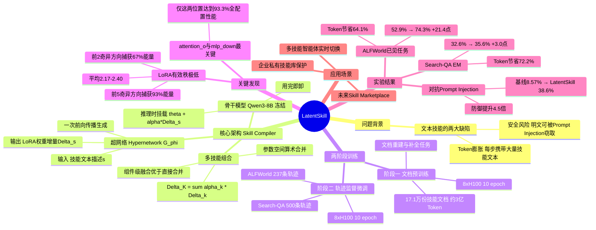

## 一、论文是干什么的？

现有 LLM 智能体系统依赖"文本技能"（Textual Skills）——用自然语言写成的可复用任务流程，每次推理时都把这些文字塞进提示词（prompt）。这引发两个核心问题：

- **Token 膨胀**：每步推理携带大量技能文本，消耗大量输入 Token，成本高且速度慢
- **安全风险**：技能明文出现在提示词中，容易被提示词注入攻击（Prompt Injection）窃取或篡改

LatentSkill 的方案是：**把技能直接编译为模型权重的增量（LoRA 适配器）**，推理时按需挂载，用完即卸，彻底消除上下文暴露问题。

## 二、核心方法与创新

**核心架构：技能编译器（Skill Compiler）**

系统的核心是一个预训练好的**超网络（Hypernetwork）**——一种专门生成另一个网络参数的神经网络。输入技能文字描述，超网络一次前向传播即输出对应的 LoRA 权重增量 $\Delta_s$。

推理流程：
1. 给定技能文本 $s$
2. 超网络计算 $\Delta_s = G_\phi(s)$（一次前向传播）
3. 将 LoRA 挂载到冻结的骨干模型（Qwen3-8B）：$\theta \oplus \alpha\Delta_s$
4. 完成任务后卸载 LoRA

**多技能组合**：$\Delta_K = \sum_{k \in K} \alpha_k \cdot \Delta_k$（参数空间算术合并）

**两阶段训练：**
- 阶段一：在17.1万份技能文档（约3亿Token）上做文档重建预训练，让超网络学会"读懂"技能描述
- 阶段二：在 ALFWorld（237条轨迹）+ Search-QA（500条轨迹）上做监督微调

**关键发现——低有效秩**：超网络生成的 LoRA 有效秩极低（平均2.17–2.40），前2个奇异方向捕获约67%能量，前5个捕获约93%。技能知识被高度压缩进极少数方向，信息密度极高。

**组件级融合**：多技能场景下，组件级融合（84.6%成功率）远优于直接权重合并（69.2%），前提是各技能 LoRA 覆盖相同的注意力模块位置。

## 三、使用了哪些模型和计算资源？

- **骨干模型**：Qwen3-8B（冻结，不参与训练）
- **超网络训练 GPU**：8 × H100
- **阶段一**：10 epoch，batch size 64，学习率 $5 \times 10^{-5}$，序列长度 4096
- **阶段二**：10 epoch，batch size 32，学习率 $1 \times 10^{-5}$
- **训练总时长**：论文未提及
- **LoRA 注入位置**：7个（attn_q/k/v/o，mlp_gate/up/down），关键位置为 attention_o 和 mlp_down

## 四、实验结果

**ALFWorld（具身导航任务）：**

| 数据集 | 基线（上下文技能） | LatentSkill | 提升 | Token 节省 |
|--------|-----------------|-------------|------|-----------|
| 已见任务 | 52.9% | 74.3% | +21.4 点 | -64.1% |
| 未见任务 | 56.0% | 69.4% | +13.4 点 | -64.1% |

**Search-QA（信息检索问答）：**

| 指标 | 基线 | LatentSkill | 提升 |
|------|------|-------------|------|
| 精确匹配（EM） | 32.6% | 35.6% | +3.0 点 |
| Token 开销 | 1.10k | 0.31k | -72.2% |

**对抗提示词注入攻击（ALFWorld）：**

| 方法 | 成功率（遭受攻击后） |
|------|-------------------|
| 上下文技能（基线）| 8.57% |
| LatentSkill | 38.6% |

防御能力约为基线的 **4.5倍**。

## 五、潜在应用与已落地应用

1. **企业私有技能库保护**：将专有工作流编译为 LoRA，不暴露内容即可部署，防止竞争对手通过提示词注入窃取
2. **多技能客服机器人**：按用户问题类型（退款/技术支持/投诉）实时切换技能模块，无需超长系统提示词
3. **降低 API 成本**：高频任务场景下 64–72% 的 Token 节省直接转化为 API 费用减少
4. **技能市场（Skill Marketplace）**：LoRA 本质是小文件，未来可能出现类似 App Store 的技能商店

## 六、网络上的讨论与评价

HuggingFace Papers 收录，2026年6月4日发布，公开讨论尚少。与技术路线相近的 Sakana AI Text-to-LoRA 系列曾获广泛关注；LatentSkill 在"智能体技能内化"这一2026年上半年热点研究方向中定位清晰——专为智能体技能管理设计，同时实现性能提升与Token节省双赢。同期相关工作（SKILL0、SkillRL、SHINE）活跃，证明该方向是当前研究热点。目前 Twitter/X 和 Reddit 上暂无可检索的专题讨论帖。

## 七、思维导图

