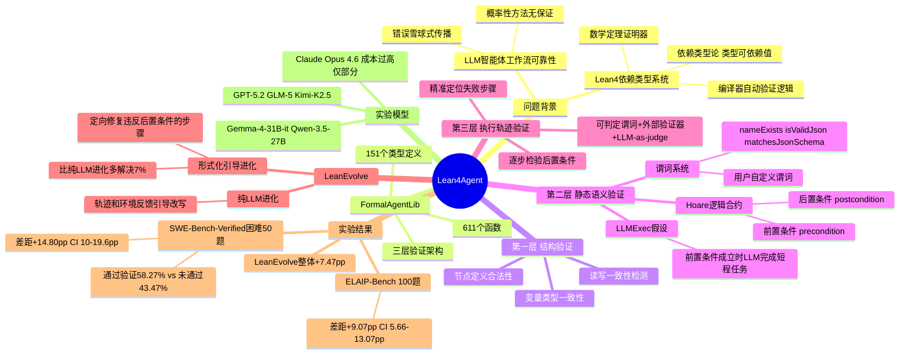

## 一、论文是干什么的？

随着 LLM 智能体被部署执行数十乃至数百步的复杂工作流（自动修复 Bug、阅读论文、多步推理），一个严峻问题出现：**任何一步出错都可能把错误"雪球式"滚到最后**。现有方法靠调 Prompt 或自我反思，都是概率性的，无法给出任何保证。

本论文将**形式化验证**（Formal Verification）引入 AI 智能体领域：用 Lean4 这门数学证明语言，在执行前对智能体工作流进行三层严格验证，并在执行后精准定位失败步骤。

**Lean4 是什么？** 微软研究院开发的定理证明器，基于依赖类型论（Dependent Type Theory）——能定义"长度恰好为5的有序列表"或"满足某逻辑条件的函数返回值"作为类型，让编译器自动验证逻辑正确性，不只是数据类型。

## 二、核心方法与创新

**FormalAgentLib（151个类型定义，611个函数）——三层验证：**

**第一层：结构验证（Structural Verification）**
检查工作流的"骨架"是否合法。通过类型系统检查变量类型、节点定义、状态转换一致性。如果某步骤想读取从未被写入的变量，会在执行前就被捕获（读写不一致检测）。

**第二层：静态语义验证（Static Semantic Verification）**
在实际执行之前验证工作流逻辑语义是否一致。核心是 **Hoare 逻辑合约**：每个步骤配有：
- **前置条件（precondition）**：执行前哪些变量必须满足什么条件
- **后置条件（postcondition）**：执行后哪些变量保证满足什么条件

关键假设（LLMExec）：前置条件成立时，LLM 能正确完成"短程任务"并满足后置条件。

谓词系统：`nameExists`、`isValidJson`、`matchesJsonSchema` 等可判定谓词 + 用户自定义谓词，支持分支、循环、子模块。

**第三层：执行轨迹验证（Execution Trajectory Verification）**
工作流运行完毕后，回溯分析实际执行路径，逐步检验后置条件，结合可判定谓词、外部验证器、LLM-as-judge 模块**精准定位失败步骤**。

**LeanEvolve——形式化引导的工作流进化：**
- **形式化引导进化**：用第三层轨迹分析找到违反后置条件的步骤，定向修改重写
- **纯 LLM 进化**：更广泛探索，用轨迹和环境反馈引导 LLM 逐步改写
- 消融实验：形式化引导进化比纯 LLM 进化平均多解决 **7%** 的问题

## 三、使用了哪些模型和计算资源？

**完整实验的5个 LLM：**
- GPT-5.2（OpenAI）
- GLM-5（智谱AI）
- Kimi-K2.5（月之暗面）
- Gemma-4-31B-it（Google）
- Qwen-3.5-27B（阿里巴巴）

**部分实验模型**：Claude Opus 4.6——因**调用成本过高**，无法运行全量实验，仅在 SWE-Bench 子集上参与评估。

**计算资源**：论文未提及 GPU 型号/数量/时长（无需训练，为推理实验）

## 四、实验结果

**SWE-Bench-Verified（50道困难GitHub Bug修复题，每题需>1小时）：**

| 工作流类型 | 解决率 |
|-----------|--------|
| 未通过形式化验证的工作流 | 43.47% |
| **通过形式化验证的工作流** | **58.27%** |
| **差距** | **+14.80%**（95% CI: 10.00%–19.60%）|

加入 LeanEvolve 后：56.93% → **64.40%**（整体提升 +7.47%）

**ELAIP-Bench（AI论文专家级理解，100题）：**

| 工作流类型 | 解决率 |
|-----------|--------|
| 未通过验证 | 27.53% |
| **通过验证** | **36.60%** |
| **差距** | **+9.07%**（95% CI: 5.66%–13.07%）|

**规律**：越小的模型，受形式化验证的提升越大——说明形式化验证对能力较弱的模型帮助更大。

## 五、潜在应用与已落地应用

1. **AI 软件工程**：代码修复智能体执行前验证计划逻辑，减少盲目尝试（直接对应 SWE-Bench 场景）
2. **金融合规与高风险决策**：用 Lean4 证明每个智能体动作符合监管规则才允许执行
3. **医疗决策支持**：确保诊断推理链满足医学逻辑约束
4. **AI 安全与对齐**：形式化描述智能体行为，用于可验证 AI 对齐——证明智能体在给定条件下"不会"做出某类危险行为
5. **自我改进 AI 系统**：根据形式化反馈不断优化，而非依赖人类反馈

**开源承诺**：作者承诺在论文发表后开源代码。

## 六、网络上的讨论与评价

2026年6月9日发布，目前尚无大量专题讨论。VentureBeat 等媒体已广泛报道 Lean4 在 AI 领域的崛起，认为"Lean4 正在成为 AI 最重要的安全网"。同期相关工作 Type-Checked Compliance（arXiv:2604.01483）、FormalJudge 等在社区中收到积极反响，"用形式化方法约束 LLM 智能体行为"被认为是解决 AI 可靠性问题的重要路径。第一作者 Ruida Wang 此前已有 ICLR 2026、ICML 2025 等顶会论文，在 Lean4+LLM 方向（TheoremLlama、GAR、MA-LoT等）积累了系统性工作。

## 七、思维导图

