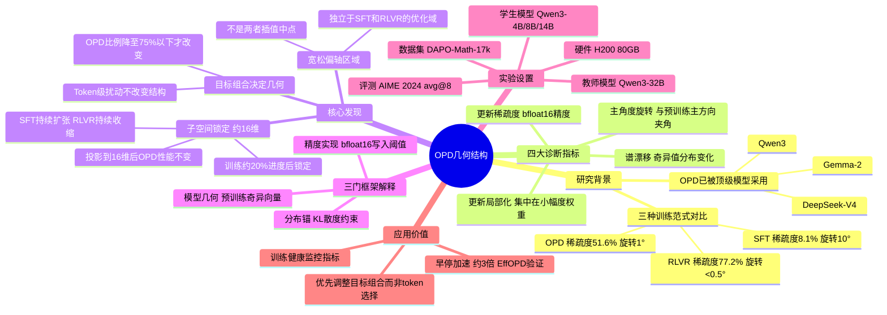

## 一、论文是干什么的？

在线策略蒸馏（OPD）是当前训练顶级大语言模型（如 DeepSeek-V4、Qwen3、Gemma-2、MiMo）的核心技术之一：学生模型先自己生成回答，再由更强的教师模型（如 Qwen3-32B）对每个词给出概率分布，学生去拟合这个分布。相比传统的有监督微调（SFT）或强化学习（RLVR），OPD 被认为兼具两者优势。

然而，**为什么 OPD 有效，它在训练过程中参数空间里到底发生了什么**，此前没有人研究清楚。本论文用四种"参数空间体检指标"，首次系统解剖 OPD 的几何结构，回答了这一基本问题。

## 二、核心方法与创新

论文对 Qwen3 系列模型的144个权重矩阵（36层×4种注意力权重）在训练过程中进行测量，使用四个指标：

- **更新稀疏度**：bfloat16精度下有多少权重数值实际发生变化
- **主角度旋转**：更新向量与预训练权重主方向的夹角
- **谱漂移**：权重矩阵奇异值分布的变化幅度
- **更新局部化**：更新量是否集中在小幅度权重区域

**三大核心发现：**

**1. OPD 处于"宽松偏轴区域"**：稀疏度51.6%（SFT仅8.1%，RLVR高达77.2%），主角度旋转约1°（SFT约10°，RLVR<0.5°）。OPD 不是 SFT 和 RLVR 的插值中点，而是一个独立的优化区域。

**2. 子空间锁定（Subspace Locking）**：OPD 训练开始约20%进度后，累积更新就锁定在约 **16维** 的极窄子空间内，此后整个训练稳定维持。将 OPD 梯度强行投影到这16维子空间，性能几乎不变；同样操作用于 SFT 则大幅下降。

**3. 目标组合决定几何**：Token 级别的扰动（选哪些词训练）不改变子空间结构；只有当 OPD 目标比例降到75%以下时，几何轨迹才发生根本改变。

论文用"三门框架"解释：分布锚（KL约束）+ 模型几何（预训练结构）+ 精度实现（bfloat16）共同塑造了 OPD 的独特几何特性。

## 三、使用了哪些模型和计算资源？

- **学生模型**：Qwen3-4B、Qwen3-8B（主要）、Qwen3-14B
- **教师模型**：Qwen3-32B（主要）、Qwen3-8B/14B/30B-A3B
- **GPU**：H200 80GB（论文明确提及，数量未说明）
- **训练步数**：OPD 299步；RLVR 1023步；SFT 5个epoch
- **学习率**：OPD/RLVR $10^{-6}$，SFT $10^{-5}$
- **训练时长**：论文未提及
- **训练数据**：DAPO-Math-17k（数学推理）

## 四、实验结果

评测基准：AIME 2024（avg@8，美国数学竞赛题）

| 训练方式 | 参数更新稀疏度 | 相对性能 |
|----------|--------------|---------|
| SFT | 8.1% | 最低 |
| OPD（8B→32B） | 51.6% | 中高 |
| RLVR（GRPO）| 77.2% | 最高（成本也最高）|

子空间维度验证：将 OPD 梯度投影到16维子空间后，AIME 性能几乎不变（相关工作验证可实现约3倍训练加速）。OPD 稀疏度在不同配置下非常稳定（48%–57%）。

## 五、潜在应用与已落地应用

1. **早停与效率优化**：子空间在训练约20%处锁定，可据此实现早期终止，相关工作（EffOPD）已验证约3倍训练加速
2. **训练健康监控**：4个诊断指标可实时检测 OPD 训练是否出轨，类似"参数空间体检"
3. **OPD 系统设计指导**：论文建议优先通过**目标组合**（而非调整 token 选择）来调控训练动态
4. **DeepSeek-V4、Qwen3、Gemma-2、MiMo** 等顶级模型均已采用 OPD 作为核心训练组件

## 六、网络上的讨论与评价

HuggingFace Papers 当日51个赞，1条社区评论。已被"awesome-on-policy-distillation" GitHub 仓库收录，定位为"对 OPD 进行参数空间诊断、揭示子空间锁定现象的重要工作"。同期独立发表的"Learning to Foresee"（arXiv:2605.11739）发现了高度吻合的"早期低秩锁定"现象，两篇论文相互印证，增强了结论可信度。综述论文《A Survey of On-Policy Distillation for LLMs》（arXiv:2604.00626）将本文列为重要理论贡献。X（Twitter）上研究者对 OPD 原理讨论活跃，但专门针对本文的公开帖子尚少。

## 七、思维导图

