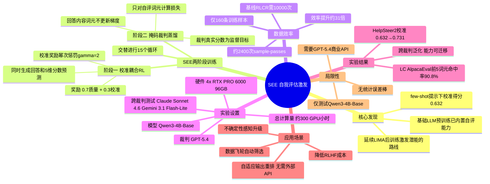

## 一、论文是干什么的？

训练大语言模型的标准流程越来越依赖"LLM 当裁判"——用 GPT-4 等模型评估回答质量，提供训练信号。一个自然的问题是：**模型能不能预测裁判 LLM 会给自己的回答打多少分？** 如果能，就可以大幅降低对昂贵外部 API 的依赖。

本文发现了一个重要事实：**基础大语言模型从预训练开始就已经内置了相当强的自我评估能力**，只是还没被激活。仅用 160 条训练样本就能把这种潜藏能力"唤醒"，数据效率约为现有方法的 31 倍。

这延续了"后训练主要是激发潜能，而非从零安装能力"的研究路线（类似 LIMA 等工作的核心洞见），并首次在"自我评估"这一元认知能力上验证了这一结论。

## 二、核心方法与创新

**先验发现：能力本已存在**

仅用少样本提示（few-shot prompting），Qwen3-4B-Base 在 HelpSteer2 验证集上的校准得分已达 **0.632**（远高于随机猜测），说明基础模型通过预训练已内化了判断回答质量的能力。

**SEE（Self-Evaluation Elicitation）——两阶段交替训练（共15个循环）：**

**阶段一：校准耦合强化学习（Calibration-Coupled RL）**

模型在生成回答时，同时预测外部裁判会在5个维度打多少分（HelpSteer2的属性：helpfulness、correctness、coherence、complexity、verbosity）。奖励函数：

$$R = 0.7 \times R_{\text{质量}} + 0.3 \times R_{\text{校准}}$$

校准奖励使用幂次惩罚（$\gamma=2$），大偏差受到额外惩罚。

**阶段二：掩码裁判蒸馏（Masked Judge Distillation）**

收集阶段一的滚动样本，用裁判的真实评分作为监督目标进行微调。**关键创新：只对"自评词元"计算损失，对回答内容的词元不施加任何梯度**——只练预测能力，不改写回答本身。

训练数据：仅 **160条** 唯一训练样本；通过8次滚动采样共约2,400次 sample-passes。基线方法（Adapted RLCR）需要约10,000次 sample-passes——**SEE效率约为基线的31倍**。

## 三、使用了哪些模型和计算资源？

- **被训练模型**：Qwen3-4B-Base（阿里通义千问，40亿参数）
- **外部裁判（监督信号）**：GPT-5.4
- **跨裁判鲁棒性测试**：Claude Sonnet 4.6、Gemini 3.1 Flash-Lite
- **评估基准**：HelpSteer2、LC AlpacaEval 2.0、Arena-Hard-Auto v2.0、WildBench v2
- **GPU**：4 × RTX PRO 6000（每块96GB显存）
- **训练框架**：VeRL（GRPO强化学习）+ vLLM（推理）
- **总计算量**：约 **300 GPU小时**（所有实验之和）

## 四、实验结果

**质量与校准双提升（HelpSteer2）：**

| 指标 | 基础模型（未训练）| SEE 训练后 |
|------|----------------|-----------|
| 质量得分 | 0.644 | **0.704** |
| 校准得分 | 0.632 | **0.731** |
| 质量胜率 | — | **67.1%** |
| 校准胜率 | — | **70.0%** |

**Token 级别预测精度：**
- 裁判真实分数出现在预测概率前5个词元中的概率：
  - HelpSteer2：**87.8%**
  - LC AlpacaEval：**90.8%**

**跨裁判泛化**：换用 Claude Sonnet 4.6 和 Gemini 3.1 Flash-Lite 打分，校准能力依然保持，说明模型学到的是对**回答质量的通用判断能力**，而非记住某个特定裁判的偏好。

## 五、潜在应用与已落地应用

1. **自适应输出重排**：模型自己预测哪个候选回答得分最高，无需调用外部裁判 API
2. **不确定性感知升级**：预测到自身回答质量低时，主动请求更强模型介入
3. **降低 RLHF/后训练成本**：用自评能力替代部分外部奖励模型，降低后训练成本
4. **数据飞轮**：自动筛选高质量自生成样本，减少人工标注需求

**局限性（作者自承）**：仅在 Qwen3-4B-Base 上验证，未测试 Llama、Mistral 等；外部裁判为 GPT-5.4（需商业 API）；无统计误差棒；仅测试了160条样本的设置。

## 六、网络上的讨论与评价

HuggingFace Papers 收录（2026年6月3日），"31倍数据效率"是吸引眼球的核心数字，预计会在模型对齐和评估社区引发关注。论文解决的问题（减少对外部裁判依赖）商业价值显著。目前 Reddit/Twitter 尚无可检索的专题讨论，可直接在 huggingface.co/papers/2606.05122 跟踪最新评论。

## 七、思维导图

