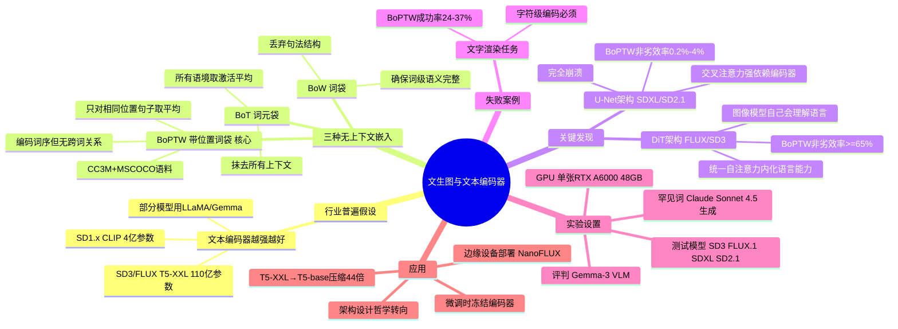

## 一、论文是干什么的？

文生图模型（如 FLUX、SD3）通常同时使用 T5-XXL（110亿参数）和 CLIP 作为文本编码器，业界普遍认为文本编码器越强越好。从早期 SD 1.x 的 CLIP（4亿参数）到 SD3/FLUX 的 T5-XXL，再到用 LLaMA/Gemma 作为编码器，这一趋势一直延续。

本论文提出核心质疑：**图像模型真的利用了文本编码器中那些丰富的上下文信息（语法结构、语义关系）吗？** 通过构造"故意去掉上下文信息"的嵌入，作者发现：在现代 Diffusion Transformer（DiT）架构中，答案是——**大部分时候没有利用**。

## 二、核心方法与创新

**三种递进复杂度的"无上下文嵌入"：**

**1. Bag of Tokens（BoT，词元袋）**
对每个 token 在语料库所有包含该 token 的句子中取激活平均值。抹去所有语境，只保留最通用的词元含义。

**2. Bag of Words（BoW，词袋）**
在 BoT 基础上，确保多 token 词的词义完整性（区分"workhouse"和"housework"）。保留单词含义，但丢弃句子级语法和组合信息。

**3. Bag of Position-Tagged Words（BoPTW，带位置的词袋）⭐ 核心**
进一步要求只对"词出现在与提示词相同位置的句子"取平均，把词序信息锚定进去。结果：只编码"每个位置上出现了哪个词"，完全没有跨词的上下文关系（主谓宾结构、属性绑定等）。

构造语料：CC3M + MSCOCO-2017 数据集；罕见词用 Claude Sonnet 4.5 生成额外例句。

**核心发现——架构差异是关键：**

| 架构 | BoPTW 非劣效率 | 结论 |
|------|--------------|------|
| **Diffusion Transformer（FLUX、SD3）** | **≥65%**（完整嵌入70-90%）| 图像模型自己会理解语言 |
| **U-Net（SDXL、SD2.1）** | **0.2%-4%**（完全崩溃）| 强依赖文本编码器上下文 |

**原因**：DiT 通过统一的自注意力机制，已在图像模型内部"学会了"语言理解能力；U-Net 的交叉注意力设计对文本编码器的上下文信息有强依赖。

## 三、使用了哪些模型和计算资源？

- **测试的文生图模型**：Stable Diffusion 3、FLUX.1 Schnell、FLUX.2 Klein-4B、SDXL、SD 2.1
- **评判模型**：Gemma-3 视觉语言模型（作为 LLM-as-Judge）
- **评估数据集**：DrawBench、GenEval、MS-COCO 2014（3万张图像验证集）
- **罕见词例句生成**：Claude Sonnet 4.5
- **计算资源**：单张 **NVIDIA RTX A6000（48GB显存）**
- **方法不需要重新训练**：仅推理时替换嵌入，计算代价较低

## 四、实验结果

**非劣效率（使用简化嵌入的图像质量不劣于完整嵌入的概率）：**

| 嵌入类型 | DiT（FLUX/SD3）| U-Net（SDXL/SD2.1）|
|---------|--------------|-------------------|
| 完整嵌入（基线） | 70%–90% | 70%–90% |
| BoPTW | **≥65%** | 0.2%–4% |
| BoW | >50% | 极低 |
| BoT | ~40% | 极低 |

**失败案例**：文字渲染任务（"生成写有'Hello'的牌子"），BoPTW 成功率仅 24%–37%，远低于完整嵌入——字符级精确编码无法用位置化词袋实现。

## 五、潜在应用与已落地应用

1. **模型压缩**：T5-XXL（110亿参数）→ T5-base（2.5亿参数，缩小44倍），相关工作"Scaling Down Text Encoders"已证明保留97%性能
2. **边缘设备部署**：更小的文本编码器让手机/嵌入式设备运行 FLUX 级别模型成为可能（NanoFLUX 等工作在探索）
3. **微调效率**：微调文生图模型时可冻结文本编码器，只训练图像模型部分
4. **架构设计指导**：未来文生图模型应把资源投入到提升图像模型语言理解能力，而非堆大编码器

## 六、网络上的讨论与评价

社区普遍认为这是"反直觉的深刻洞察"，与用户日常体验（FLUX 用乱序 prompt 也能出好图）相印证。争议焦点：65% vs 70%-90%仍有可观差距；文字渲染的硬伤；U-Net 架构（SDXL 仍被大量用户使用）完全不适用。部分研究者认为：这可能反映的是**训练方法的不足**，而非文本编码器本身无用——未来更好的训练策略可能会改变这一结论。论文网站：nsping13.github.io/contextless-TTI/

## 七、思维导图

