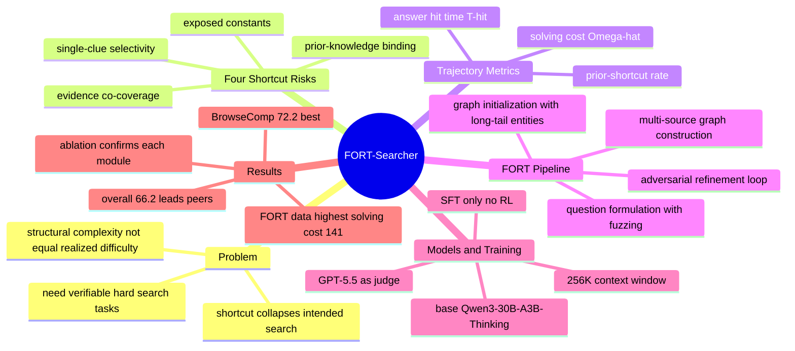

## 一、论文是干什么的？

想象你在训练一个会上网帮你查资料的 AI 助手（也就是**深度搜索智能体**，deep search agent）。你希望它学会像一名认真的研究员那样：一步步搜索、交叉比对很多线索，最后才得出可靠答案。要训练它，你得先准备大量"练习题"——这些题目应该足够难，逼着 AI 真的去多轮搜索。

但问题来了：很多现有的方法把题目设计得"看起来很复杂"（比如牵扯一大堆实体和关系），却没保证 AI 真的得费劲去搜。就好比一道数学应用题写了五段背景，但其实第一行就泄露了答案，学生瞄一眼就能蒙对。论文把这种"题目本应很难、实际却能抄近道做出来"的现象叫做**捷径**（shortcut）。这篇论文要解决的就是：如何系统性地堵住这些捷径，造出真正"防作弊"的训练题，从而训练出更强的搜索智能体。作者把这套合成框架命名为 **FORT**，用它训练出的模型叫 **FORT-Searcher**。

## 二、核心方法与创新

论文的第一个核心贡献，是把"捷径"这件模糊的事讲清楚了。作者归纳出四种典型的"抄近道"风险：

- **单线索选择性**（single-clue selectivity）：某一条线索太"独特"了，一下子就把候选答案缩到极小范围。好比侦探题里只要看到"独臂的左撇子钢琴家"，凶手立刻锁定，根本不用看其他证据。
- **证据共覆盖**（evidence co-coverage）：一次检索就同时验证了好几个本应分开查的条件。就像翻开一页恰好把三道题答案都印在了一起。
- **暴露常量**（exposed constants）：本该靠搜索才能发现的中间名字、日期、数字，直接写在题目表面上了，于是少了好几步推理。
- **先验知识绑定**（prior-knowledge binding）：模型靠"背过的知识"在还没真正检索证据前就脱口说出了答案，属于"凭记忆作弊"。

第二个贡献是用三个可观测的"轨迹指标"来量化题目到底有多难（不是看题目长相，而是看 AI 实际解题过程）：

- **实际求解成本**（realized solving cost）$\hat{\Omega}=\frac{1}{N}\sum|\tau_i|$，即成功轨迹里平均要调用多少次检索。
- **答案命中时间**（answer hit time）$\bar{T}_{hit}$，即答案第一次出现在第几步——越靠后说明越需要长搜索。
- **先验捷径率**（prior-shortcut rate）$\hat{p}_{prior}=\frac{1}{N}\sum\mathbb{1}[T_{model}(\tau_i)<T_{tool}(\tau_i)]$，即有多少比例的题是模型"先于证据"说出答案的（即凭记忆蒙对）。

第三个贡献是 FORT 合成流水线，分四个阶段，每一步都针对性地堵捷径：

1. **图初始化**：从 Wikidata 选"长尾"冷门实体（最好连英文维基都没有），降低模型凭记忆作弊的可能；并用预先挖好的环状结构避免线索被一条直线串起来。
2. **图构建**：从多种异构来源（Wikidata、网页、数据库、Google Scholar、Google Maps）取证据，避免一次检索覆盖多个条件；再用"巧合桥接、计数聚合、数值关系、元事实抽取"四种构造器衍生新事实；并刻意挑选那种"可靠但不太典型、单独无法锁定目标"的事实，避免单线索选择性。
3. **问题构造**：把中间实体名替换成泛化表达（如"那位艺术家""那家机构"），再用五种"模糊化"策略（类别泛化、范围放宽、元属性描述、算术编码、对比排除）把暴露的精确值藏起来。
4. **对抗精炼**（adversarial refinement）：用一个强搜索智能体真去做每道草稿题，观察它的解题轨迹。若题被秒杀（捷径过多），就替换共覆盖证据、删掉选择性事实；若题完全无解（模糊过头），就收紧线索、恢复必要约束。这一步是"用实战检验来反复打磨题目"。

简单说，FORT 就像一位极其严格的出题老师：先想清楚学生有哪几种抄近道的办法，然后逐一封死，最后还亲自找个学霸来试做、按反馈改题。

## 三、使用了哪些模型和计算资源？

- **基座模型**（base model）：Qwen3-30B-A3B-Thinking-2507，这是一个 MoE 模型，总参数 30B、推理时仅激活约 3B，上下文窗口 256K。
- **训练方式**：仅用监督微调（supervised fine-tuning, SFT），在 FORT 合成的轨迹数据上训练。
- **裁判/标注模型**：GPT-5.5，用于轨迹标注与实体一致性验证。
- **训练超参**：6 个 epoch，全局 batch size 64，最大序列长度 262,144；Adam 优化器（$\beta_1=0.9$，$\beta_2=0.95$，$\epsilon=10^{-8}$，权重衰减 0.01）；余弦学习率（峰值 $2\times10^{-5}$，最低 $10^{-7}$，2 步 warmup）；bf16 精度，梯度裁剪 1.0。
- **并行策略**：张量并行 4、专家并行 4、流水并行 1、上下文并行 1，并启用序列并行与激活重计算。
- **数据规模**：分析实验用到 12K 条样本、消融实验用 2K 条问题；论文未明确公布 FORT 数据集的总规模与确切 GPU 算力小时数（暂无相关信息）。
- **代码地址**：https://github.com/RUCAIBox/FORT-Searcher

## 四、实验结果

在与同规模开源智能体的对比中（综合多个深度搜索基准），FORT-Searcher 拿到了最佳综合分。

| 模型 | BrowseComp | BC-ZH | xbench-05 | xbench-10 | Seal-0 | 综合 |
|------|-----------|-------|-----------|-----------|--------|------|
| FORT-Searcher | 72.2 | 75.0 | 80.8 | 57.2 | 46.0 | 66.2 |
| MiroThinker-1.7-mini | 67.9 | 72.3 | 77.2 | 57.2 | 48.2 | 64.6 |
| Qwen3.5-35B-A3B | 61.0 | 69.5 | 77.4 | 50.3 | 41.4 | 59.9 |
| OpenSeekerV2 | 46.0 | 58.1 | 78.0 | 43.4 | 41.4 | 53.4 |

综合分上 FORT-Searcher 比 MiroThinker 高 1.6 分，比 Qwen3.5-35B-A3B 高 6.3 分。在 BrowseComp 上从 67.9 提升到 72.2，BrowseComp-ZH 从 72.3 提升到 75.0。值得注意的是它推理时只激活约 3B 参数、且只用了 SFT，却能和更大的开源智能体掰手腕。

几个关键发现：

- **数据难度对照**：用同一个强智能体去做各数据集 200 道题，FORT 的实际求解成本 $\hat{\Omega}$ 高达 141.0，远超 InfoSeek（20.6）、DeepDive（47.7）、OpenSeeker（84.7）等；且答案命中时间最晚（46.9），证明 FORT 题目确实"逼着多搜"。
- **同长度不同难度**：在轨迹长度都约为 140 的情况下，FORT 数据因为答案暴露得更晚（$T_{hit}=47.0$ 对比开源数据的 22.3），训练效果更好（BrowseComp 52.9 对比 49.5）。
- **消融实验**：逐项去掉抗捷径组件后，题目准确率（被秒杀程度）一路从 29.0 飙到 81.6，其中"去掉模糊化"导致难度下降最大，说明每个堵捷径模块都真有用。
- **对抗精炼有效**：被秒杀的草稿题经精炼后，求解成本从 33.9 升到 82.7；原本无解的题精炼后也变得可解（成本 123.0）。
- **上下文管理**：在达到轮次上限后清空历史、从原问题重启的策略，在 BrowseComp 上带来 +16.3 的显著提升。

## 五、潜在应用与已落地应用

- **训练更强的搜索/研究类智能体**：FORT 提供的是一套"造好题"的方法论，可直接用于训练各类需要多轮检索的 deep research 助手。
- **数据合成工具链**：四类捷径风险 + 三个轨迹指标，可作为任何团队评估自家训练数据"是否真的够难"的诊断标准。
- **基准与评测**：论文揭示了"结构复杂 ≠ 实际难"，对设计更可靠的搜索智能体评测集有参考价值。
- 论文与代码已开源（RUCAIBox/FORT-Searcher），属于研究阶段成果；目前暂无大规模商业产品落地的公开信息（暂无相关信息）。

## 六、网络上的讨论与评价

该论文在 HuggingFace Papers 上获得 17 票。由于论文非常新（2026 年 6 月提交），目前公开的深入第三方评测与社区讨论较少（暂无相关信息）。从已有信息看，外界关注点主要集中在两方面：一是它"仅靠 SFT、推理激活约 3B 参数"就能在 BrowseComp、BrowseComp-ZH、xbench-DeepSearch、Seal-0 等高难基准上达到同规模领先甚至与更大模型竞争，性价比亮眼；二是它对"结构复杂不等于实际搜索难度"这一痛点的清晰刻画，被认为对深度搜索数据合成方向具有方法论价值。

## 七、思维导图

