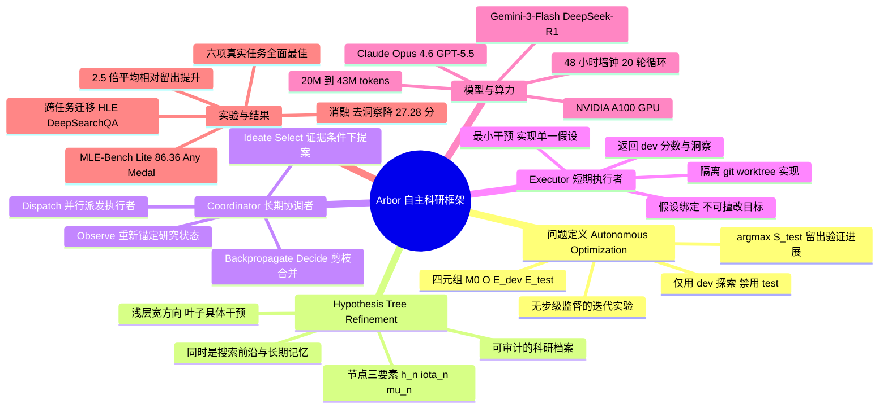

## 一、论文是干什么的？

想象你是一个新手研究员，老板给你一个初步的代码项目，让你想办法把它的某项指标做得更好（比如让模型训练更快、让一个搜索智能体回答得更准）。你会怎么做？你会先猜一个改进方向，写代码试一试，看结果好不好，然后根据结果再调整下一步的猜测。这个"猜测—实验—总结—再猜测"的循环，正是科研的核心。

这篇论文要解决的问题是：**能不能让 AI 智能体自己完成这整套循环，而且做得又久又好？** 现在的 AI 编程助手（如 Codex、Claude Code）能写代码、跑实验，但它们更像是"埋头干活的临时工"——尝试很多次，却记不住前面踩过的坑，每次都从头摸索，时间一长就乱了方寸。论文提出的系统叫 **Arbor**（拉丁语意为"树"），它的核心思路是：给 AI 装一棵"假设树"作为长期记忆和作战地图，把成百上千次零散的局部尝试，组织成一个能不断累积经验、越做越聪明的科研过程。论文把这类任务正式命名为**自主优化**（Autonomous Optimization，简称 AO）。

## 二、核心方法与创新

Arbor 的设计可以用一个"科研团队"来类比，它把工作拆成三块：一个**协调者**（Coordinator）、若干**执行者**（Executor），以及一棵贯穿始终的**假设树精炼**（Hypothesis Tree Refinement，简称 HTR）结构。

**假设树是什么？** 把它想象成一棵决策树，每个节点代表一个"待验证的科研猜想"。靠近树根的节点是宽泛的大方向（比如"也许换个优化器会更好"），越往叶子走越具体（比如"把学习率从 0.01 调到 0.005"）。每个节点存三样东西：

- **假设**（$h_n$）：一个可以被实验验证的明确主张。
- **洞察**（$\iota_n$）：从实验证据里提炼出的、可复用的经验教训——试了什么、结果如何、有什么约束条件。
- **元数据**（$\mu_n$）：节点状态、开发集得分、实验结果、对应的 git 分支等。

这棵树同时扮演三个角色：**搜索前沿**（决定下一步往哪试）、**长期记忆**（记住所有经验）和**可审计的科研档案**（每一步都可追溯）。

**协调者**是"长期在岗的项目主管"，它循环执行六个动作：观察当前树的状态（Observe）、提出新的子假设（Ideate）、挑选要执行的节点（Select）、并行派发给执行者（Dispatch）、把返回的证据写回树并向上传播洞察（Backpropagate）、最后决定扩展、剪枝还是合并分支（Decide）。

**执行者**是"短期的临时工"，每个只领一个假设，在一个隔离的 git 工作区里做最小改动来实现这个假设，跑开发集评测，必要时修复代码（但不能擅自改假设），最后把得分和提炼的洞察交回去。这种"假设绑定"机制很关键——执行者不能因为指标卡住就偷偷换目标，从而保证了树上每个更新的语义都是干净可信的。

**最大的创新在于"开发集 / 留出测试集"的纪律。** 一个 AO 任务被定义为四元组 $\mathcal{P}=(\mathcal{M}_0, \mathcal{O}, \mathcal{E}_{dev}, \mathcal{E}_{test})$，分别是初始项目、优化目标、开发评测器和留出测试评测器。智能体探索时只能用开发集，绝不能碰测试集；只有通过留出测试集这道"准入闸门"的改进才会被合并进最终成果。这就避免了"在练习题上刷高分、真考试却翻车"的过拟合问题。跨任务比较时用归一化的留出提升来衡量：

$$

\Delta_{test}(\mathcal{M}^*) = \frac{\tilde{S}_{test}(\mathcal{M}^*) - \tilde{S}_{test}(\mathcal{M}_0)}{|\tilde{S}_{test}(\mathcal{M}_0)| + \epsilon}

$$

一句话总结创新点：**靠"组织管理"而非"堆算力"取胜**——同样的 token 预算，Arbor 因为有了树状的经验累积，效果远超线性的反复尝试。

## 三、使用了哪些模型和计算资源？

- **测试的大模型骨干**（LLM backbone）：Claude Opus 4.6（主力）、GPT-5.5、Gemini-3-Flash，以及作为对比的 DeepSeek-R1。MLE-Bench Lite 上的最佳成绩用 GPT-5.5 取得。
- **GPU**：MLE-Bench Lite 评测使用 NVIDIA A100 GPU。
- **时间预算**：真实科研任务设定 48 小时的墙钟时间上限。
- **默认配置**：协调者循环 20 轮，假设树最大深度为 2，执行者并行度受评测资源限制。
- **Token 消耗**：六次完整运行约消耗 20.12M 至 43.19M tokens，与单轨迹基线（Codex、Claude Code）相当。
- **数据集 / 基准规模**：六项真实任务的开发 / 测试切分各不相同，例如 Terminal-Bench 2.0 为 36 开发 / 53 测试，BrowseComp 为 50 开发 / 300 测试；外加公开基准 MLE-Bench Lite。

## 四、实验结果

论文在**六项真实科研任务**上让 Arbor 与 Codex（GPT-5.5）、Claude Code（Claude Opus 4.6）在相同接口、评测器和资源预算下正面对决。Arbor 在全部六项任务上都拿到最佳的留出测试结果，平均相对留出提升超过对手的 **2.5 倍**。

| 任务 | 指标（方向） | 初始 | Codex | Claude Code | Arbor |
|------|------|------|------|------|------|
| Optimizer Design | 步数（↓） | 3325 | 3325 | 3287.5 | 3237.5 |
| Architecture Design | 最终 loss（↓） | — | 1.083 | 1.033 | 1.028 |
| Terminal-Bench 2.0 | 通过率（↑） | 69.81% | 73.59% | 71.70% | 77.36% |
| BrowseComp | 准确率（↑） | 45.33% | 50% | 53.33% | 67.67% |
| Search-Agent 数据合成 | 差距（↑） | 5 | 9 | 12 | 18 |
| Math-Reasoning 数据合成 | 差距（↑） | 1.04 | 6.25 | 8.33 | 20.83 |

在公开基准 **MLE-Bench Lite** 上，用 GPT-5.5 的 Arbor 拿到了 **86.36% 的任意奖牌率**（Any Medal），是榜单最高；有效提交 100%，超过中位数 95.45%，金牌率 77.27%。换 Gemini-3-Flash 时任意奖牌率为 81.82%。

**消融实验**很有说服力（MLE-Bench Lite，任意奖牌率）：完整 Arbor 为 81.82%；去掉树结构变成扁平队列后掉到 63.64%（降 18.18 分）；去掉洞察反馈后掉到 54.54%（降 27.28 分）。可见**洞察传播比树结构本身更重要，两者互补**。

此外还有一个有趣的发现：在 Terminal-Bench 上，Claude Code 的开发集得分（75%）反而比测试集（71.70%）高，暴露了过拟合；而 Arbor 开发集得分更低（72.22%）测试集却更高（77.36%），说明它的留出闸门确实挡住了"虚假的好成绩"。BrowseComp 上优化好的搜索框架还能迁移到没见过的 HLE（+6.0）和 DeepSearchQA（+8.0）基准上。

## 五、潜在应用与已落地应用

Arbor 面向的是"需要长时间反复实验才能优化"的开放式科研工程任务，潜在应用覆盖论文验证的几大类：

- **模型训练**：自动设计优化器、自动搜索神经网络架构。
- **智能体框架工程**：自动改进终端操作智能体（Terminal-Bench）、深度搜索问答智能体（BrowseComp）。
- **数据合成**：自动设计搜索智能体训练数据、数学推理（AIME 风格）题目生成管线。
- **机器学习工程竞赛**：MLE-Bench Lite 中的端到端 Kaggle 式建模任务。

已落地方面，作者团队已开源完整系统：提供命令行工具（CLI）、代码与文档，发布在 [GitHub](https://github.com/RUC-NLPIR/Arbor) 并配有[项目主页](https://ruc-nlpir.github.io/Arbor/)，定位为可直接使用的实用系统而非单纯的研究演示。

## 六、网络上的讨论与评价

- 论文在 HuggingFace Papers 上获得 108 票，关注度较高。
- 科技媒体 Digg 的报道将其总结为"在 6 项研究任务上击败 Codex 和 Claude Code，并在 MLE-Bench Lite 上达到 86% 任意奖牌率"。有评论者称其方法是"有条理的搜索"，并感叹"token 预测永远赢不过系统化的探索"。
- 也有持保留态度的声音：有观察者质疑评测透明度，希望看到失败尝试的"难看轨迹"（ugly trace）而不仅是成功结果，并追问智能体究竟是"真的学到了科研策略，还是只是靠反复重试碰运气"。
- 该工作被相近综述（如《From AI for Science to Agentic Science》）归入"自主科学发现 / 智能体科学"这一活跃方向，与 OR-Agent 等结合进化搜索与结构化研究的工作相呼应。

## 七、思维导图

---

**参考来源：**
- [arXiv 摘要页](https://arxiv.org/abs/2606.11926)
- [arXiv 全文 HTML](https://arxiv.org/html/2606.11926)
- [项目主页](https://ruc-nlpir.github.io/Arbor/)
- [GitHub 仓库](https://github.com/RUC-NLPIR/Arbor)
- [Digg 报道](https://digg.com/tech/jshcy2l8)
