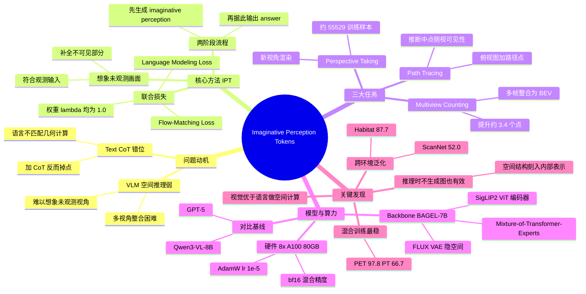

## 一、论文是干什么的？

想象一下，你站在一个房间里，朋友问你：「如果你走到对面的门口回头看，能看到桌子上的杯子吗？」你不会用一长串文字去推理，而是会在脑子里「想象」一个画面：站在门口往回看时房间大概是什么样子。这种「闭上眼睛在脑中模拟一个看不见的视角」的能力，就是人类空间推理的核心。

可惜，现在的多模态大模型（既能看图又能说话的 AI）在这件事上很吃力。它们擅长描述「眼前看得见的东西」，但一旦问题涉及「换个角度会看到什么」「沿着这条路走过去会不会被挡住」「把好几张照片拼起来一共有几个物体」这类**需要想象未观测画面**的问题，就经常出错。过去大家让模型用「文字思维链」（Chain-of-Thought，即一步步用文字推理）来解决，但作者发现：用语言去描述几何空间关系，本身就是一种「错位」——空间是图像，硬要翻译成文字反而越说越乱。

这篇论文提出了一个很直观的解决思路：既然空间推理本质是视觉的，那就让模型**先在脑中「画」出那个看不见的画面，再据此回答**。这个被画出来的中间画面，作者称之为「想象式感知 Token」（Imaginative Perception Tokens，简称 IPT）。

## 二、核心方法与创新

核心想法可以用「先打草稿再答题」来类比。普通模型是「看一眼题目直接写答案」，而本文的模型是「先在草稿纸上把看不见的那个视角画出来，再看着草稿写答案」。这张草稿就是 IPT。

**关键区别**在于：传统的视觉中间表示（比如分割图、深度图）只是把**已经看得见**的东西描绘得更清楚；而 IPT 描绘的是**根本没看见**的东西——比如换个视角后的场景、走到半路时的侧视图。它要满足两个条件：既要符合已观测到的输入信息（不能瞎画），又要补全未观测的部分。

整个流程拆成两步：
1. 先生成想象画面：$P(\hat{I}_{imag} \mid I_{obs}, Q)$（根据观测图像和问题，画出想象的视角）
2. 再根据想象画面给出答案：$P(A \mid I_{obs}, Q, \hat{I}_{imag})$

训练时用两个损失函数联合优化。一个是负责「画得像」的**流匹配损失**（Flow-Matching Loss），让生成的图像逼近真实的中间想象图：

$$
L_{fm} = \mathbb{E}\left[\left\| v_t(G_t \mid C) - (G_{gt} - G_0) \right\|^2\right]
$$

另一个是负责「答得对」的**语言建模损失**（Language Modeling Loss）：

$$
L_{lm} = -\sum_i \log P(a_i \mid C, U_{gt}, G_{gt}, a_{<i})
$$

最终目标是两者加权求和（两个权重 $\lambda$ 都设为 1.0）：

$$
L_{total} = \lambda_{fm} \cdot L_{fm} + \lambda_{lm} \cdot L_{lm}
$$

为了训练和评测，作者专门构建了三类需要「想象」的任务，每类约 2 万个带「标准答案想象图」的样本：

- **视角变换**（Perspective Taking）：给第一人称视角，预测换到新位置后看到的画面。
- **路径追踪**（Path Tracing）：给俯视地图和路径点，推断沿途某点的侧视画面，判断可见性。
- **多视角计数**（Multiview Counting）：把多张局部第一人称照片整合成一张俯视鸟瞰图（BEV），从而正确数物体。

**最有意思的发现**是：即使在推理时**不真的去生成图像**（只用想象目标做过训练），模型的空间推理能力依然更强。这说明「用想象目标训练」这件事，实质上是把空间结构「刻进」了模型的内部表示里，画图只是训练时的脚手架。

## 三、使用了哪些模型和计算资源？

- **主干模型**：BAGEL-7B，一个统一的 decoder-only Transformer，采用 Mixture-of-Transformer-Experts（混合 Transformer 专家）设计。其中理解类 Token 由 SigLIP2 ViT 编码器产生，生成类 Token 来自 FLUX VAE 的隐空间，所有层共享自注意力以实现无损的多模态交互。
- **对比模型**：GPT-5、Qwen3-VL-8B 等作为基线。
- **GPU**：8 张 NVIDIA A100 80GB。
- **优化器与超参**：AdamW，学习率 $1\times10^{-5}$，warmup 2000 步，最大批量 32768 tokens，使用 bf16 混合精度。
- **数据集规模**：视角变换约 55529 条、路径追踪约 11204 条、多视角计数约 19499 条训练样本（论文摘要统一称「每类约 2 万」，正文给出的是更细分的数字）；环境涵盖 AI2-THOR、Habitat 等模拟器以及真实场景。
- **训练时长**：暂无相关信息（提供的全文内容中未明确给出）。

## 四、实验结果

简单说：**让模型先想象、再回答，比用文字一步步推理更靠谱**，尤其在多视角计数任务上提升明显。

下表是在 AI2-THOR 模拟器同分布场景下的准确率（PET=视角变换，PT=路径追踪，MVC=多视角计数）：

| 模型 | PET | PT | MVC |
|------|-----|----|----|
| GPT-5 | 79.8% | 60.2% | 53.5% |
| Qwen3-VL-8B | 52.0% | 35.9% | 43.8% |
| BAGEL（仅标签训练） | 97.5% | 65.7% | 63.9% |
| + 文本思维链（Text CoT） | 83.1% | 49.7% | 62.3% |
| + IPT（想象式感知 Token） | 96.8% | 49.0% | 67.3% |
| + 混合训练（Mixed Training） | 97.8% | 66.7% | 62.3% |

几个关键结论：
- **文本思维链反而会拖后腿**：加了 Text CoT 后，PET 从 97.5% 掉到 83.1%，PT 从 65.7% 掉到 49.7%，印证了「用语言做空间推理是一种错位」。
- **IPT 在多视角计数上提升约 3.4%**（63.9% → 67.3%），且整体优于文本思维链。
- **混合训练**（同时用标签和想象目标）效果最稳，PET 达 97.8%、PT 达 66.7%。

跨环境迁移也表现不错：
- Habitat 视角变换：87.7%（混合训练）
- 真实场景路径追踪：58.6%（混合训练，对比仅标签的 54.7%）
- SAT 视角变换：63.6%（混合训练）

外部基准上，微调后的 BAGEL 在 ScanNet 上达 52.0%（基线 40.5%），MindCube 47.5%，All-Angles-Bench 50.0%，说明在模拟器里学到的空间表示能泛化到不同任务结构。

消融实验还揭示：想象图的分辨率越高效果越好（PET 从 Latent-4 的 87.4% 升到 Latent-64 的 96.8%）；若直接喂入「标准答案想象图」，路径追踪能再涨 36.3 个点，说明天花板还很高。

## 五、潜在应用与已落地应用

**潜在应用方向**：
- **机器人与具身智能**：机器人需要预判「走过去后会看到/被挡住什么」，IPT 的路径追踪和视角变换能力天然契合导航与抓取规划。
- **AR/VR 与室内场景理解**：根据局部观测重建鸟瞰图，可用于房间布局理解、家居设计辅助。
- **自动驾驶的多视角融合**：把多个摄像头的局部画面整合成统一空间地图（与多视角计数任务思路一致）。
- **可解释 AI**：IPT 生成的中间图像本身就是可视化的「思考过程」，比文字推理更直观，便于人类核查模型为何这样回答。

**已落地应用**：暂无相关信息。该工作为研究阶段成果，作为预印本发布并被 CVPR 2026 的 MUSI Workshop 接收，尚未见明确的产品化落地案例。

## 六、网络上的讨论与评价

该论文在 HuggingFace Papers 上获得 36 票，关注度中等偏上。从可检索到的信息看：

- **发表渠道**：被 CVPR 2026 的 MUSI Workshop 接收，作者之一 Jaemin Cho 在个人主页列出了该成果，许可为 CC BY-NC-ND 4.0。
- **研究脉络**：本文是「Perception Tokens」系列思路的延续与拓展。此前已有 [Perception Tokens Enhance Visual Reasoning in Multimodal Language Models](https://arxiv.org/abs/2412.03548) 等工作探讨用感知 Token 增强视觉推理，本文将其从「描绘可见信息」推进到「想象不可见视角」这一更难的方向。
- **同期相关工作**：HuggingFace 上还有相近主题的论文 [Thinking with Imagination: Agentic Visual Spatial Reasoning with World Simulators](https://huggingface.co/papers/2606.06476)，以及 Machine Mental Imagery 等用「潜在视觉 Token」做推理的研究，说明「让模型用图像而非文字思考空间」正成为一个活跃的研究热点。

截至撰写时，未检索到针对本文的大规模深度技术评测或争议性讨论，社区评价整体偏正面，认可其「视觉模态比语言更匹配空间计算」的核心洞见。

来源：
- [Jaemin Cho 个人主页（论文页）](https://j-min.io/publication/ipt_cvprw2026/)
- [相关论文 2412.03548](https://arxiv.org/abs/2412.03548)
- [相关论文 2606.06476](https://huggingface.co/papers/2606.06476)

## 七、思维导图

