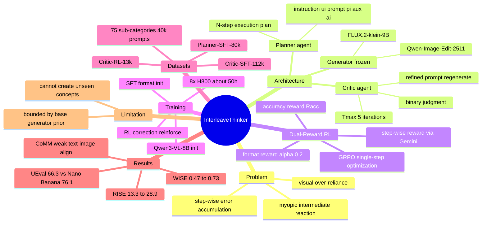

## 一、论文是干什么的？

想象你请一位画师帮你画一本绘本。普通的图像生成模型就像一位只会闷头画画、不会回头检查的画师：你给它一句话，它就画一张图，画完也不管对不对、好不好，更不会主动规划"这本书一共要画几页、每页画什么"。这样一来，当任务需要一连串图片（比如一个分多步的菜谱、一个故事的连环画、一个机器人操作的分解动作）时，模型常常会犯两个毛病：一是**视觉过度依赖**（visual over-reliance），它太看重上一张已经画出来的图，结果一步错、步步错，像传话游戏一样越画越偏；二是**步骤间误差累积**（step-wise error accumulation），前面的小错误会被一路放大到最后。

这篇论文提出的 **InterleaveThinker**（交错思考者）就是要解决这个问题。它不是再训练一个超级大模型，而是搭了一个"团队"——给现成的、被冻结（不再训练）的图像生成器配上两个会思考的助手：一个**规划者**（Planner）负责先把整个任务拆成清晰的若干步，相当于先列好绘本的分镜脚本；一个**评判者**（Critic）负责在每一步画完后检查质量、发现问题并改写提示词让它重画，相当于一位会审稿的编辑。通过这种"先规划、边画边批改"的方式，让一个普通的图像生成器也能产出高质量的**图文交错**（interleaved text-image）内容，效果可以媲美 Nano Banana、GPT-5 这类顶级闭源模型。

## 二、核心方法与创新

整个系统由三个模块串联组成，可以类比成一个出版工作室：

- **规划者**（Planner）——总编辑。它接收用户的输入序列 $S$，把任务翻译成一个 $N$ 步的执行计划。对第 $i$ 步，它生成三样东西：给人看的指令 $u_i$、给图像生成器看的"模型友好"提示词 $p_i$、以及辅助文字 $a_i$。形式化写作 ${(u_i,p_i,a_i)}_{i=1}^{N}=\mathrm{Planner}(S)$。关键创新在于规划者一次性把全局蓝图想清楚，避免了"只盯着刚画出的那张图做近视反应"的毛病。

- **生成器**（Generator）——画师。它就是任何现成的、被冻结的图像生成模型，按提示词逐步出图。

- **评判者**（Critic）——审稿编辑。每画完一步，它对比执行前的图 $I_{i-1}$ 和执行后的图 $I_i^t$，结合原始提示词 $p_i$ 和当前改写后的提示词 $r_i^t$，输出三样东西：一个二元判断 $j_i^t$（合格还是不合格）、一个新的改写提示词 $r_i^{t+1}$、以及推理理由 $R_i^t$，写作 $(j_i^t,r_i^{t+1},R_i^t)=\mathrm{Critic}(I_{i-1},I_i^t,p_i,r_i^t)$。如果不合格就改写提示词重画，直到合格或达到最大迭代次数 $T_{max}=5$。

**最核心的创新是双奖励强化学习策略**（dual-reward RL strategy）。训练评判者很难，因为一整条生成轨迹很长，但论文巧妙地设计了两个奖励信号，让模型只需做单步强化学习就能优化整条长轨迹：

- **准确性奖励**（accuracy reward）：衡量评判者的判断是否和真实答案一致：

$$
R_{acc}=-|\mathrm{Critic}(I_{i-1},I_i^t,p_i,r_i^t)-J_i|
$$

- **步进奖励**（step-wise reward）：用 Gemini 给改写前后的两张图打分，看评判者的改写是否真的让结果变好了：

$$
R_{step}=\mathrm{Gemini}(I_{i-1},I_i^{t+1},p_i,r_i^{t+1})-\mathrm{Gemini}(I_{i-1},I_i^t,p_i,r_i^t)
$$

最终奖励把格式、准确性、步进三者加权组合：

$$
R=0.5*R_{format}+0.5*(\alpha R_{acc}+(1-\alpha)R_{step})
$$

其中默认 $\alpha=0.2$。整个训练分两阶段：先用监督微调（SFT）让规划者和评判者学会正确的输出格式，再用 **GRPO** 强化学习强化其纠错能力。这种"解耦架构 + 双奖励单步 RL"让框架可以即插即用地配在任何冻结图像生成器上。

## 三、使用了哪些模型和计算资源？

**基础图像生成器**（被冻结，不训练）：
- FLUX.2-klein-9B（主力评测模型，使用 4 步快速变体）
- Qwen-Image-Edit-2511
- FLUX.1-dev（用于对比基准）

**语言/多模态模型**：
- Qwen3-VL-8B-Instruct（用作 Planner 和 Critic 的初始化模型）
- Gemini 2.5 Pro（用于轨迹生成与打分）
- Nano Banana Pro（用于轨迹生成）

**计算资源**：整条训练流程在 **8 张 H800 GPU** 上约耗时 **50 小时**。
- SFT：2 个 epoch，学习率 $2\times10^{-5}$，批大小 32
- RL：1 个 epoch，学习率 $2\times10^{-6}$，全局批大小 16，rollout 数 $N=8$，KL 散度惩罚系数 $1\times10^{-3}$
- 最大图像分辨率 $1024\times1024$

**数据集**（自建三套高质量数据）：从 8 个主类目自顶向下扩展到约 75 个子类目（涵盖机器人、讲故事、艺术、工作流、日常生活、科学、专业技能等），生成约 40000 条多样化文本提示。三套数据为：
- Interleave-Planner-SFT-80k（规划者监督微调数据）
- Interleave-Critic-SFT-112k（评判者监督微调数据，筛选低分数方差的步骤）
- Interleave-Critic-RL-13k（评判者强化学习数据，保留高方差步骤，SFT 与 RL 维持 2:1 比例）

## 四、实验结果

一句话总结：给普通图像生成器装上 InterleaveThinker 后，效果大幅提升，在多个基准上接近顶级闭源模型。

**UEval 基准**（文本到图文交错生成，分数越高越好）：

| 方法 | 平均分 | 文本 | 图像 |
|---|---|---|---|
| Janus-Pro（开源） | 22.9 | - | - |
| Emu3.5（开源） | 49.1 | - | - |
| InterleaveThinker + FLUX.2-klein-9B | 66.3 | 58.6 | 74.0 |
| InterleaveThinker + Qwen-Image-Edit | 67.2 | - | - |
| Nano Banana Pro（闭源） | 76.1 | - | - |

**WISE 基准**（基于推理的生成）：FLUX.2-klein-9B 从基线 0.47 提升到 0.73（约 55% 提升）。分项中生物从 0.32 涨到 0.72、化学从 0.27 涨到 0.69、物理从 0.50 涨到 0.78、文化从 0.44 涨到 0.72，提升尤为明显。

**RISE 基准**（基于推理的图像编辑）：从基线 13.3 提升到 28.9（约 117% 提升）。其中时序类从 7.1 飙升到 36.5，因果类从 13.3 涨到 33.3。

**CoMM 基准**（多模态输入）：在风格、实体、趋势、完整性等维度大多达到 9 分以上（满分 10），图像质量高达 9.7，但"图文对齐"一项仅约 5.2-5.5，是相对短板。

**消融实验**（UEval 平均分）清楚展示了每个组件的贡献：FLUX.2-klein 裸模型仅 18.2 → 加 Qwen3-VL 升到 48.1 → 加规划者 SFT 升到 60.5 → 全套 SFT 达 64.5 → 全套 RL 达到最佳 66.3。这证明规划者、评判者、强化学习每一环都有实打实的增益。

## 五、潜在应用与已落地应用

- **教育与科普绘本**：自动生成分步图文教程，比如分步菜谱、实验流程、手工教学。
- **故事/连环画创作**：保持人物风格一致地连续出图，辅助内容创作者。
- **机器人与具身智能**：把复杂操作拆解成可视化的分步动作序列。
- **设计工作流**：把一段需求自动展开为多步骤的图文设计方案。
- **即插即用增强**：因为框架对底层生成器是"通用、可插拔"的，企业可以把它套在自己已有的、冻结的图像模型上，无需重训大模型即可获得推理与纠错能力。

论文中暂无明确提及已上线的商业产品，属于研究阶段成果。

## 六、网络上的讨论与评价

截至综述撰写时（2026-06-12），该论文刚于 2026 年 6 月 11 日提交到 arXiv，HuggingFace 上获得 76 票关注，热度较高，但网络上尚无针对本文的具体评测文章或社区深入讨论，**暂无相关信息**。通过检索发现与之研究方向相近的工作包括 LLM-I（把交错生成视为工具调用问题）、IRG（Interleaving Reasoning for Better Text-to-Image Generation）、ISG-AGENT（规划-执行-精修三组件）等，说明"规划者-评判者多智能体 + 强化学习"是当前图文交错生成领域的活跃研究脉络，InterleaveThinker 是其中较新的代表性工作。

## 七、思维导图

