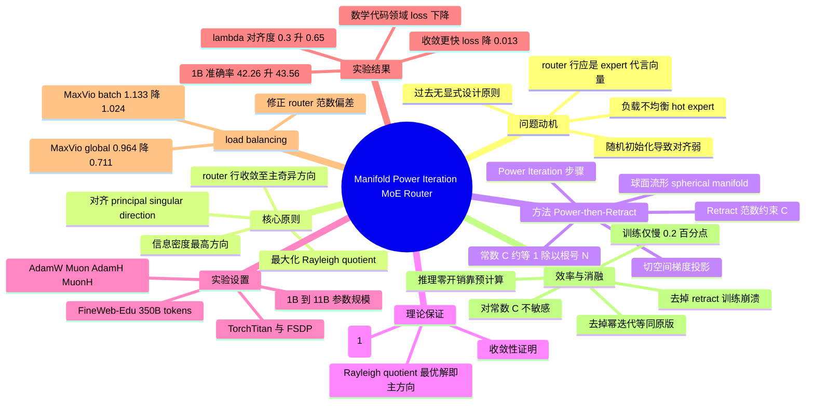

## 一、论文是干什么的？

想象一家大型餐厅里有很多位专精不同菜系的厨师（这就是混合专家模型里的**专家**，Expert）。每当一份订单（也就是一个 token）送进来，门口有一位**接待员**（这就是**路由器**，Router）负责快速判断：「这道菜应该交给哪位厨师做？」如果接待员判断得准，订单就能交到最合适的厨师手里，整个餐厅又快又好；如果判断得糊涂，要么把川菜订单送进了西餐区，要么所有订单都堆给同一个厨师（这就是负载不均衡），餐厅就乱套了。

**混合专家**（Mixture-of-Experts，MoE）模型是当今大语言模型扩容的主流方案：模型里塞进很多专家网络，但每个 token 只激活其中一小部分，从而在参数量很大的同时保持计算量可控。这里的关键瓶颈正是那位「接待员」——路由器。这篇论文发现了一个长期被忽视的问题：路由器的每一行本应是对应专家的「代言向量」，浓缩出这位专家最擅长什么，但过去没有任何设计原则去强制这种「浓缩」，路由器只是随机初始化后任由训练自由发挥。作者提出了一个明确的设计原则——让路由器的每一行对齐它所代表专家权重矩阵的**主奇异方向**（principal singular direction），并设计了一套名为**流形幂迭代**（Manifold Power Iteration，MPI）的方法来实现它。实验显示，这个改动能让 MoE 模型训练收敛更快、下游任务表现更好、专家负载更均衡，而且几乎不增加额外开销。

## 二、核心方法与创新

### 为什么要对齐「主奇异方向」？

任何一个矩阵都可以做**奇异值分解**（SVD），把它拆成若干方向，每个方向配一个奇异值表示「重要程度」。其中奇异值最大的那个方向就是**主奇异方向**，它代表这个矩阵「信息密度最高」的核心特征。论文打的比方是：如果要用一根向量来概括一位专家「最擅长什么」，那么这位专家权重矩阵的主奇异方向就是最佳答案。

作者把这个目标写成一个数学量——**瑞利商**（Rayleigh quotient）。设 $R[i]$ 是路由器的第 $i$ 行，$W^i$ 是第 $i$ 个专家的权重矩阵，目标是让路由器行在专家方向上的投影尽可能大：

$$

\max_{R[i]} \; \varphi(W^i, R[i]) = \frac{\lVert R[i]\, W^i \rVert_2^2}{\lVert R[i] \rVert_2^2}

$$

线性代数告诉我们：让这个瑞利商取最大值的 $R[i]$，恰好就是 $W^i$ 的主奇异方向。换句话说，「让代言向量信息最浓缩」这件直觉上的事，在数学上等价于「最大化瑞利商」。

### Power-then-Retract：先发力，再收手

怎么把路由器行推向主奇异方向呢？经典做法是**幂迭代**（Power Iteration）：反复用矩阵乘一个向量，向量就会自动滑向主奇异方向。这就像往一个碗里随便扔颗小球，它来回滚几次最终都会停在碗底最低点。论文的更新公式是：

$$

\hat{R}[i] = R[i]\, W^i_g (W^i_g)^{\top}

$$

但幂迭代有个老毛病：反复相乘会让向量的长度（范数）爆炸或者塌缩，导致数值不稳定。作者的巧思在于加了一步**收回**（Retract）——做完幂迭代后，立刻把向量的长度归一化、约束到一个固定常数 $C$ 上：

$$

R'[i] = C \cdot \frac{\hat{R}[i]}{\lVert \hat{R}[i] \rVert_2}

$$

这一「先发力（power）、再收手（retract）」的组合就是 **Power-then-Retract** 范式。它的几何含义是：路由器的每一行被约束在一个半径为 $C$ 的**球面流形**（spherical manifold）上运动——既能朝主奇异方向滑动，又永远不会跑飞。这也是「流形幂迭代」名字的由来。梯度更新被投影到球面的切空间上，作者给出了流形上的近似更新式：

$$

\Delta r_M \approx \frac{1}{R'[i]\, M\, R'[i]^{\top}} \left( R'[i]\, M - R'[i]\,\bigl(R'[i]\, M\, R'[i]^{\top}\bigr) \right)

$$

### 那个常数 C 怎么定？

$C$ 不能随便取。作者从「保持路由打分（logit）尺度稳定」出发推导出一个设计原则：

$$

C \approx \Theta\!\left(\frac{1}{\sqrt{N}}\right)

$$

其中 $N$ 是隐藏维度。这样能让路由 logit 维持在 $O(1)$ 的合理量级，不会因为专家数量或维度变化而失衡。

### 创新点小结

- **第一次为路由器提出明确设计原则**：对齐专家的主奇异方向，给出了「路由器行应该长什么样」的理论答案，而非放任随机训练。
- **Power-then-Retract 范式**：用幂迭代驱动对齐，用流形收回保证稳定，二者缺一不可（消融实验证明，去掉幂迭代等同于原版 MoE，去掉收回则训练直接崩溃）。
- **零推理开销**：对齐结果可以预先计算并融合进路由器，推理时不增加任何计算。

## 三、使用了哪些模型和计算资源？

- **模型规模**：自研的 MoE 语言模型，覆盖 1B 到 11B 参数：
  - 1B：8 层，隐藏维 1024，64 个专家
  - 3B：12 层，隐藏维 1536，64 个专家
  - 11B：12 层，隐藏维 1536，256 个专家
- **训练数据**：预训练使用 FineWeb-Edu 数据集约 350B tokens；中段训练（midtraining）在 Olmo 数据集上约 100B tokens。
- **优化器**：测试了 AdamW、Muon，以及它们的超球版本 AdamH、MuonH。
- **训练框架**：基于 **TorchTitan**，使用 **FSDP**（Fully Sharded Data Parallel，全分片数据并行）。
- **吞吐量**：11B 预训练中，原版 MoE 吞吐约 34.97 billion tokens/天，MPI 仅带来约 0.2% 的速度下降。
- **GPU 型号与总训练时长 / 总算力（FLOPs）**：暂无相关信息。论文只给了吞吐量和相对开销，未披露具体硬件与总耗时。

## 四、实验结果

效果用大白话说就是：「同样的训练成本，换上这个新路由器后，模型学得更快、考得更好、干活更均匀。」评测覆盖 25 个任务（ARC、MMLU、TriviaQA、GSM8K、MBPP 等）。

| 指标 | 原版 MoE | 加上 MPI | 变化 |
|---|---|---|---|
| 1B 模型平均准确率 | 42.26 | 43.56 | +1.3 |
| 11B 验证 PPL（bits/byte） | 0.728 | 0.723 | 下降（更好） |
| 数学领域 loss | 1.852 | 1.581 | 大幅下降 |
| 代码领域 loss | 1.263 | 1.259 | 下降 |
| 负载不均衡 MaxVio（batch） | 1.133 | 1.024 | 更均衡 |
| 负载不均衡 MaxVio（global） | 0.964 | 0.711 | 明显更均衡 |

- **收敛更快**：预训练 loss 代表性地降低约 0.013。
- **对齐确实发生了**：作者用 $\lambda$ 指标（路由器行与专家主方向的归一化余弦相似度，范围 $[0,1]$）验证，原版 MoE 各层 $\lambda$ 仅约 0.22–0.37，加上 MPI 后升到约 0.62–0.70，说明对齐目标真的实现了。
- **几乎零成本**：训练仅慢 0.2%，推理零开销（靠预计算）。
- **消融结论**：单独做行归一化（不做幂迭代）几乎等于原版 MoE；不做收回则在 AdamW / Muon 下出现 loss 尖峰、梯度异常乃至训练崩溃；对常数 $C'$（取 1、2、4、8）相对不敏感。

## 五、潜在应用与已落地应用

- **大模型预训练加速**：MPI 是对路由器的轻量级即插即用改造，理论上可直接用于任何主流 MoE 大语言模型的预训练，降低达到同等性能所需的训练量。
- **改善专家负载均衡**：MaxVio 指标显著下降，意味着专家利用更均匀，有助于在分布式部署时减少「热点专家」造成的通信与计算瓶颈，提升推理服务的吞吐稳定性。
- **零推理开销的工程价值**：由于对齐可预计算融合，落地时不需要修改推理路径，迁移成本低。
- **已落地应用**：暂无相关信息。论文为方法研究，未提及具体的生产部署案例。

## 六、网络上的讨论与评价

该论文非常新（2026 年 6 月发布），目前在 HuggingFace Papers 页面获得 4 票，页面上暂无公开评论或讨论。网络搜索除 arXiv 与 HuggingFace 官方页面外，也未见独立的深度评测或社区讨论。值得注意的是，搜索结果显示同期存在多篇主题相近的工作，例如 Routing Manifold Alignment、Similarity Preserving Routers（2506.14038）以及 Grassmannian Mixture-of-Experts（2602.17798），说明「从流形与几何视角改进 MoE 路由」正成为一个活跃的研究方向，但针对本文的具体第三方评价暂无相关信息。

## 七、思维导图

