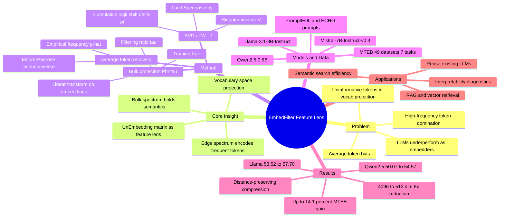

## 一、论文是干什么的？

我们都知道大语言模型（LLM）很聪明，能写文章、能聊天。但当我们想让它做另一件看似简单的事情时，它却经常表现平平：把一句话或一段文字压缩成一串数字（也就是**文本嵌入**，text embedding），让语义相近的文字得到相近的数字。这串数字是搜索引擎、推荐系统、问答系统的地基。奇怪的是，一个能写诗的大模型，做这件「打地基」的活儿却常常不如一些专门的小模型。这篇论文就是想搞清楚：为什么这么聪明的模型，做嵌入却不太行？又该怎么修？

作者打了个比方来理解问题所在。想象你让一群人投票描述一段文字，但人群里混进了一大批「话痨」，他们不管什么话题都拼命喊「的、是、了、and、the」这类没营养的高频词。结果投票统计出来的「文字画像」被这些噪音严重污染了，淹没了真正有意义的关键词。论文发现，大模型生成的文本嵌入正是被这种「高频但无信息的词」过度主导了。更妙的是，作者发现模型最后一层那个负责把内部表示翻译回词表的矩阵——**解嵌入矩阵**（unembedding matrix）——可以当成一面「透镜」，透过它就能看清嵌入里到底混进了多少这种噪音，并且把噪音过滤掉。他们提出的方法叫 **EmbedFilter**，不需要重新训练模型，只做一次简单的线性变换，就能让嵌入质量大幅提升，最高约14%。

## 二、核心方法与创新

核心洞察是：解嵌入矩阵 $W_U$（把模型隐状态投影回词表得到 logits 的那个矩阵）的某些方向，专门负责写入「高频词」。如果能找出这些方向并把它们从嵌入中剔除，剩下的就是更干净、更有语义的表示。

**第一步：找出「平均 token」长什么样。** 作者反推了一个代表无信息背景噪音的「平均 token」隐状态。直觉是：如果一个嵌入只反映词频统计、不带任何语义，它投影到词表上应该正好等于语料里的经验词频分布 $\hat{p}$。于是用解嵌入矩阵的伪逆 $W_U^{+}$（Moore-Penrose 伪逆）反解出这个背景表示：

$$

\hat{h} = \log(\hat{p}) W_U^{+}

$$

这相当于问：什么样的隐状态会让模型输出「就是一堆高频词」？答案就是噪音的源头。

**第二步：用「Logit 光谱学」定位噪音方向。** 作者对解嵌入矩阵做奇异值分解（SVD）：

$$

W_U = U \Sigma V^{\top}

$$

然后逐个考察每个奇异方向，测量它对高频 token 的 logit 贡献有多大。他们定义了一个累积 logit 偏移量来量化第 $i$ 个方向写入高频词的强度：

$$

\Delta\pi(i) = \frac{\sum_{j \in V^{+}} |\tilde{w}_j^{(i)} - \hat{w}_j|}{\sum_{j \in V^{+}} |\hat{w}_j|}

$$

结果发现：光谱「两端」（即极大和极小的奇异值对应的方向）的 $\Delta\pi$ 特别高——这些边缘子空间正是负责写入高频无信息词的「话痨方向」。这就像用棱镜把白光分成光谱后，发现某些特定波段全是噪音。

**第三步：过滤，只保留「主体光谱」。** 既然知道噪音藏在光谱两端，那就只保留中间这段有用的「主体光谱」（bulk spectrum）。具体做法是用保留下来的奇异向量列（从 $l_\tau$ 到 $r_\tau$）构造一个投影矩阵：

$$

\Phi_\tau = V[l_\tau{:}r_\tau] \, V[l_\tau{:}r_\tau]^{\top}

$$

其中 $\tau$ 是控制过滤强度的比例参数。最后，把原始嵌入 $e_i$ 投影一下就得到精炼后的嵌入：

$$

\tilde{e}_i = e_i \Phi_\tau^{\top}

$$

**创新点与妙处：** 这个方法完全不需要训练、不需要标注数据、不需要 GPU 微调，只是一个一次性计算好的线性投影，可以套在任何 LLM 嵌入之上即插即用。更巧的是，因为它丢掉了一批方向，等于顺便做了**降维**——而且是「保距离」的降维，嵌入维度大幅缩小后检索效果几乎不掉，反而让向量检索更快、更省内存。一个动作同时解决了「质量差」和「维度高」两个痛点。

## 三、使用了哪些模型和计算资源？

- **LLM 骨干模型：** Qwen2.5（0.5B）、Llama-3.1-8B-Instruct（8B）、Mistral-7B-Instruct-v0.3（7B）。
- **嵌入提取方式（prompt 方案）：** PromptEOL、ECHO 等现有的从 LLM 抽取句向量的方法，EmbedFilter 套在它们的输出之上。
- **数据集与基准：** MTEB（Massive Text Embedding Benchmark），共7类任务、约49个数据集，涵盖语义文本相似度（STS, 10个）、分类（12个）、聚类（11个）、句对分类（3个）、重排序（4个）、检索（8个，如 SciFact、ArguAna、NFCorpus、FiQA2018、QuoraRetrieval、SCIDOCS、Touche2020、TRECCOVID）、摘要（1个）。计算经验词频用的语料用于估计 $\hat{p}$。
- **GPU / 算力 / 耗时：** 暂无相关信息。论文仅提及因「计算资源有限」，在检索任务上只评测了一个子集而非完整 MTEB。由于方法本身无需训练、只是一次线性变换，整体算力需求很低。

## 四、实验结果

总体效果：在多个 LLM 骨干上，EmbedFilter 都带来了稳定提升，**MTEB 总体最高提升约14.1%**（Qwen2.5-0.5B 配合 ECHO 时取得），且不需要任何训练。

| 配置 | 基线分数 | EmbFilter（τ=2） | EmbFilter（τ=4） | EmbFilter（τ=8） |
|---|---|---|---|---|
| Qwen2.5-0.5B + PromptEOL | 50.07 | 54.57（+9.0%） | 53.47（+6.8%） | 51.43（+2.7%） |
| Llama-3.1-8B + ECHO | 53.52 | 57.70（+7.8%） | 57.32（+7.1%） | 56.61（+5.8%） |

降维方面同样亮眼：以 Llama-3.1-8B 为例，原始嵌入维度是4096，用 $\tau=8$ 过滤后压缩到 **512 维（8倍压缩）**，此时平均分仍有56.61。这意味着在维度只有传统模型一小部分的情况下，依然能与 SimCSE-BERT（768维，53.54）、coCondenser-msmarco（768维，55.48）这类专门训练的嵌入模型相抗衡甚至更优。

一句话总结：用更小的向量、零额外训练，换来了更好的检索与语义表示效果。

## 五、潜在应用与已落地应用

- **向量检索 / RAG 系统：** 直接用现成 LLM 当嵌入器时，套上 EmbedFilter 可显著提升召回质量，同时降维带来更快的相似度搜索和更省的存储。
- **语义搜索与推荐：** 任何依赖文本相似度的检索、去重、聚类场景都能受益。
- **节省成本：** 无需为「嵌入」单独训练或微调专门模型，复用已有 LLM 即可，对算力受限的团队很友好。
- **可解释性工具：** 论文提出的「Logit 光谱学」（Logit Spectroscopy）本身是一种诊断工具，可用于分析 LLM 内部表示如何被词频统计污染，为理解 LLM 表示机制提供新视角。
- **已落地应用：** 暂无相关信息；论文已开源代码（GitHub 仓库 CentreChen/EmbFilter），便于复现与集成。

## 六、网络上的讨论与评价

该论文较新，在 HuggingFace Papers 上获得 18 票关注。通过公开网络检索，暂未找到针对本文的具体深度讨论或第三方评测文章（暂无相关信息）。从研究脉络看，它延续并补充了一条近期热门的研究线索——即「LLM 文本嵌入与关键 token / 词表空间高度对齐」这一观察（相关工作包括《A Text is Worth Several Tokens》《Probability Signature》等），本文的独特贡献在于把这种对齐中的「高频词污染」明确量化，并给出一个无需训练、即插即用的过滤解法。

## 七、思维导图

