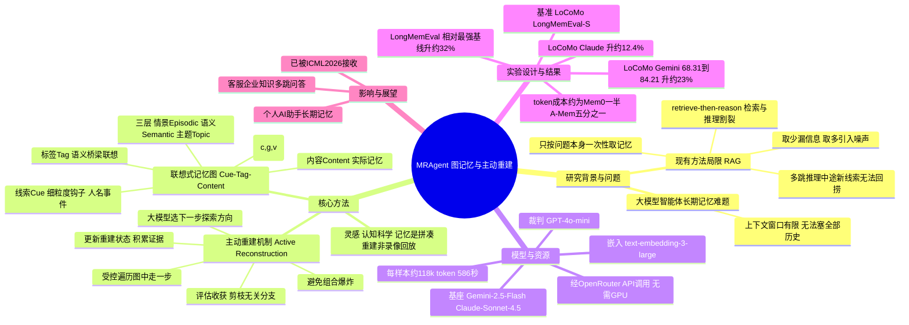

## 一、论文是干什么的？

大语言模型（LLM）一次能"看"的文字是有限的（受上下文窗口长度限制），不可能把和用户几个月的对话原封不动全塞进去。可一个好的 AI 助手又需要长期记忆——要记得你几周前说过"我对花生过敏"、"我喜欢周末早起跑步"。这就是大模型智能体的**长期记忆**难题。

目前的主流方案叫**检索增强生成**（RAG）：把历史对话切成小片段存进"记忆库"，回答问题时先**检索**出最相关的几段，再让大模型基于这几段去推理作答。论文把它称为静态的"先检索、后推理"范式。它的毛病在于：检索和推理是**割裂、一次性**的——系统只根据"问题本身"决定取哪些记忆，取完就定死了。但很多复杂问题（尤其是需要把多条线索串起来的**多跳推理**）一开始根本看不出该取哪些记忆，中途推理发现新线索后却没法回头再捞。结果要么取得不够（漏关键信息），要么为保险取一大堆（浪费算力、引入噪声）。本文要解决的，就是让记忆访问能**随推理进展动态调整**：边想边找。

## 二、核心方法与创新

论文提出的框架叫 **MRAgent**，有两大支柱。

**联想式记忆图——线索·标签·内容（Cue-Tag-Content）**

不再把记忆存成一堆零散文字片段，而是组织成一张**图**。图里有三类节点：**线索**（Cue，细粒度的小钩子，如人名、事件、关键词）、**标签**（Tag，起"语义桥梁"作用的联想标签，把相关线索和内容连起来）、**内容**（Content，实际记忆）。它们以三元组 $(c, g, v)$ 表示关系。记忆还被分成三层：

- **情景层**（Episodic）：带时间戳的具体事件；
- **语义层**（Semantic）：稳定的知识（如用户偏好、属性）；
- **主题层**（Topic）：跨多个事件归纳出的反复出现的模式。

**主动重建机制（Active Reconstruction）**

这是论文标题"记忆是被重建的，而非被检索的"的技术落点。它把大模型的推理能力直接嵌入记忆访问过程，让智能体在图里反复"探索加剪枝"：大模型选择下一步往哪个方向找（动作选择）→ 沿选定方向在图里走一步（受控遍历）→ 大模型评估收获、剪掉无关分支、更新"重建状态"（积累到目前为止的证据）。这样既能根据中途证据自适应地多步探索，又通过剪枝避免组合爆炸。

**创新点总结**：从"被动检索（查一次定死）"转向"主动重建（随证据演进的多步探索）"，并配套设计了能支撑这种探索的图结构——本质是把"检索"和"推理"融为一体。灵感来自认知科学：人脑回忆往事并非像放录像带那样原样调出，而是根据线索临时拼凑、重新组装。

## 三、使用了哪些模型和计算资源？

- **基座大模型**：Gemini-2.5-Flash（主评测）、Claude-Sonnet-4.5（对比）；代码还支持 GPT-4o 与 Qwen 作为可切换后端。均通过 [OpenRouter](https://openrouter.ai/) 统一接口调用。
- **评判模型**：GPT-4o-mini，作为打分的"LLM 裁判"。
- **文本嵌入模型**：text-embedding-3-large（3072 维）。
- **硬件需求**：**不需要 GPU**。代码 README 明确说明 torch 仅用于嵌入向量的归一化运算，CPU 版本即可；算力主要消耗在调用商业大模型 API 上。
- **每个计算单位的成本/耗时**（论文 Table 3，按每样本计）：

| 方法 | 每样本 token 消耗 | 每样本运行时间 |
|---|---|---|
| **MRAgent（本文）** | **约 118k** | **586.11 秒** |
| Mem0 | 245k | 533.29 秒 |
| A-Mem | 632k | 1122.23 秒 |

即 MRAgent 比基线省得多（约为 Mem0 的一半、A-Mem 的五分之一 token），耗时与 Mem0 接近、远快于 A-Mem。每次实验的具体美元花费论文未给出。
- **代码仓库**：[Ji-shuo/MRAgent](https://github.com/Ji-shuo/MRAgent)。

## 四、实验结果

评测基准：**LoCoMo**（长期对话记忆，约 50 段对话、每段最多约 35 个会话约 300 轮）与 **LongMemEval-S**（超长期记忆，每个问题配套约 11.5 万 token 的聊天历史）。打分用 GPT-4o-mini 作 LLM 裁判。

| 设置 | 结果 |
|---|---|
| LoCoMo（Gemini 骨干） | 整体分数 68.31 → 84.21，相对提升约 23.3% |
| LoCoMo（Claude 骨干） | 相对提升约 12.4% |
| LongMemEval | 相比最强基线相对提升约 32% |

结论：在长期/超长期记忆任务上效果显著更好，同时更省 token、更省时间——印证了"在提升效果的同时降低计算成本"的主张。

## 五、潜在应用与已落地应用

适用于任何需要长期、多会话记忆的大模型智能体：

1. **个人 AI 助手 / 陪伴型聊天机器人**：长期记住用户偏好、习惯、过往事件，跨周跨月保持一致。
2. **客服 / 企业知识助手**：在很长的服务历史或文档库中做多跳追溯式问答。
3. **多跳推理问答系统**：把分散在长历史中的多条线索串联起来作答。

代码仓库已提供可运行实现（构建图式情景记忆加 LLM 工具调用推理循环），可作研究/工程起点。论文本身是方法研究，未声称已在某个真实产品中规模化落地。

## 六、网络上的讨论与评价

学术出处可靠：已被 **ICML 2026** 接收（arXiv 页注明），并出现在 ICLR 2026 Workshop MemAgent 相关页面，也被图记忆方向的资源汇总（如 Awesome-GraphMemory）收录。但截至综述时，经定向检索 Twitter/X、Reddit、知乎、机器之心等，**几乎没有找到针对本篇论文的具体社媒或中文社区讨论**；OpenReview 上的具体审稿评分与意见也未能抓取到。知乎、机器之心相关文章多为"Agent 记忆机制"的通用综述，并未专门讨论本篇。

需特别注意**同名混淆**：网上另有一个完全不同的 "MRAgent"——用于孟德尔随机化（Mendelian Randomization）疾病因果发现的生物信息学工具，与本文的图记忆 MRAgent 毫无关系。

## 七、思维导图

