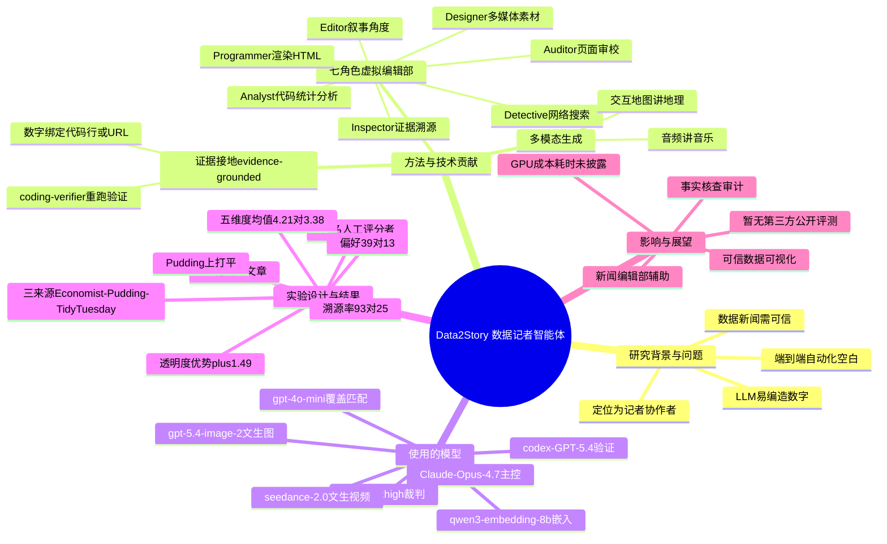

## 一、论文是干什么的？

想象你拿到一份枯燥的电子表格（比如全球咖啡产量、某城市房价、各国选举数据），想把它写成一篇生动、可信、还配有交互地图和音频的新闻报道。通常这需要一整个编辑部：有人查资料、有人跑数据分析、有人构思角度、有人做图、有人写网页、有人校对。这篇论文做的事，就是用一群 AI 智能体（agent）把整个编辑部「搬进电脑」，端到端地自动完成这件事。

这套系统叫 **Data2Story**。它要解决数据新闻里一个核心痛点：**可信度**。现在的大模型很会「写得好看」，但常常一本正经地胡编数字。Data2Story 的最大卖点是「可验证」——文章里每一个数字、每一个观点、每一张图，都被绑定到它的源头证据上（要么是生成它的那行代码，要么是一个外部参考网址），读者点一下就能查到「这个数据是从哪来的」。就像一篇带了「显示批改痕迹」的作业，老师能看到每一步是怎么算出来的。

## 二、核心方法与创新

Data2Story 把工作拆给 **七个分工明确的角色**（roles），像流水线上的工人一样协作。可以把它想象成一个 AI 版的报社编辑部：

- **Detective**（侦探）：通过网络搜索补充外部背景资料。
- **Analyst**（分析师）：写可执行代码、跑统计分析，把数据嚼碎。
- **Editor**（编辑）：确定叙事角度和编辑方案，决定这篇报道「讲什么故事」。
- **Designer**（设计师）：调用各种生成工具，制作图片、视频、音频、地图等多媒体素材。
- **Programmer**（程序员）：把所有内容渲染成最终的 HTML 网页文章。
- **Auditor**（审校）：检查渲染出的页面有没有视觉或结构上的毛病，并提出修改建议。
- **Inspector**（检查官）：本文最关键的创新模块，负责把文章里的每条主张追溯回上游证据。

其中两大创新值得展开：

**第一，证据接地**（evidence-grounded）。**Inspector** 这个角色专门做「溯源」：它把页面上渲染出来的每一句话、每个数字，绑定到「产生它的那行代码」或「引用的那个 URL」。这相当于给每个论断都附上了一张「出生证明」，读者可以自己重新跑代码或点开链接核实。论文用一套「编码验证器」（coding verifier）真的会把文章里的陈述拿回数据里重新执行一遍，看结果对不对。

**第二，多模态生成**（multimodal generation）。一般的 AI 写报道，默认就是「一堆文字 + 几张静态柱状图」。Data2Story 会先思考「读者最想看到什么形式」，再去调用合适的工具——讲地理就上交互地图，讲音乐就配音频，而不是千篇一律地堆文字和折线图。

整个评测设计也很有意思，它从四个维度衡量好坏：人机角度覆盖率（human–agent angle coverage）、五维度人工评分、用「电脑操作智能体」当裁判（computer-use agents as judges），以及可验证性测试。

## 三、使用了哪些模型和计算资源？

这篇论文是「调用现成大模型 + 商用生成 API」的工程编排路线，没有自己训练模型。具体用到的模型如下：

- **主控大模型**：Claude Opus 4.7（claude-opus-4.7），承担各角色的核心推理。
- **文本嵌入**：OpenAI text-embedding-3-small；另有 qwen/qwen3-embedding-8b 用于嵌入。
- **覆盖率匹配**：gpt-4o-mini。
- **代码验证 / Coder**：OpenAI codex-GPT-5.4。
- **「电脑操作」裁判模型**：OpenAI gpt-5.5-xhigh。
- **生成类工具**（经 OpenRouter 调用）：
  - 文生图：openai/gpt-5.4-image-2
  - 文生视频：bytedance/seedance-2.0
  - 图生视频：google/veo-3.1-fast
  - 文生音频：google/lyria-3-pro-preview

**计算资源与成本**：这是一个纯 API 调用的系统（不依赖本地训练）。论文**未披露 GPU 型号与数量、单篇报道的生成耗时、API 调用次数或费用、GPU·小时**等具体数字——这些字段**暂无相关信息**。

## 四、实验结果

一句话总结：**Data2Story 生成的报道在「可信透明」上明显胜过人类，但在「编辑角度、创意设计、呈现」上仍不如专业记者。** 它被定位成记者的「协作者」，而非替代品。

评测规模：**18 篇文章**，每篇都和一篇已发表的专家作品配对，数据来源为三家：**The Economist**（简洁分析型经济报道）、**The Pudding**（艺术性强的长篇交互式专题）、**TidyTuesday**（社区数据集，附带数据处理代码与原始文章）。人工评分由 **53 名参与者** 在 1–7 分量表上完成。

| 评测维度 | Data2Story | 人类记者 | 说明 |
|---|---|---|---|
| 五维度评分均值 | 4.21 | 3.38 | Data2Story 整体占优 |
| 数据与方法透明度（差距） | — | — | +1.49（最大优势项）|
| 视觉设计（差距） | — | — | +0.51（最小优势项）|
| 整体偏好（53人）| 39 票 | 13 票 | 1 票打平 |
| 证据可溯源比例 | 93% | 25% | 人类文章纯文本可还原仅 25% |

分来源看：Economist 上 Data2Story 领先 +1.02（p&lt;.001），TidyTuesday 领先 +1.20（p&lt;.001），The Pudding 则打成统计学平手（因其艺术创意极强）。角度覆盖方面：Human-in-Agent 覆盖率 50.4%，Agent-in-Human 覆盖率 35.1%。用「电脑操作智能体」当裁判时，其判断与人类评委相关性为 ρ=0.44（p&lt;.01），而 Inspector 带来的透明度提升达 Δ=+1.67。

## 五、潜在应用与已落地应用

**潜在应用方向**：

- **新闻编辑部的辅助工具**：帮记者快速从原始数据出一稿可验证的多模态报道初稿，记者再做编辑判断和创意润色。
- **可信数据可视化**：金融、科研、政务报告中需要「每个数字可溯源」的场景。
- **教育与科普**：把枯燥数据集自动变成图文音视频并茂、且能查证的讲解材料。
- **事实核查 / 审计**：Inspector 的「主张—证据」绑定机制，可独立用于内容审计。

**已落地情况**：作者开源了项目，提供了[项目主页](https://data2story.github.io/)（含 AI 生成故事画廊）与 [GitHub 代码仓库](https://github.com/QinghongLin/data2story-skill)。截至本综述，**尚无大规模商业落地或新闻机构正式采用的公开记录**，作者明确将其定位为记者的协作者而非替代者。

## 六、网络上的讨论与评价

该论文在 [HuggingFace Papers](https://huggingface.co/papers/2606.11176) 上获得 118 票，热度较高。不过截至本综述撰写时（2026-06-20），**除官方渠道（arxiv、项目主页、GitHub）外，尚未找到来自 X/Twitter、Reddit、知乎、技术博客的实质性第三方公开讨论或独立评测**。这与论文极新（2026-06-09 提交）有关。HuggingFace 页面也未见有实质内容的社区评论留存。后续如有第三方深度讨论，需再行检索。

## 七、思维导图

