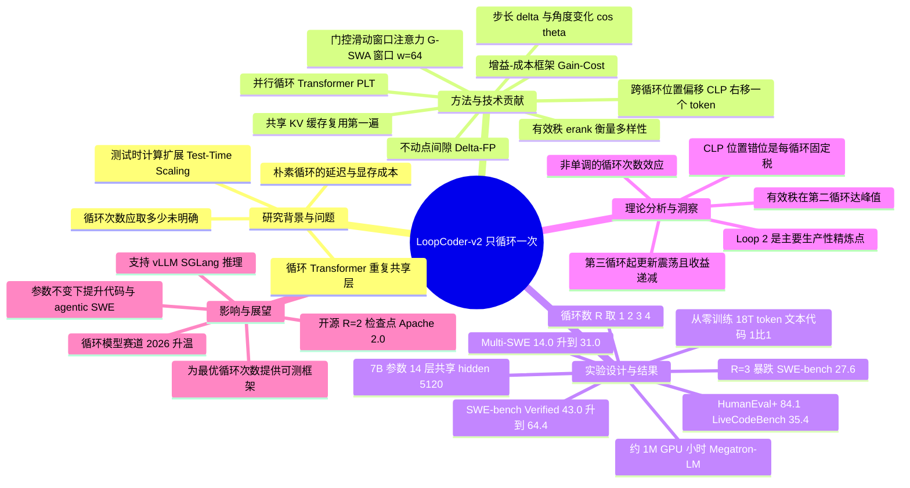

## 一、论文是干什么的？

想象你写一篇作文：写完初稿后再读一遍、改一遍，文章通常会变好。但如果你强迫自己一连修改十遍，越改到后面越是在原地打转，甚至越改越糟。这篇论文研究的就是大语言模型里一种类似「反复修改」的机制——**循环 Transformer**（Looped Transformer）。

普通的大模型由很多层网络堆叠而成，数据从头流到尾走一遍就出结果。循环 Transformer 的思路是：不增加参数（不增加「脑容量」），而是让同一组网络层被**重复执行多遍**，相当于让模型在回答前多「想几轮」。这属于近年很火的「测试时计算扩展」（Test-Time Computation Scaling）方向——用更多的思考时间换更好的答案。作者训练了一个 7B（70 亿参数）的代码模型家族 LoopCoder-v2，分别让它循环 1、2、3、4 次，结果发现一个反直觉的现象：循环 2 次效果最好，循环 3 次及以上反而性能崩塌。论文标题「只循环一次」（Only Loop Once）指的就是：在第 1 遍的基础上只需再补一个有效循环就够了。

## 二、核心方法与创新

朴素的循环会带来两个大麻烦：一是**慢**（跑两遍就慢两倍），二是循环时位置信息会乱。论文提出**并行循环 Transformer**（Parallel Loop Transformer，PLT）来解决，核心由三个零件组成：

- **跨循环位置偏移**（Cross-Loop Position Offset，CLP）：每多循环一遍，就把表示「右移一个 token 位置」再加回输入。这好比批改作文时，让每一遍审阅都从稍微不同的角度切入，避免重复看同一处。
- **门控滑动窗口注意力**（Gated Sliding-Window Attention，G-SWA）：用一个「门」把两路注意力输出融合，窗口大小为 $w=64$，降低重复计算的开销。
- **共享 KV 缓存**：后面的循环直接复用第一遍算好的键值缓存（KV cache），不必重算，从而把循环带来的延迟和显存成本压下去。

论文最硬核的贡献是提出一个**增益-成本框架**（Gain-Cost Framework）来解释「为什么只该循环一次」。它定义了几个可测量的指标来追踪每一遍循环里表示的变化：

- 步长 $\delta(r)=\lVert h(r)-h(r-1)\rVert_2$，衡量这一遍改了多少；
- 角度变化 $\cos\theta(r)$，衡量连续两遍的修改方向是否一致；
- 有效秩 $\mathrm{erank}(h(r))=\exp(-\sum_i \bar\sigma_i \log \bar\sigma_i)$，衡量表示的多样性；
- 不动点间隙 $\Delta_{FP}(r)=\lVert h(r)-f_\theta(h(r))\rVert_2$。

分析结论是：**第 2 个循环是「主要的生产性精炼」发生地**（有效秩在此达到峰值），而 CLP 带来的位置错位是一笔「每循环都要交的固定税」，大致恒定。于是从第 3 遍起，这笔位置错位的「税」开始压过精炼带来的「收益」，更新变得微小、来回震荡，性能因此饱和甚至倒退。

## 三、使用了哪些模型和计算资源？

| 项目 | 内容 |
|------|------|
| 模型 | LoopCoder-v2，7B 参数的 PLT 代码模型家族（从零训练，非微调自他人模型） |
| 架构细节 | 14 层（循环共享）、hidden size 5120、40 个注意力头、GQA 分 8 组、head dim 128、FFN 中间维 27648、词表 76800、RoPE（base $5\times10^5$）、bf16 精度 |
| 训练数据量 | 18T（18 万亿）token，文本与代码 1:1，覆盖 100+ 种编程语言 |
| 优化器 | Adam（$\beta_1=0.9$，$\beta_2=0.95$），学习率 $4\times10^{-4}$ 余弦衰减，权重衰减 0.1，梯度裁剪 1.0 |
| 训练框架 | 定制的 Megatron-LM 技术栈 |
| 计算资源（GPU·小时） | 约 1M（100 万）GPU·小时 |
| GPU 型号与数量 | 暂无相关信息 |
| 训练总时长（墙钟时间） | 暂无相关信息 |
| 单次推理耗时 | 暂无相关信息（论文强调通过共享 KV 与 G-SWA 控制延迟，但未给出具体毫秒数） |
| 发布权重 | 循环数为 2 的检查点（plt_num_loops=2），Apache 2.0 许可，支持 Transformers / vLLM / SGLang |

## 四、实验结果

一句话总结：**让模型循环 2 次，在代码与软件工程任务上全面碾压不循环的基线；但循环 3 次会大幅退步。** 最亮眼的是 SWE-bench Verified（修真实开源仓库 bug 的难任务）从 43.0 跳到 64.4 分，提升超过 21 分。

| 基准（R=2 vs 基线） | R=2 成绩 | 非循环基线 |
|------|------|------|
| SWE-bench Verified | 64.4% | 43.0% |
| SWE-bench Multilingual / Multi-SWE | 31.0% | 14.0% |
| HumanEval+ | 84.1% | 81.1% |
| MultiPL-E | 73.9% | 暂无相关信息 |
| BigCodeBench | 46.1% | 暂无相关信息 |
| LiveCodeBench | 35.4% | 暂无相关信息 |
| Terminal-Bench v1 | 34.2% | 暂无相关信息 |
| Mind2Web | 34.5% | 暂无相关信息 |
| Berkeley Function-Calling Leaderboard | 40.1% | 暂无相关信息 |

显式思维链（CoT）变体在 R=2 时：LiveCodeBench 62.3%（比指令微调版 +26.9）、CRUX 93.5%（+6.6）、FullStackBench 49.9%（+2.7）。

**关键反转**：循环 3 次（R=3）时 SWE-bench Verified 暴跌到 27.6%；模型卡也显示 R=2 平均分 46.5，而 R=3 仅 36.9。这正是「只循环一次」的实证依据。

## 五、潜在应用与已落地应用

- **潜在方向**：在不增加模型参数（不增加部署显存中权重大小）的前提下提升代码生成、代码推理、智能体式软件工程（agentic SWE）和工具调用能力；为「用计算换性能」提供了一个比单纯堆叠层数更省参数的路线；为后续循环模型确定「最优循环次数」提供了可测量的理论框架。
- **已落地**：作者已在 HuggingFace 开源了循环数为 2 的检查点 [Multilingual-Multimodal-NLP/LoopCoder-V2](https://huggingface.co/Multilingual-Multimodal-NLP/LoopCoder-V2)（Apache 2.0，过去一月约 374 次下载），提供 Transformers、vLLM、SGLang 三种推理方式，可直接用于代码补全与软件工程任务。

## 六、网络上的讨论与评价

该论文于 2026 年 6 月 16 日提交，HuggingFace 论文页获得 175 票，热度较高。其所属的「循环 Transformer」赛道在 2026 年明显升温，相关工作如 [LoopFormer](https://loopformer.github.io/)（弹性深度循环、ICLR 2026 录用）也在同期受到关注，社区将「循环 / 重复同一层」视为高效利用参数、增强迭代推理的有前景方向。不过，截至本综述时（2026-06-20），尚未在 Reddit、X/Twitter、知乎等平台检索到针对本论文的具体公开讨论帖或深度评测文章，HuggingFace 论文页也暂未见公开社区评论文本。可核查的一手信息主要来自 [HF 论文页](https://huggingface.co/papers/2606.18023)、[arXiv 摘要](https://arxiv.org/abs/2606.18023) 与 [模型卡](https://huggingface.co/Multilingual-Multimodal-NLP/LoopCoder-V2)。

## 七、思维导图

