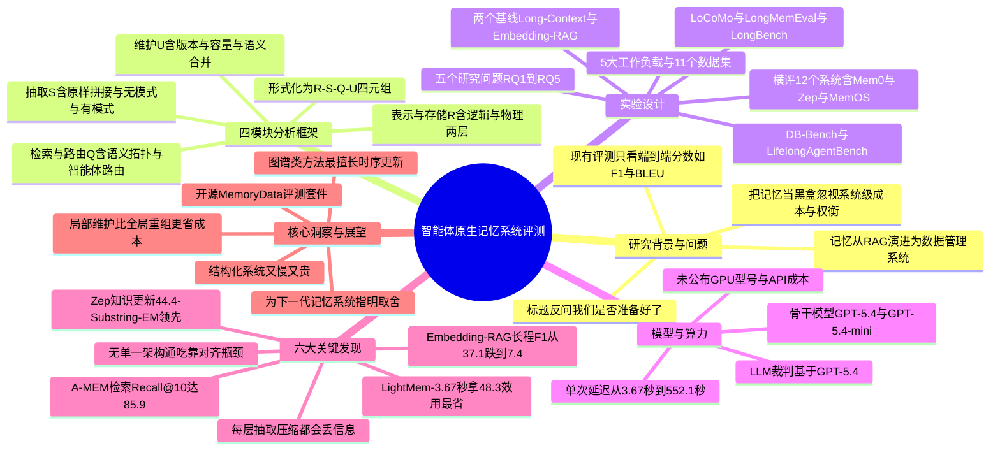

## 一、论文是干什么的？

想象你有一个私人助理，你跟它聊了一年的天、交代了无数事情。一年后你问它「上个月我说要给妈妈买的那个生日礼物，我后来改主意换成什么了？」一个好助理应该能准确记起来，而且要记住的是「最新版本」，而不是把你改过几次的说法都混在一起。对大语言模型（LLM）智能体来说，这套「记东西、找东西、更新东西、清理旧东西」的能力，就是所谓的**记忆系统**（Memory System）。

过去大家评价这类记忆系统，基本只看「最终答题准不准」（比如 F1、BLEU 这些分数），把记忆系统当成一个不透明的「黑盒子」。这篇论文换了一个全新视角：把智能体记忆当成一个**数据管理问题**（像数据库那样去研究），系统性地把它拆开、量化、横向对比。论文标题用了一个反问句「我们准备好了吗？」，言下之意是——目前还没有一个真正成熟的、专为智能体而生的记忆系统，业界仍在探索。作者横向评测了 12 个代表性记忆系统，跑了 5 大基准、11 个数据集，得出的核心结论是：**没有任何一种架构能在所有场景都最好**，关键在于记忆的组织方式是否与具体任务的「瓶颈」相匹配。

## 二、核心方法与创新

这篇论文最大的贡献不是提出一个新模型，而是提出了一个**分析框架**（Analytical Framework），把一个完整的智能体记忆系统形式化地拆成四个核心模块。用一个公式表示就是：

$$\mathcal{M}_{sys} = \langle \mathcal{R}, \mathcal{S}, \mathcal{Q}, \mathcal{U} \rangle$$

可以把它类比成管理一座**图书馆**：

- **记忆表示与存储**（Representation and Storage, $\mathcal{R}$）：决定信息长什么样、放在哪。书是按散页存、还是装订成册、还是编成知识图谱（Knowledge Graph）、树形结构？物理上是放在临时桌面（寄存器），还是单引擎数据库，还是多引擎后端？这相当于图书馆的「书架编排方式」。
- **记忆抽取**（Extraction, $\mathcal{S}$）：决定怎么把原始素材（多轮对话、工具调用日志）变成可存的条目。有三种做法——原样拼接（raw concatenation）、无模式语义抽取（schema-free）、有模式结构化抽取（schema-constrained）。相当于「把读者带来的资料整理成可入库的卡片」。
- **记忆检索与路由**（Retrieval and Routing, $\mathcal{Q}$）：根据当前问题，从海量记忆里快速找出相关的那一小撮。可以基于注意力、语义、拓扑结构、智能体自主决策，或混合方式。相当于「图书管理员根据你的问题去对的书架取书」。
- **记忆维护**（Maintenance, $\mathcal{U}$）：管理记忆的整个生命周期，又细分为三个子操作——冲突解决与版本管理（处理前后矛盾，比如你改了主意）、容量管理（防止无限膨胀，用 FIFO、token 上限或时间衰减来淘汰旧记忆）、语义合并（用 LLM 把重复内容压缩成摘要，或通过工具调用做增删改查 CRUD）。相当于「定期下架过期书、合并重复书、处理版本冲突」。

**创新点**在于：以往没人把记忆系统这样「解剖」开来逐模块分析。有了这个框架，作者就能做**细粒度消融实验**（fine-grained ablation），单独量化每个模块对四件事的影响——表示保真度、检索精度、更新正确性、长程稳定性，从而真正看清「某个系统好/差，到底差在哪个零件上」。

## 三、使用了哪些模型和计算资源？

- **使用的 LLM 模型**：论文采用了 **GPT-5.4** 与 **GPT-5.4-mini** 作为骨干模型（backbone），并测试了多个骨干变体以验证结论的稳健性。评测中的「LLM 裁判」（LLM Judge Accuracy 指标）也基于 GPT-5.4。
- **GPU / 硬件资源**：论文未明确给出 GPU 型号、数量或显存配置等信息（暂无相关信息）。这与论文性质相符——它主要调用 API 进行评测，关注的是系统级的延迟与成本，而非自己训练模型。
- **API / Token 成本**：论文未给出具体的 API 美元花费或 token 计费数字（暂无相关信息），但通过「每次操作平均延迟」间接反映了运算开销。
- **耗时（每次查询/操作的延迟）**：这是论文重点测量的成本维度。各系统单次操作平均延迟差异巨大，例如 LightMem 约 **3.67 秒**、MemoChat 约 15.4 秒、MemTree 约 15.9 秒、MemoryOS 约 28.6 秒、Mem0 约 35.9 秒、Cognee 约 116.5 秒、Zep 高达 **155.1 秒**；在 LongBench 这类跨工作负载场景下，延迟范围跨越 **17.3 至 552.1 秒**。可见「越是频繁地全局重组记忆，越慢、越贵」。

## 四、实验结果

作者从五个研究问题（RQ）切入评测：任务效果（RQ1）、检索保真度（RQ2）、动态更新鲁棒性（RQ3）、长程稳定性（RQ4）、运算成本（RQ5）。**被评测的 12 个系统**包括：MemoChat、Mem0、MEM1、MemAgent、MemTree、Zep、Mem0$^g$、Cognee、LightMem、SimpleMem、MemOS、MemoryOS、A-MEM、Letta 等；另设两个参考基线——**Long Context**（长上下文）与 **Embedding RAG**。**5 大工作负载**为 LoCoMo、LongMemEval、DB-Bench、LongBench、LifelongAgentBench，共覆盖 11 个数据集。

用大白话总结六大发现：

| 发现 | 通俗解读 | 关键数据 |
|------|----------|----------|
| 1 工作负载对齐 | 没有万能架构，好坏看记忆结构是否匹配任务瓶颈 | 不同架构各擅胜场 |
| 2 证据为中心 | 检索能力差异很大 | A-MEM 的 Recall@5/@10 达 69.5/85.9，MemTree 达 59.7/80.5，而 SimpleMem 的 Recall@1 仅 39.0 |
| 3 时序更新 | 图谱类方法最擅长处理「信息被更新」的情况 | Zep 在「知识更新」上以 44.4 Substring EM 领先；Cognee 在「时序推理」上以 18.7 Substring EM 居首 |
| 4 长程结构 | 证据离得越远，普通方法越扛不住 | Embedding RAG 的 Answer F1 从 37.1 暴跌到 7.4；Cognee 保持稳定 |
| 5 运算成本 | 结构化系统又慢又贵 | LightMem 用 3.67 秒拿到 48.3 归一化效用；Zep 要 155.1 秒才换来 84+ 效用 |
| 6 表示粒度 | 抽取/压缩的每一层都会丢信息 | LightMem 的「User-Only Raw」配置在全部四个指标上最优 |

一个贯穿全文的成本结论是：**把维护操作局限在一小块记忆上（局部维护），比反复重组整个全局状态要高效得多**（Localized maintenance is more cost-efficient than global reorganization）。

## 五、潜在应用与已落地应用

- **潜在方向**：这套四模块框架可作为「选型指南」——根据你的应用瓶颈（是检索难、还是更新多、还是对话特别长）来挑选或设计记忆架构，而非盲目追求功能最全的系统。也为下一代「智能体原生记忆系统」指明了设计取舍：在保真度、检索精度、更新正确性、长程稳定性与成本之间做平衡。
- **已落地/可直接使用的资源**：论文配套开源了统一评测套件 [MemoryData](https://github.com/OpenDataBox/MemoryData)（A Unified Memory Benchmark Suite for Memory-Augmented Agents），以及一份持续维护的论文清单 [awesome-agent-memory](https://github.com/OpenDataBox/awesome-agent-memory)。被评测的诸多系统（Mem0、Zep、Letta/MemGPT、MemOS、Cognee 等）本身已是业界正在使用的开源记忆框架，本文的评测结论可直接指导这些产品的选型与改进。

## 六、网络上的讨论与评价

这篇论文在 HuggingFace Daily Papers 上获得 58 票，热度可观。社区讨论主要来自官方与论文聚合渠道：

- HuggingFace 官方账号 DailyPapers 在 X 上转发推荐：「这项研究把智能体记忆当作一个数据管理问题，通过一个四模块分析框架横评 5 大基准上的 12 个系统，发现没有任何单一架构能称霸。」相关推文见 [HuggingPapers 的 X 帖](https://x.com/HuggingPapers/status/2070015170366025835)。
- 论文聚合账号 reachsumit 也在 [X 上分享了该论文](https://x.com/_reachsumit/status/2069624295161295114)。
- [alphaXiv](https://www.alphaxiv.org/audio/2606.24775) 提供了该论文的音频解读版本。

截至综述撰写时，尚未检索到 Reddit 长篇讨论帖或独立技术博客的深度评测（暂无更多相关信息）。总体而言，社区评价集中在「视角新颖、把记忆系统拆解为可量化模块」这一点上，认为它填补了「只看端到端分数、忽视系统级成本与权衡」的评测空白。

## 七、思维导图

