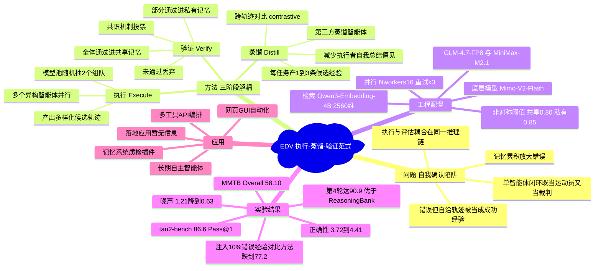

## 一、论文是干什么的？

想象一个学生在自习。他做完一道题，自己对照自己的思路，觉得"逻辑挺顺，应该对了"，于是把这套解法记进了错题本。问题是——他的答案其实是错的，只是他自己骗过了自己。下次遇到类似题目，他翻出这条"经验"再用一遍，错得更彻底。久而久之，错题本里堆满了"看起来很有道理的错误"，越学越偏。

这篇论文把 LLM 智能体（Agent）学习时的这个毛病起了个名字，叫 **自我确认陷阱**（Self-Confirmation Trap）。现在很多智能体的"经验学习"是一个**单智能体闭环**：同一个智能体既负责**执行任务**，又负责**判断自己做得对不对**，还负责**总结经验**。因为"做事"和"评判"用的是同一套大脑、同一条推理链，它很容易把**错误但自圆其说**的轨迹误判成成功经验，并把这条坏经验存进记忆库。更糟的是，这种错误会随着记忆不断累积而被**逐步放大**。

论文给出的解药是 **EDV 框架**（Execute-Distill-Verify，执行-蒸馏-验证）。核心思想一句话：**把"做事"、"总结"、"验收"这三件事拆给不同的角色去干**，谁也别既当运动员又当裁判，从而在经验写进记忆之前就把错误和噪声过滤掉。论文在三个智能体基准（tau2-bench、Mind2Web、MMTB）上验证了这套方法，效果稳定优于现有方案。

## 二、核心方法与创新

传统做法的根本问题在于：**执行与评估耦合在同一条推理链里**。EDV 的创新就是把这条链**解耦**成三个独立阶段，并引入"多人协作 + 投票"的机制。打个比方：以前是一个人自己出题、自己答题、自己批改；现在改成"多个考生分头作答 → 一个独立阅卷老师对比批改 → 全体考生集体复核才算数"。

**第一阶段：执行（Execute）—— 多人分头作答**

不再用一个智能体单打独斗，而是让**多个异构（heterogeneous）智能体并行探索同一个任务**。所谓异构，就是用不同的底层模型组队。具体做法是从模型池里**随机抽 2 个模型**组成一个执行小组，让它们各自独立地完成任务，产出**多条多样化的候选轨迹**。多样性是关键：不同模型犯的错往往不一样，互相一对照，错误就更容易暴露。

**第二阶段：蒸馏（Distill）—— 独立老师对比批改**

引入一个**第三方蒸馏智能体**，它不参与执行，只负责**横向对比多条轨迹**（cross-trajectory comparison），用对比分析（contrastive analysis）的方式从中提炼出经验。这一步的关键在于：它做的是**跨轨迹对比**，而不是让执行者**自我总结**（self-summarization）。因为执行者总结自己的轨迹时，天然带有"我做得挺好"的偏见（executor-centric bias），而旁观的第三方对比好坏轨迹时更客观。每个任务最终产出 **1 到 3 条候选经验**。

**第三阶段：验证（Verify）—— 集体复核才算数**

候选经验不能直接进记忆库，要先经过原执行小组的**共识机制**（consensus）投票：

- **全体一致通过** 的经验 → 写入**共享记忆**（shared memory）
- **部分通过** 的经验 → 只写入**私有记忆**（private memory）
- **没通过** 的 → 直接**丢弃**

这样就把经验学习从"一个人闭门反思"变成了"集体协作建构"，在写入记忆之前完成了**质量过滤**。

**一些工程细节**：检索用 Qwen3-Embedding-4B 生成 2560 维向量，并采用**非对称相似度阈值**——共享记忆 0.80、私有记忆 0.85（私有记忆要求更严以减少污染）。这种"先过滤再入库"的设计，正是为了对抗下面会讲到的记忆污染问题。

## 三、使用了哪些模型和计算资源？

**底层 LLM 模型（用于组成异构执行小组）：**

- Mimo-V2-Flash
- GLM-4.7-FP8
- MiniMax-M2.1

**Embedding 模型：** Qwen3-Embedding-4B（输出 2560 维向量）

**运行配置：**

- 并行 worker 数 $N_{workers}=16$
- 重试容忍度 $k=3$
- 温度调度：GLM / MiniMax 用 $T=(1.0, 1.0, 0.0)$；Mimo 用 $T=(0.3, 0.3, 0.0)$
- 单次生成最大 token：8192

**GPU 型号 / 数量、训练或推理总耗时、API 调用花费：** 暂无相关信息。论文（基于抓取到的内容）主要给出并行 worker 数和温度等推理参数，未披露具体 GPU 硬件型号、卡数及总运行时长。这些模型多为可通过 API 调用的商用/开源大模型，推测主要走 API 推理而非自建训练，但论文未明确说明。

## 四、实验结果

一句话总结：**EDV 在三个基准上都比现有方法稳，记忆质量明显更高，而且越学越好不容易"学歪"。**

主要数值结果如下表（Pass@1 / Success Rate 等，数值越高越好）：

| 基准 / 设置 | EDV | Router 基线 | Judge 基线 | 说明 |
|---|---|---|---|---|
| tau2-bench（平均 Pass@1） | **86.6%** | 83.5% | 81.5% | 无记忆基线约 76-80% |
| MMTB（Overall） | **58.10** | 55.96 | 54.79 | 多工具使用；动作级 Asgl 达 60.94 |
| Mind2Web | 略优/持平于 Router | Router 相当 | — | 三种设置（跨任务/跨网站/跨域）EDV 与最强基线相当或微弱领先 |

（注：Mind2Web 这一类网页导航任务整体绝对成功率本身就偏低、离理论上限较远，EDV 主要体现为相对最强基线的稳定不掉队，具体逐项数值以原文表格为准。）

**记忆质量的人工评测**（τ2-Bench RETAIL 域，5 分制，箭头表示从基线提升到 EDV）：

| 维度 | 基线 → EDV | 方向 |
|---|---|---|
| 正确性 Correctness | 3.72 → **4.41** | 越高越好 |
| 可操作性 Actionability | 3.58 → **4.32** | 越高越好 |
| 具体性 Specificity | 3.64 → **4.27** | 越高越好 |
| 噪声/幻觉 Noise | 1.21 → **0.63** | 越低越好 |
| 潜在危害 Potential Harm | 1.08 → **0.51** | 越低越好 |

**对抗记忆污染的能力**：往记忆库里**注入 10% 错误经验**，对比方法 ReasoningBank 的表现从 82.5% 跌到 77.2% Pass@1，说明传统方法对"坏经验"很敏感；EDV 的过滤机制正是冲着这个问题去的。

**学习曲线（越学越好还是越学越歪）**：EDV 随训练轮次持续改善，到第 4 个 epoch 达到 **90.9%**；而 ReasoningBank 在第 2 个 epoch 后停滞甚至下滑（83.0% → 81.5%）。在检索记忆数量扩展上，EDV 用 3 条记忆仍保持 88.6%，ReasoningBank 退化到 79.3%。这印证了核心卖点：**EDV 不容易掉进自我确认陷阱、越积累越可靠。**

## 五、潜在应用与已落地应用

**潜在应用方向：**

- **长期运行的自主智能体**：客服、运维、网页操作等需要"边干边学、长期积累经验"的场景，EDV 能避免错误经验滚雪球。
- **多工具 / API 编排智能体**（对应 MMTB 场景）：在复杂工具调用任务中沉淀可复用的可靠经验。
- **网页 / GUI 自动化**（对应 Mind2Web 场景）：跨任务、跨网站、跨域的导航操作经验复用。
- **任意带"记忆库 / 经验库"的智能体系统**：EDV 是一套通用的"经验入库前质检"机制，可作为现有记忆系统（如 ReasoningBank 类方法）的增强插件。

**已落地应用：** 暂无相关信息。论文目前处于学术验证阶段（基准实验 + 人工评测），抓取到的内容未提及具体的生产环境部署或商业产品落地。

## 六、网络上的讨论与评价

**HuggingFace 票数：** 0（页面未显示有效投票计数，可能尚未进入 Daily Papers 投票或刚发布）。

**网络讨论：** 暂无实质性公开讨论。通过网络搜索，目前主要能检索到论文本身的 arxiv 页面，以及若干"自主智能体 / On-Policy 蒸馏 / 自我验证"主题的论文合集仓库（如 GitHub 上的 Autonomous-Agents、Awesome-LLM-On-Policy-Distillation 等），尚未发现针对本文的深度评测、博客解读或社交媒体热议。考虑到这是一篇 2026 年 6 月新发布的论文，社区反响可能还在形成中。相关主题方向（自我验证困境、自我进化智能体）已有若干并行工作，说明"智能体经验学习的可靠性"是当前活跃的研究热点。

参考链接：
- [arxiv 全文 HTML](https://arxiv.org/html/2606.24428v1)
- [HuggingFace Daily Papers](https://huggingface.co/papers)
- [Autonomous-Agents 论文合集](https://github.com/tmgthb/Autonomous-Agents)

## 七、思维导图

