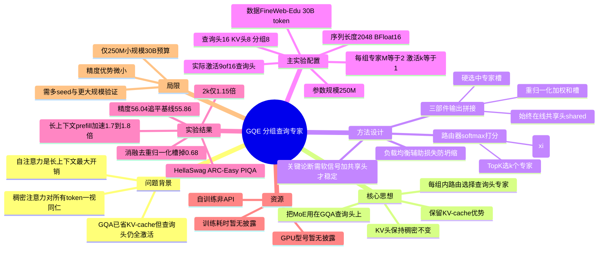

## 一、论文是干什么的？

### 先用一个类比理解两个关键词

想象一家公司开会，每次讨论一个问题（一个 token）都要把全公司**所有 16 位专家**叫到会议室发言。问题简单时这很浪费——很多人其实没必要来。

**注意力机制（Self-Attention）** 就是 Transformer 的"开会讨论"环节：每个词都要和上下文里的其他词互相"打招呼、算关系"。它是 Transformer 里最强大、但在长文本下也**最烧算力**的部分。

注意力内部又分两类角色：
- **查询头（Query head）**：负责"主动去问"——这个词想从别人那里获取什么信息。
- **键值头（Key-Value head, KV head）**：负责"被查询"——别的词能从我这里读到什么。推理时 KV 会被缓存下来（即 **KV-cache**），是显存占用的大头。

**GQA（Grouped-Query Attention，分组查询注意力）** 是目前主流大模型（如 Llama 系列）普遍采用的优化：让**多个查询头共享同一组 KV 头**。比如 16 个查询头分成 8 组，每组 2 个查询头共用 1 个 KV 头。这样 KV-cache 只需存 8 份而不是 16 份，省显存、省带宽。

**MoE（Mixture-of-Experts，混合专家）** 则是另一个省算力的思路：准备很多个"专家"模块，但每个 token 只**激活其中一小部分**（由一个"路由器 router"决定派给谁），从而在不增加单次计算量的前提下扩大模型容量，或在固定容量下减少计算。

### 这篇论文做了什么

本文把 MoE 的"按需激活"思想，**搬到了 GQA 注意力的查询头上**，提出 **GQE（Grouped Query Experts，分组查询专家）**：

> 在每个 GQA 分组内部，用一个路由器为每个 token 挑选 $k$ 个"查询头专家"来计算注意力，而**所有 KV 头保持稠密、原封不动**。

一句话：**让简单的 token 少用几个查询头，难的 token 多用**，而 KV 缓存这条省显存的路径完全不动。

核心结论：在 250M 参数规模、固定 30B token 训练预算下，GQE 在每个 token 只激活**一半查询头**的情况下，下游精度仍能追平"全部查询头都激活"的 GQA 基线；在长上下文场景下 prefill（预填充）阶段获得约 **1.7–1.8 倍**加速。

---

## 二、核心方法与创新

### 整体设计

设原本有 $N$ 个查询头、$G$ 个分组（即 $G$ 个 KV 头），那么每组内有 $M = N/G$ 个查询头。GQE 把**每组内的每个查询头看作一个"专家"**，路由器在组内挑选要激活哪几个。

论文主实验配置：

- 查询头数 $N=16$，KV 头数 / 分组数 $G=8$
- 每组专家数 $M = N/G = 16/8 = 2$
- 每组激活专家数 $k=1$

也就是说每组 2 个查询头里只算 1 个，8 个组共激活 8 个路由查询头。

### 路由器：决定派给谁

对第 $i$ 个 token、第 $g$ 个分组，路由器 $r_g$ 先对输入 $x_i$ 打分并做 softmax 归一化，得到对组内 $M$ 个专家的概率分布：

$$p_{i,g} = \mathrm{softmax}(r_g(x_i)) \in \mathbb{R}^{M}$$

再用 Top-k 选出得分最高的 $k$ 个专家：

$$K_g(x_i) = \mathrm{TopK}_m(p_{i,g,m},\, k)$$

只有被选中的查询头才真正去做注意力计算，没被选中的直接跳过，算力就省下来了。

### 输出怎么拼起来：三个关键部件

直接把"硬选中的几个专家"拼起来训练并不稳定。论文发现，要让稀疏路由真正追平稠密基线，输出需要由**三部分拼接**而成（拼接后再过输出投影 $W_O$）：

1. **硬选中专家槽**：被 Top-k 选中的那些查询头的注意力输出，直接拼接。
2. **重归一化加权和槽**：把选中专家的输出按其（重新归一化的）路由概率加权求和，得到一个"软"汇总向量。权重为

$$w_{i,g,m} = \frac{p_{i,g,m}}{\sum_{m' \in K_g} p_{i,g,m'}}$$

$$\bar{o}_i = \sum w_{i,g,m}\, o_{i,g,m}$$

3. **始终在线的共享头（shared head）** $s(x_i)$：一个对**每个 token 都计算**的查询头，提供稳定的"兜底"信号。

最终拼接为：

$$y_i = \mathrm{Concat}\big(O_i,\, \bar{o}_i,\, s(x_i)\big)\, W_O$$

因此每个 token 实际激活的查询注意力是 **8 个路由头 + 1 个共享头 = 9 个**（共 16 个里激活 9 个，约一半）。

### 为什么需要这些"看似多余"的设计

论文反复强调一句核心观察：

> 稀疏的查询头路由，**只有在路由器收到恰当的学习信号、并由一个始终在线的共享头加以稳定时**，才能追平稠密 GQA 基线。

- **重归一化加权和槽**给了路由器可微的梯度信号（否则 Top-k 的硬选择会让路由器学不动）。
- **共享头**保证每个 token 至少有一条稳定的注意力通路，防止训练早期路由器"摆烂"导致信息丢失。
- 训练时还加了**标准的 MoE 负载均衡辅助损失（auxiliary loss）**，防止"路由坍缩"（所有 token 都涌向同一个专家）。

### 最大的创新点

以往 MoE 大多用在 **FFN（前馈层）** 上，很少动注意力。GQE 的巧妙之处在于：它把稀疏激活只施加在**查询侧**，而 KV 侧保持稠密。这样既拿到了 MoE 减少计算的好处，又**完整保留了 GQA 省 KV-cache 的优势**——两全其美，对长上下文推理尤其友好。

---

## 三、使用了哪些模型和计算资源？

| 项目 | 内容 |
|---|---|
| 基座模型 | 自行训练的 250M 参数 Transformer（非基于现成大模型微调） |
| 注意力配置 | 16 查询头 / 8 KV 头 / 8 组，每组 2 专家，激活 1 |
| 训练数据 | FineWeb-Edu 的 30B token 采样子集 |
| 训练预算 | 固定 30B token |
| 序列长度 | 2048 |
| 优化器 | Fused AdamW（$\beta_1=0.9$，$\beta_2=0.95$，$\epsilon=1\times10^{-7}$） |
| 学习率 | WSD 调度，峰值 $1\times10^{-5}$ 到 $5\times10^{-4}$ |
| Warm-up | 30 亿 token |
| 全局 batch | 约 105 万 token |
| 权重衰减 | 0.1 |
| 精度 | BFloat16 混合精度 |
| GPU 型号 / 数量 | 暂无相关信息（全文未披露硬件） |
| 训练 / 推理耗时 | 暂无相关信息 |
| API 使用 | 无，属自训练架构研究 |

注：这是一篇**架构方法论文**，并未使用外部 LLM API；模型为作者自行从头训练的小规模模型。论文未公开任何 GPU 型号、数量或训练墙钟时间。

---

## 四、实验结果

### 精度：用一半查询头，追平甚至略超基线

在 250M 参数、30B token 下与稠密 GQA 基线对比（数值越高越好）：

| 配置 | HellaSwag | ARC-Easy | PIQA | 平均 |
|---|---|---|---|---|
| GQA 基线（16 头全激活） | 41.31 | 61.36 | 64.90 | 55.86 |
| GQE（8 路由头 + 共享头） | 41.01 | 62.41 | 64.69 | **56.04** |

大白话：**算力砍掉一半左右，成绩单几乎没变，平均分还略微高了一点点**（56.04 vs 55.86）。

### 速度：上下文越长，越赚

| 上下文长度 | prefill 加速 |
|---|---|
| 2k token | 约 1.15× |
| 4k – 1024k token | 约 **1.7 – 1.8×** |

短文本时省不了太多（注意力占比小），但**长文本时注意力是大头，GQE 的加速就非常可观**——这正是它的目标场景。

### 消融实验：证明每个部件都重要（Table 2）

| 去掉某部件后的配置 | 平均分 | 相对完整 GQE 的变化 |
|---|---|---|
| 完整 GQE | 56.04 | — |
| 仅加权拼接，去掉重归一化槽 | 55.18 | −0.68 |
| 仅硬拼接 | 55.43 | −0.43 |

说明：去掉"重归一化加权和槽"或"共享头/软信号"，精度都会掉，印证了第二节的核心论断——**这些稳定化设计不是花架子，是稀疏路由能work的前提**。

### 作者自己承认的局限

实验只做到 **250M 参数、30B token** 这一小规模；GQE 相对基线的精度优势**很微小**，作者明确建议要用**多个随机种子**和**更大规模**进一步验证后才能下定论。

---

## 五、潜在应用与已落地应用

### 潜在应用

- **长上下文推理加速**：最直接的受益场景。在 RAG、长文档问答、长代码理解中，注意力是瓶颈，GQE 的 1.7–1.8× prefill 加速很有吸引力，且**不牺牲 KV-cache 显存优势**。
- **边缘/端侧部署**：按 token 难度自适应分配算力，适合算力受限设备。
- **与现有 GQA 模型兼容**：因为只改查询侧、不动 KV 侧，理论上可作为现有 GQA 架构的"增量改造"方向。
- **注意力级 MoE 的研究范式**：为"把 MoE 从 FFN 扩展到注意力"提供了一个具体可行的设计模板。

### 已落地应用

**暂无相关信息。** 该论文 2026 年 6 月刚发布，属早期架构探索，目前没有公开的工业界落地或开源大模型采用记录。

---

## 六、网络上的讨论与评价

截至本综述撰写时（2026-06-29）：

- **HuggingFace Papers** 页面未显示点赞票数（hfVotes 记为 0），也无公开评论区讨论。
- **WebSearch 检索**（含 Reddit、r/MachineLearning 等关键词）**未找到针对该论文的实质性社区讨论帖**。搜索结果基本只返回论文本身（arXiv 摘要页与 HTML 全文），以及一些关于 GQA / MoE 通用背景的科普文章。

**客观说明：这是一篇刚发布约一周的新论文，目前网络上尚无有热度的讨论或第三方评测。** 以上为如实情况，未作任何编造。

可参考的来源链接：
- [arXiv 摘要页](https://arxiv.org/abs/2606.20945)
- [arXiv 全文 HTML](https://arxiv.org/html/2606.20945)
- [HuggingFace Papers 页面](https://huggingface.co/papers/2606.20945)

---

## 七、思维导图

