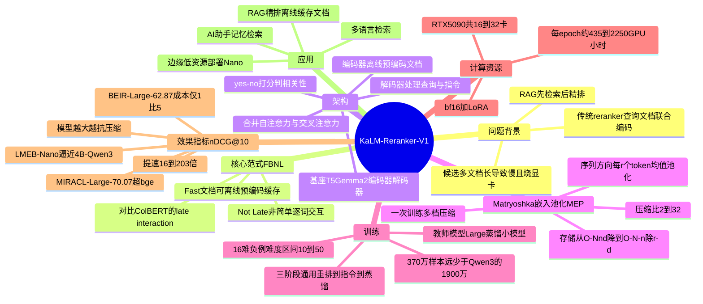

## 一、论文是干什么的？

想象你在图书馆问管理员一个问题，管理员先用关键词从几十万本书里粗略翻出 100 本"可能相关"的书（这一步叫**检索**，retrieval），但这 100 本里很多其实跑题。于是你需要一个更细心的人，把这 100 本一本本拿起来仔细读、和你的问题逐字比对，按"到底有多相关"重新排个序，把最对口的几本放最前面。这个"细心的人"就是**重排器**，也就是 reranker。

在如今很火的 **RAG**（检索增强生成，即让大模型先查资料再回答）系统里，reranker 几乎是标配：检索负责"广撒网"，reranker 负责"精挑细选"，最后只把最相关的少数文档喂给大模型，这样回答才准。

但 reranker 有个老大难问题——**慢**。传统做法是把"查询"和"每一篇候选文档"拼在一起，整体扔进一个大模型里算一次相关性分数。你有 100 篇候选，就得跑 100 次完整的大模型，而且每次都要把那篇长长的文档从头读一遍。文档越长、候选越多，就越烧显卡、越慢。

这篇论文提出的 **KaLM-Reranker-V1** 就是要解决"既要准、又要快"的矛盾。它的核心思路叫 **FBNL（Fast but Not Late Interaction，快速但非延迟交互）**：把文档的计算和查询的计算**拆开**——文档可以提前离线算好、存起来、还能压缩；线上来了查询，只需做一次轻量计算，去"翻阅"那些预先存好的文档表示即可。结果是最小的模型比同体量对手快约 10 倍，最大的模型效果逼近 80 亿参数级别的工业重排器。

## 二、核心方法与创新

### 先理解三个概念

- **检索 / RAG**：见上文，先粗筛再精排，最后给大模型当参考资料。
- **Late Interaction（延迟交互）**：以 **ColBERT** 为代表的一种做法。查询和文档各自先编码成一堆向量（每个词一个向量），等到要算分时才让查询的每个词向量去和文档的每个词向量"逐一碰面"取最大相似度。好处是文档能预先算好，坏处是要存"每个词一个向量"，存储开销巨大，而且这种逐词点积的交互方式表达能力有限。
- **本文的 FBNL（快速但非延迟交互）**：它也让文档预先算好，但交互不是简单的逐词点积，而是放进解码器里用**交叉注意力**做更丰富的相关性建模。所以叫"快"（文档可缓存）但"不是延迟交互"（交互更深、更聪明）。

### 创新点一：编码器-解码器解耦架构

模型基座是 **T5Gemma2**（一种编码器-解码器结构的基础模型）。

- **编码器**负责离线把每一篇文档（passage）压成一组表示，提前存进库里。文档一旦入库，不管将来谁来查、查多少次，都不用再重算。
- **解码器**负责处理在线来的东西：系统指令、用户指令、以及查询本身。解码器内部把自注意力和交叉注意力**合并**计算——查询的 token 既看自己（解码器输入），也通过交叉注意力去"看"缓存好的文档表示。

打个比方：传统 reranker 是每来一个问题，就把整本书重新读一遍再回答；FBNL 则是提前给每本书做好详细索引卡，问题来了只翻索引卡，省掉重复读书的功夫。

注意力计算大致是：查询提供 $Q$，键和值 $K, V$ 来自"解码器输入"与"编码器输出"的拼接，再经 softmax 配合掩码矩阵 $M$ 归一化。最终相关性分数靠比较 "yes" 与 "no" 两个 token 的概率得出（监督微调损失）：

$$\mathcal{L}_{sft} = -\log\frac{\exp(z_l)}{\exp(z_{yes})+\exp(z_{no})}$$

其中 $z_{yes}$、$z_{no}$ 分别是模型判断"相关/不相关"的打分，$z_l$ 是正确标签对应的分。

### 创新点二：Matryoshka 嵌入池化（MEP）

文档预先算好是省了重复计算，但"每篇文档存一大堆向量"还是很占空间。这里引入 **Matryoshka Embedding Pooling（套娃式嵌入池化，MEP）**：沿着序列方向，把连续的 $r$ 个 token 表示用均值池化合并成 1 个。$r$ 就是**压缩比**，论文测试了 $\{2,4,8,16,32\}$。

"套娃"的妙处在于一次训练、多档压缩：训练时同时用多个压缩比 $\mathcal{R}=\{2,4,8,16\}$、等权重 $\lambda_r=1$ 联合优化：

$$\mathcal{L}_{sft}(\mathcal{R}) = \sum_{r\in\mathcal{R}}\lambda_r\left(-\log\frac{\exp(z_l^{(r)})}{\exp(z_{yes}^{(r)})+\exp(z_{no}^{(r)})}\right)$$

这样部署时可以自由地在"省内存"和"高精度"之间滑动：内存紧张就用 $r=8$ 甚至 $r=16$，要精度就用 $r=2$，一套模型权重通吃。

### 创新点三：三阶段训练 + 知识蒸馏

1. **通用重排**：不带任务指令，先学会基本的相关性判断。
2. **任务自适应**：加入指令微调，让模型听懂"针对某类任务该怎么排"。
3. **细粒度蒸馏**：用最大的 KaLM-Reranker-V1-Large 当老师，蒸馏给小模型，蒸馏损失为二元交叉熵：

$$\mathcal{L}_{kd} = -y\log\hat{y}-(1-y)\log(1-\hat{y})$$

这套"解耦 + 压缩 + 蒸馏"的组合，使存储复杂度从存全表示的 $O(Nnd)$ 降到压缩后的 $O(N\lceil n/r\rceil d)$（$N$ 文档数，$n$ 文档长度，$d$ 维度），在线计算也大幅减负。

## 三、使用了哪些模型和计算资源？

| 项目 | 内容 |
| --- | --- |
| 基座模型（LLM） | T5Gemma2，提供 270M-270M、1B-1B、4B-4B 三档编码器-解码器变体 |
| 模型规格 | Nano 0.27B（18 层，隐藏维 640）；Small 1B（26 层，1152）；Large 4B（34 层，2560）；最大序列长 128K |
| 教师模型 | KaLM-Reranker-V1-Large（用于第三阶段蒸馏） |
| 训练数据 | 约 370 万样本（对比 Qwen3-Reranker 的 1900 万），来自 KaLM embedding 数据 + BGE-M3 训练子集；每条查询采样 16 个难负例（取自第 10-50 名）|
| GPU 型号与数量 | RTX 5090：Nano/Small 用 16 卡，Large 用 32 卡 |
| 训练耗时 | 每个 epoch 约 435 GPU 小时（Nano）、约 780（Small）、约 2250（Large）|
| 训练配置 | bf16 精度；LoRA rank 96（Nano）/ 64（Small/Large）；梯度累积 4 步；学习率 1e-4 / 2e-4 / 5e-5（对应三阶段）；查询/文档最大长 128/512 |

推理端没有给出单独的绝对耗时数字，而是以"相对加速比"衡量（见下节）。论文未提及使用任何外部 API。

## 四、实验结果

大白话总结：**最小的 Nano 模型又小又快，效果还能压住同体量对手；最大的 Large 模型用几分之一的成本，逼近甚至局部超过 40-80 亿参数的工业级重排器。** 评测全部用检索常用指标 **nDCG@10**（数值越高越好，衡量排序质量，越相关的排越靠前得分越高）。表中 Cost 是相对计算成本（越低越省）。

### BEIR（13 个英文检索任务，nDCG@10）

| 模型 | 平均分 | 相对成本 |
| --- | --- | --- |
| KaLM-Reranker-V1-Nano（0.27B） | 57.41 | 1.0x |
| KaLM-Reranker-V1-Small（1B） | 60.01 | 6.9x |
| KaLM-Reranker-V1-Large（4B） | 62.87 | 43.7x |
| Qwen3-Reranker-4B | 63.50 | 236.8x |
| Qwen3-Reranker-8B | 65.11 | 539.7x |

解读：Large 拿到 62.87，离 Qwen3-Reranker-4B 的 63.50 只差 0.6 分，但成本只有它的约 1/5（43.7x 对 236.8x）。

### MIRACL（18 种语言多语检索，nDCG@10 平均）

| 模型 | 体量 | 平均分 | 相对成本 |
| --- | --- | --- | --- |
| KaLM-Reranker-V1-Nano | 0.27B | 62.08 | 1.0x |
| KaLM-Reranker-V1-Small | 1B | 66.89 | 6.9x |
| KaLM-Reranker-V1-Large | 4B | 70.07 | 43.7x |
| bge-reranker-v2-gemma | 2.5B | 69.82 | 81.3x |

解读：Large 以约一半成本超过 bge-reranker-v2-gemma（70.07 对 69.82），且这是在多语训练数据有限的情况下取得的。

### LMEB（记忆检索，6 任务，nDCG@10）

| 模型 | 体量 | 平均分 |
| --- | --- | --- |
| KaLM-Reranker-V1-Nano | 0.27B | 61.39 |
| KaLM-Reranker-V1-Small | 1B | 63.15 |
| KaLM-Reranker-V1-Large | 4B | 64.16 |
| Qwen3-Reranker-4B | 4B | 62.86 |

解读：连最小的 Nano 都能在这套任务上接近 4B 的 Qwen3-Reranker，Large 则全面反超。

### 压缩与提速的代价权衡

- 提速：文档长 256 token 时约 16.6 倍加速；长 1024 token 时随压缩比可达 33.3 至 203.4 倍；压缩比 $r=4$ 约 18.5 倍，$r=8$ 约 33.3 倍。
- 精度损失（BEIR 平均）：$r=2$ 几乎无损；$r=4$ 掉约 1-2 分；$r=8$ 掉约 2-3 分；$r=16$ 掉约 4-5 分；$r=32$ 掉约 7-10 分。
- 一个有意思的规律：**模型越大，越抗压缩**。例如 NQ 任务上 Large 从 $r=2$ 到 $r=32$，ROC-AUC 仅从 0.952 微降到 0.948；而小模型在 FiQA 上从 0.871 降到 0.832。

一句话：中等压缩（$r=2$ 到 $r=8$）基本是"白嫖"的提速，精度几乎不疼。

## 五、潜在应用与已落地应用

**潜在应用**：

- **RAG 系统的精排环节**：在企业知识库问答、智能客服中，文档可离线预编码入库，线上只算查询，显著降低延迟与显卡开销。
- **大规模搜索引擎重排**：候选文档量大、QPS 高的场景，FBNL 的"文档可缓存 + 套娃压缩"特别适合控成本。
- **多语言检索**：MIRACL 上 18 语种的竞争力使其适合跨语言搜索与国际化产品。
- **边缘/低资源部署**：Nano 仅 0.27B 且可压缩存储，适合内存受限设备。
- **个性化记忆检索**：LMEB（记忆检索）上的强表现暗示可用于"AI 助手长期记忆"的相关片段排序。

**已落地应用**：论文将其定位为 KaLM 系列模型，对标 Qwen3-Reranker、bge-reranker、gte-reranker 等工业重排器，并提供 Nano/Small/Large 三档以适配不同部署预算。截至本综述撰写，公开渠道暂无关于具体生产环境部署案例的相关信息。

## 六、网络上的讨论与评价

整体而言，这是一篇较新的论文（2026 年 6 月），网络讨论尚不丰富。

- HuggingFace 论文页面**未显示点赞票数**（记为 0），页面上也没有评论区讨论。
- 推荐系统类技术博客 [RecSys Substack](https://recsys.substack.com/p/fast-but-not-late-interaction-reranking) 在一期周报中介绍了该工作，称其"打破了把查询和文档放在一起联合编码的惯常做法"，肯定了 Matryoshka 嵌入池化提供的"内存-质量灵活权衡"，并复述了其在 BEIR 上匹配 Qwen3-Reranker 家族、在 MIRACL 上跨 18 语种保持竞争力、在 LMEB 上即便最小的 Nano 也能与 70 亿到 120 亿参数嵌入模型相抗衡的结论。该博客以正面介绍为主，未提出明显批评。
- 命名上需注意：该工作与 Jina 的 [jina-reranker-v3（Last but Not Late Interaction）](https://arxiv.org/abs/2509.25085) 思路相近但不同——后者用因果注意力把查询和所有候选放进同一上下文做列表式重排，二者都在探索"避免昂贵延迟交互"的方向，容易混淆。

除上述外，暂无更多公开的第三方深入评测或争议性讨论。

## 七、思维导图

