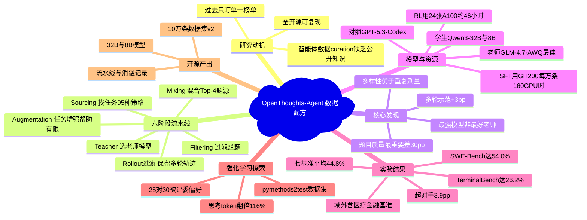

## 一、论文是干什么的？

想象你要培养一名「全能实习生」，让他既能改 GitHub 上的代码 bug，又能在 Linux 终端里敲命令，还能看懂财报、辅助医疗问诊。要培养这样的人，光有聪明的脑子（大模型）还不够，关键在于给他看什么样的「教学案例」——案例选得好，实习生进步飞快；案例选得糟，再聪明也学不会。

过去开源社区训练这类「智能体模型」（agentic model，指能多轮调用工具、自己动手完成任务的 AI）时，大家各自为战，只盯着某一个榜单（比如只刷 SWE-Bench 改代码、或只刷 Terminal-Bench 敲终端），而且**怎么挑选训练数据几乎全是闭门秘方**，外人无从学习。

这篇论文做的事，就是把「挑选训练数据」这件事彻底摊开来做成一本公开的「菜谱」。作者团队（OpenThoughts 项目，UC Berkeley、Stanford 等多校联合）跑了 **100 多次受控消融实验**，把数据处理流水线的每一道工序都拆开逐一验证，最后整理出一份 10 万条样本的训练集，用它微调开源模型 Qwen3-32B，在七个不同领域的智能体基准上拿到 **44.8% 的平均准确率**，比此前最强的开源数据模型（Nemotron-Terminal-32B 的 40.9%）高出 **3.9 个百分点**。更重要的是，他们把数据、流水线、实验记录和模型全部开源（[openthoughts.ai](https://www.openthoughts.ai)），让任何人都能照着菜谱复现。

## 二、核心方法与创新

论文最核心的贡献是把一条**六阶段的 SFT（监督微调）数据流水线**讲清楚，并用实验证明每一步该怎么做。可以把它理解成「为实习生编教材」的六道工序：

1. **Sourcing Tasks（找任务）**：去哪儿找练习题。作者对比了多达 95 种任务生成策略，既有合成题（机器造）也有真人写的题。
2. **Mixing Tasks（混合任务）**：把表现最好的几个题源按比例掺在一起，比如「Top-4」混合。
3. **Task Augmentation（任务增强）**：用 LLM 把题目改写润色——结果发现这一步对基础效果帮助不大。
4. **Filtering Tasks（过滤任务）**：用 LLM 当质检员，剔除描述含糊的烂题。
5. **Teacher Model Selection（选老师）**：用哪个强模型来「示范解题」、生成解题轨迹。
6. **Filtering Agent Rollouts（过滤轨迹）**：把解题过程太短（少于 5 轮交互）或超时的示范丢掉。

为了客观比较「哪种工序设置更好」，作者设计了一个**跨基准的 z-score 排名指标**：对每个候选策略，先在每个基准上减去该阶段的均值、除以标准差得到标准分，再对三个基准的标准分取平均。用公式表达即

$$z = \frac{1}{3}\sum_{b=1}^{3}\frac{a_b - \mu_b}{\sigma_b}$$

其中 $a_b$ 是该策略在基准 $b$ 上的准确率，$\mu_b$、$\sigma_b$ 是该阶段所有候选在基准 $b$ 上的均值与标准差。这样不同难度的基准就能放在同一把尺子上比较。

论文挖出的几条**反直觉发现**最有价值：

- **题目质量（instruction）比什么都重要**：换个题源，SWE-Bench 上的成绩能差出多达 30 个百分点。教材选得对不对，是整条流水线最关键的一环。
- **最强的模型不一定是最好的老师**：性能最高的 GPT-5.3-Codex 当「老师」生成示范时，效果反而比看似更弱的 GLM-4.7-AWQ 差，在 Terminal-Bench 2.0 上约低 5%。原因可能是强模型的解法太「跳跃」，学生模型反而学不来。
- **多轮示范更管用**：只保留交互轮数 ≥5 的解题轨迹，平均能提升约 3 个百分点。手把手、步骤多的示范比一步到位的更利于学习。
- **多样性 > 重复刷量**：一味重复最强的几个题源会很快遇到瓶颈（从 31.6K 到 100K 几乎不再涨），必须扩充题源种类、或用合成增强才能继续提升。

作者还做了一小步 **RL（强化学习）** 探索：在 pymethods2test 数据集上对 8B 模型做强化学习后，模型每条轨迹的「思考 token」数量翻倍多（30.3 → 65.4，+116%），LLM 评委在 30 条里有 25 条更偏好 RL 后的版本，说明智能体学会了更深入地「思考再动手」。

## 三、使用了哪些模型和计算资源？

| 项目 | 具体信息 |
|------|----------|
| 学生 / 基座模型 | Qwen3-32B（主力 32B 实验）、Qwen3-8B（消融与 RL 实验） |
| 老师 / 示范模型 | GLM-4.7-AWQ（最终选定的最佳老师）、GPT-5.3-Codex、Kimi K2.5、GLM-4.6-AWQ、GLM 5 |
| SFT 训练硬件 | GH200 GPU；每 1 万条样本的微调约耗 **160 GPU-小时** |
| SFT 超参 | 全参数微调，学习率 4e-5（余弦调度），全局 batch size 96，7 个 epoch，上下文长度 32,768 |
| RL 训练硬件 | 6 个节点，每节点 4 张 NVIDIA A100-SXM4-80GB，共 **24 张 A100 80GB**；总墙钟时间约 **46 小时**，batch size 64 |
| 推理 | vLLM 异步，16 个推理引擎，eager 模式，最多 280 个并发试验 |
| RL 算法 | RLOO（带 per-prompt 标准差归一化），PPO clip 范围 [0.2, 0.2]，AdamW，学习率 5e-6 |

整体计算资源信息披露得相当完整：用了 GH200 做监督微调、24 张 A100 做强化学习，关键耗时（每万条 160 GPU-小时、RL 约 46 小时）均有明确数字。

## 四、实验结果

一句话：**用公开数据也能训出当前最强的开源智能体模型**。最终的 OpenThoughts-Agent 32B 模型在七个基准上平均 44.8 分，比对手 Nemotron-Terminal-32B 高 3.9 分。

| 基准 | OpenThoughts-Agent | Nemotron-Terminal |
|------|--------------------|-------------------|
| SWE-Bench Verified-100（改代码） | 54.0% | 41.9% |
| Terminal-Bench 2.0（终端操作） | 26.2% | 25.1% |
| 七基准平均 | 44.8% | 40.9% |

评测覆盖面很广：除了改代码（SWE-Bench）和敲终端（Terminal-Bench、自建的 TBLite），还专门留了一批「训练时没见过」的域外（OOD）基准来检验通用性，包括 Aider Polyglot、BFCL-Parity、MedAgentBench（医疗）、GAIA-127、FinanceAgent-Terminal（金融）。

几个关键消融数字：

- 换题源策略：SWE-Bench 上波动可达 30 个百分点，Terminal-Bench 上达 10 个百分点。
- Top-4 混合 vs 仅用 Top-1：归一化平均分 18.19 对 16.65，混合更优。
- ≥5 轮交互过滤：平均 +3 个百分点。
- 实验可复现性：重复跑的成绩波动约为域内 1.6 分、域外 2.0 分，说明结论稳健而非随机噪声。

最终的 10 万条训练集由四个题源组成：SWE-Smith（合成 GitHub issue）、StackExchange-SuperUser、StackExchange-Tezos（仅 997 条独特任务）、Issue-Tasks。规模扩展实验显示，单纯上采样会在 31.6K→100K 区间触顶，而加入合成增强后仍能持续提升。

## 五、潜在应用与已落地应用

**潜在应用**：这套数据配方让任何团队都能更便宜、更可控地训练「全能智能体」。论文明确指出其洞见可用于构建跨领域的稳健通用智能体，覆盖编程、终端运维、金融分析、医疗辅助等复杂任务场景。对研究者而言，它提供了一个透明的对照基线，省去了反复试错的成本。

**已落地**：项目本身就是一次完整落地——团队已在 [openthoughts.ai](https://www.openthoughts.ai) 公开发布了全部数据集（OpenThoughts-Agent-v2，10 万条）、数据流水线代码、上百次消融实验记录，以及微调好的 32B / 8B 模型，任何人都可直接下载使用或在此基础上继续研究。这种「数据 + 流水线 + 模型」三件套全开源的做法，在智能体训练领域本身就属于稀缺资源。

## 六、网络上的讨论与评价

截至综述时，这篇论文较新（2026-06-23 提交），HuggingFace Papers 页面**未显示点赞数据**（记为 0），尚无成规模的社区讨论。

目前可见的网络踪迹主要是若干论文聚合与解读站点收录，如 [alphaXiv](https://www.alphaxiv.org/abs/2606.24855)、[Emergent Mind](https://www.emergentmind.com/papers/2606.24855)、[Moonlight 文献综述](https://www.themoonlight.io/en/review/openthoughts-agent-data-recipes-for-agentic-models)。科技博客 [Digg](https://digg.com/tech/rmqlv5mz) 报道了「OpenThoughts 发布全开放数据流水线」，但据其页面数据仅约 2000 次浏览、2 次收藏，且无实质性评论。总体而言，业界对其「全开源、可复现」的定位评价正面，但深入的第三方评测与独立复现尚待出现。

## 七、思维导图

