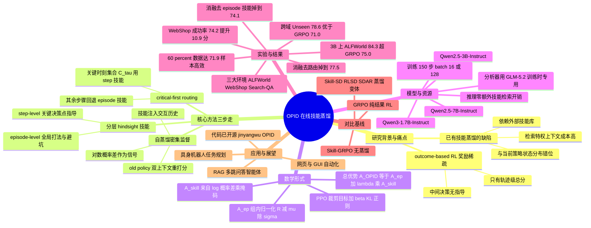

## 一、论文是干什么的？

想象你在教一个新手玩密室逃脱。传统做法是：让他自己玩一整局，最后只告诉他「这局你赢了」或「这局你输了」。这种反馈太粗糙了——他赢了，但到底是哪几步走对了？他输了，又是哪一步埋下了祸根？新手完全无从知道。这正是当下用强化学习训练**语言智能体**（指能调用工具、多轮交互、自己做决策的大模型 Agent）时的核心痛点：**基于结果的奖励**（outcome-based reward）只在整条轨迹结束后给一个总分，对中间每一步该不该鼓励、该不该抑制几乎没有指导。

OPID（On-Policy Skill Distillation，在线策略技能蒸馏）就是来解决这个问题的。它的思路很像一位「复盘教练」：让智能体先自己把一局打完，然后教练回过头看这条完整轨迹，从中总结出可复用的**「技能」**（skill，即对成功经验或失败教训的文字总结），再把这些技能「喂」回给模型，让它明白每一步好在哪、坏在哪。关键在于，这些技能不是从外部数据库里现查现取的，而是从智能体**自己刚跑出来的轨迹**（on-policy，在线策略）里提炼的，所以和模型当前的能力水平、状态分布完全匹配，不会出现「教材太难或太简单」的错位。

更妙的是，这套复盘教练只在训练时上岗。模型真正上线干活（推理）时，不需要任何外部技能检索，速度和原版完全一样。

## 二、核心方法与创新

OPID 的核心可以拆成三步走：提炼分层技能、路由并转成密集监督、与结果奖励合并优化。

**第一步：提炼分层技能（hierarchical hindsight skills）。** 教练复盘时分两个层次总结经验。**episode-level 技能**（轨迹级）抓的是全局打法或「避坑」规则，相当于「这类任务整体应该先搜索再下单」。**step-level 技能**（步骤级）则针对某些关键决策点，相当于「在第 7 步那个岔路口，应该选左边而不是右边」。粗细搭配，既有大局观又有精准指导。

**第二步：关键优先路由（critical-first routing）。** 不是每一步都需要精细指导。OPID 识别出轨迹里的关键时刻（critical timesteps，记为集合 $C_\tau$），在这些点上用精细的 step-level 技能，其余地方默认用 episode-level 技能。这就像教练只在最容易出错的几个关口反复强调，其他地方点到为止。

**第三步：自蒸馏转成密集监督。** 这是最巧妙的地方。把选中的技能注入到交互历史里，让**旧策略**（old policy，即更新前的模型）对同一条已经采样出来的回答重新打分一次——一次在原始上下文下打分，一次在「加了技能提示」的上下文下打分。两次打分的对数概率之差，就是这一步的密集监督信号。直觉上：如果加了技能提示后模型对某个 token 的概率明显上升，说明这个 token 是技能所鼓励的好动作，就该强化它。

用公式表达，OPID 的总优势函数把轨迹级优势和技能优势相加：

$$A^{OPID}_{\tau,t,\ell} = A^{ep}_{\tau,t,\ell} + \lambda_{skill} \cdot A^{skill}_{\tau,t,\ell}$$

其中轨迹级优势用组内相对归一化（类似 GRPO）：

$$A^{ep}_{\tau} = \frac{R(\tau) - \mu_q}{\sigma_q}$$

$\mu_q$ 和 $\sigma_q$ 是同一问题下一组采样的均值和标准差。技能优势则来自前述「加技能 vs 不加技能」的对数概率差：

$$A^{skill}_{\tau,t,\ell} = (\ell^{skill}_{\tau,t,\ell} - \ell^{old}_{\tau,t,\ell}) \cdot m_{\tau,t,\ell}$$

最终的策略损失沿用 PPO 式的裁剪目标，再加一个 KL 正则项：

$$\mathcal{L}_{policy}(\theta) = -\mathbb{E}[\min(\rho \cdot A^{OPID}, \mathrm{clip}(\rho, 1-\epsilon, 1+\epsilon) \cdot A^{OPID})] + \beta \cdot \mathcal{L}_{KL}(\theta)$$

**为什么这是创新？** 过去的技能蒸馏方法大多依赖外部技能库或检索来的「特权上下文」，维护成本高，而且容易和当前策略的状态分布对不上号。OPID 则把成败奖励作为主目标稳住大局，同时从自己的轨迹里现场榨取密集的、逐 token 的技能监督，二者互补——既保留了结果奖励的稳定性，又补上了过程指导的精细度。

## 三、使用了哪些模型和计算资源？

**基础 LLM 模型：** 实验使用了三个 Qwen 系列模型，覆盖 1.7B 到 7B 参数规模：

- Qwen2.5-3B-Instruct
- Qwen2.5-7B-Instruct
- Qwen3-1.7B-Instruct

**技能提炼分析器：** 用于从轨迹中提炼技能的 LLM 分析器（analyzer）采用了 GLM-5.2。这个分析器只在训练阶段使用。

**训练配置：** batch size 为 16（ALFWorld / WebShop）或 128（Search-based QA）；所有环境统一训练 150 步；采用 PPO 标准裁剪参数 $\epsilon$、带调度器的 KL 系数 $\beta$，以及技能权重 $\lambda_{skill}$。

**GPU 型号与数量：** 暂无相关信息（公开摘要与 HTML 全文未明确列出 GPU 型号和卡数）。

**训练 / 推理耗时：** 暂无相关信息（未给出具体的小时数或墙钟时间）。论文强调推理阶段不需要外部技能检索，因此推理开销与原版策略相同。

## 四、实验结果

论文在三大类智能体环境上做了评测：**ALFWorld**（具身家务任务，含 Pick、Look、Clean、Heat、Cool、Pick2 等子任务）、**WebShop**（电商网购导航，128 个测试任务）和 **Search-based QA**（基于搜索的问答，含 Natural Questions、TriviaQA、PopQA、HotpotQA、2WikiMultiHopQA、MuSiQue、Bamboogle 七个子集）。

大白话总结：不管模型大小，OPID 都稳稳超过「只看结果」的强化学习基线 GRPO，而且学得更省数据、更抗干扰。

以 Qwen2.5-3B-Instruct 为例：

| 评测基准 | OPID | GRPO（基线） | 提升 |
|---|---|---|---|
| ALFWorld 平均 | 84.3% | 75.0% | +9.3 分 |
| Search-QA 平均 | 45.0% | 36.4% | +8.6 分 |
| WebShop 成功率 | 74.2% | 63.3% | +10.9 分 |

在更大的 Qwen2.5-7B-Instruct 上同样有效：ALFWorld +8.8 分、Search-QA +7.2 分、WebShop +7.1 分。

**跨域泛化能力：** 在 ALFWorld 的 Unseen（未见过任务）测试集上，OPID 平均成功率 78.6%，明显高于 GRPO 的 71.0%，说明学到的技能确实有迁移性，而非死记硬背。

**样本效率：** OPID 只用 60% 的训练数据就能达到 71.9% 的表现，接近 GRPO 用全部数据才达到的 75.0%——也就是说更省数据。

**消融实验（验证每个部件都有用）：**

| 去掉的部件 | ALFWorld 平均 | 相对完整版 |
|---|---|---|
| 完整 OPID | 84.3% | 基准 |
| 去掉 episode 技能 | 74.1% | -10.2 分 |
| 去掉 step 技能 | 79.1% | -5.2 分 |
| 去掉关键优先路由 | 77.5% | -6.8 分 |

可见两个层级的技能和「关键优先路由」机制缺一不可，去掉任何一个都会明显掉点。

## 五、潜在应用与已落地应用

**潜在应用方向：**

- **网页 / GUI 自动化 Agent：** WebShop 上的强表现说明它适合训练能自主浏览、点击、下单的网购或操作类智能体。
- **检索增强问答（RAG）智能体：** Search-based QA 的多跳问答场景，可用于训练会自己规划搜索、综合证据的问答助手。
- **具身智能 / 机器人任务规划：** ALFWorld 这类家务任务的提升，对需要长序列决策的具身智能体有借鉴意义。
- **通用多轮工具调用 Agent：** 任何「奖励稀疏、中间步骤难评判」的多轮交互训练场景，都可以套用这套密集化监督的思路。

**已落地应用：** 暂无相关信息。这是一篇 2026 年 6 月刚发布的研究论文，目前停留在学术验证阶段，尚无公开的工业落地案例。作者已开源代码，仓库地址见 [GitHub - jinyangwu/OPID](https://github.com/jinyangwu/OPID/tree/main)，便于社区复现和二次开发。

## 六、网络上的讨论与评价

截至综述撰写时（2026-06-29），该论文在 HuggingFace Papers 上获得 50 票，显示出一定的社区关注度。不过目前网络上**尚无大量深度讨论或第三方评测**——除论文本身的 [arxiv 页面](https://arxiv.org/abs/2606.26790) 和 [HuggingFace 论文页](https://huggingface.co/papers/2606.26790) 外，公开搜索未发现知名博客、社交媒体长帖或独立复现报告。

从研究脉络看，它属于近期一个活跃的方向——「智能体强化学习中的技能 / 自蒸馏」。相关同期工作包括 [Self-Distilled Agentic Reinforcement Learning](https://arxiv.org/abs/2605.15155)、Skill-SD（Skill-Conditioned Self-Distillation）等，OPID 在论文中也把它们列为对比基线。OPID 的差异化卖点在于「分层技能 + 关键优先路由 + 完全在线、推理零额外开销」这一组合。后续随着开源代码被更多人使用，预计会有更多社区反馈出现。

如需了解整体方向，可参考社区维护的 [awesome-on-policy-distillation](https://github.com/chrisliu298/awesome-on-policy-distillation) 论文合集。

## 七、思维导图

