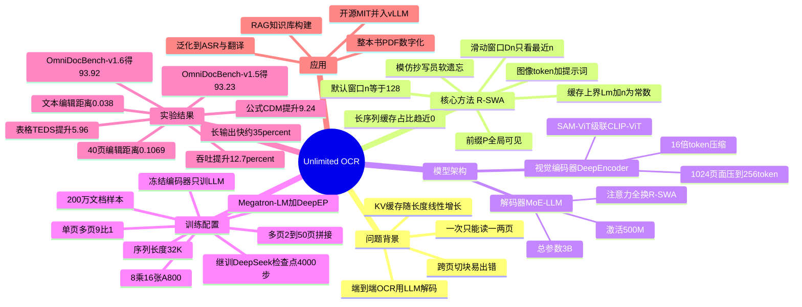

## 一、论文是干什么的？

先说 OCR 是什么。OCR（Optical Character Recognition，光学字符识别）就是让计算机"看一张图片，把里面的文字读出来并打成可编辑文本"。你用手机扫一张菜单、把一本旧书拍照转成 Word，背后干活的就是 OCR。现代 OCR 已经不只是认字，还要还原版面：哪段是标题、哪块是表格、公式怎么排、阅读顺序是从左到右还是分栏，这叫"文档解析"。

近两年最先进的做法是"端到端"模型：一个**视觉编码器**把图片压成一串特征 token，再接一个**大语言模型**（LLM）像写文章一样把整页内容"逐字续写"出来（包括 Markdown、表格、公式、坐标）。代表作是 DeepSeek OCR。

但这种做法有个老大难问题，可以打个比方：让一个人抄书，他每写一个字，都要把"前面已经抄过的所有字"重新瞄一遍才能写下一个字。抄得越多，要回顾的内容越多，速度越来越慢、占的"草稿纸"（显存）越来越大。在 Transformer 里，这张越积越厚的草稿纸就是 **KV 缓存**（KV Cache），它随生成长度**线性增长**。于是模型一次只能处理一两页，想读完一本几十页的书，就得切成很多块分别处理，既慢又容易在跨页处出错。

这篇论文要解决的就是：**怎么让模型一口气（一次前向传播）读完几十页文档，而显存还不爆。** 作者提出的 Unlimited OCR（无限 OCR）做到了在标准 32K 上下文里一次解析几十页，并且在权威基准 OmniDocBench 上比 DeepSeek OCR 高约 6 个百分点。

## 二、核心方法与创新

核心创新只有一个名字：**Reference Sliding Window Attention（R-SWA，参考滑动窗口注意力）**。

它模仿人类抄写员的认知习惯——"软遗忘"。一个抄写员在抄写时，眼睛始终盯着**原稿**（reference，也就是要识别的那张图），但对自己**刚刚抄过的内容**只需要记住最近的一点点（保证语句连贯、不重复、不跳行），更早抄的内容就可以忘掉了，因为标准答案永远在原稿上。

把这个直觉翻译成注意力机制，R-SWA 让每个待生成的 token 只看两部分内容：

- **前缀 P**：所有视觉 token + 提示词（也就是"原稿"），这部分**全局可见、永不丢弃**；
- **滑动窗口 $D_n(t)$**：只看自己前面最近 $n$ 个已生成的 token（论文默认 $n=128$）。

用集合写出来就是，token $t$ 的注意力邻域为：

$$N(t) = P \cup D_n(t)$$

这一个小改动带来质变。标准多头注意力的 KV 缓存大小是 $L_m + T$，会随着输出长度 $T$ 不断变大；而 R-SWA 的缓存被卡在一个上界：

$$\text{cache} \le L_m + n$$

其中 $L_m$ 是前缀（图像与提示）的固定长度。也就是说，无论你输出 1 页还是 50 页，缓存几乎不变，是一个**常数**。当输出很长时，缓存占比 $\rho(T) \approx (L_m+n)/T \to 0$，趋近于零。这就是标题里"Unlimited（无限）"的由来：长度不再是显存的敌人。

为什么这样还能保证质量？关键在于"原稿（前缀）永远全局可见"。普通的滑动窗口注意力会把更早的内容彻底看不到，容易跑题；而 R-SWA 保留了对图像 token 的完整访问，模型随时能"抬头看原稿核对",所以即使忘掉了早期生成文本，也不会漏读或读错。

配套的工程设计还包括：把页面坐标统一归一化到 0–1000 区间，便于跨页对齐;训练时按 9:1 混合单页与多页样本，多页样本由 2–50 页拼接而成，让模型学会跨页连续解析。

## 三、使用了哪些模型和计算资源？

| 项目 | 内容 |
|------|------|
| 视觉编码器 | DeepEncoder（沿用自 DeepSeek OCR），结构为 SAM-ViT 级联 CLIP-ViT，16 倍 token 压缩，把 1024×1024 页面压到约 256 个 token；支持 Base（多页）与 Gundam（动态分辨率）两种模式 |
| 语言解码器 | 一个 MoE（混合专家）LLM，总参数 3B，每次推理仅激活约 500M 参数；所有标准多头注意力被替换为 R-SWA（窗口 $n=128$） |
| 训练数据 | 约 200 万份文档 OCR 样本，单页:多页 = 9:1，多页样本 2–50 页拼接，序列长度 32K |
| 训练方式 | 从 DeepSeek OCR 检查点**继续训练** 4000 步；冻结 DeepEncoder，只训练 LLM 参数 |
| GPU | 8 × 16 张 A800 GPU（论文表述为 "8 × 16 A800 GPUs"）；专家并行 EP=4；框架 Megatron-LM + DeepEP |
| 超参数 | 全局 batch size 256；优化器 AdamW；学习率 1e-4，余弦退火 |
| 训练/推理耗时 | 论文给出训练步数（4000 步）但未明确折算成具体小时数，**绝对训练时长暂无相关信息**；推理侧给出了吞吐数据（见第四节），但单份文档端到端耗时**暂无相关信息** |
| 推理框架 | 支持 SGLang / vLLM 部署，可批量处理 PDF；Flash Attention v3 内核 |
| 开源 | 权重开源，MIT 许可（部分报道称 MIT，代码托管于百度 GitHub） |

## 四、实验结果

用大白话说效果：在公认最难的文档解析基准 **OmniDocBench** 上，这个只激活 5 亿参数的小模型，综合分数拿到了 SOTA（最先进），还把"读得快、占显存少"这两件事同时做到了。

OmniDocBench v1.5 主要指标（编辑距离越小越好，TEDS/CDM 越大越好）：

| 指标 | Unlimited OCR | 相对 DeepSeek OCR 的变化 |
|------|---------------|--------------------------|
| 综合分数 | 93.23% | 约 +6.2 分（SOTA） |
| 文本编辑距离 Edit Distance | 0.038 | ↓0.035（越低越好） |
| 公式 CDM | 92.61% | ↑9.24 |
| 表格 TEDS | 90.93% | ↑5.96 |
| 表格 TEDS_s | 94.07% | ↑5.27 |
| 阅读顺序编辑距离 | 0.045 | ↓0.041 |

OmniDocBench v1.6 综合分数进一步到 **93.92%**。

长文档解析能力（这是本文最大卖点，一次前向读多页）：

| 文档长度 | 编辑距离 | Distinct-35（去重质量） |
|----------|----------|--------------------------|
| 20 页 | 0.0572 | 99.89% |
| 40+ 页 | 0.1069 | 96.90% |

速度与显存：在输出 6144 个 token 时，约 7848 TPS，对比 DeepSeek OCR 的 5823 TPS，快约 35%；OmniDocBench 整体吞吐 5580 TPS（512 并发）对 4951 TPS，提升 12.7%。更重要的是，得益于 R-SWA，每次解码调用的耗时基本**恒定**，不会像标准注意力那样越读越慢。论文还指出在 PPT、论文、书籍、教材、考卷、杂志、报纸、笔记、报告 9 个子类上全面超过基线。

一句话总结：又快、又省显存、又准，还能一口气读完几十页。

## 五、潜在应用与已落地应用

潜在应用：

- **整本书/长 PDF 数字化**：科研文献、教材、合同、年报一次性转 Markdown，跨页表格和公式不再断裂。
- **RAG 知识库构建**：高质量、保留版面和阅读顺序的文本，是检索增强生成（RAG）的优质语料来源。
- **金融与法务**：招股书、财报、判决书等长文档结构化抽取。
- **泛化到非 OCR 任务**：作者强调 R-SWA 是通用的"解析型注意力"，同样适用于 ASR（语音识别）、机器翻译等"输入是参考、输出是长序列"的任务。

已落地情况：

- 模型已**开源**（权重 + 代码，托管于百度 GitHub），并被纳入 **vLLM Recipes** 与 SGLang 的官方部署示例，开发者可直接拉起服务批量处理 PDF。这意味着它从论文走到了可用的开源工具阶段。是否已嵌入百度自家产品线，论文未明确，**暂无相关信息**。

## 六、网络上的讨论与评价

关于 HuggingFace 票数：任务说明称页面显示约 11.7k 票，但这一数字对 HF Papers 而言明显异常（该平台热门论文通常为数十到数百票）。经查询 HuggingFace 官方 API（`/api/papers/2606.23050`），该论文真实 upvotes 为 **40**，发布日期 2026-06-22。因此本文采用 40 作为真实票数，11.7k 应为误传。

媒体与社区讨论（较为热烈）：

- 多家科技媒体在发布后两三天内报道，普遍标题强调"百度开源、对标并击败 DeepSeek OCR、能一次读完整本书"，如 MarkTechPost、TechTimes、Medium（Data Science in Your Pocket）等。
- **BigGo Finance** 的报道有一个引人注目的角度：标题称"百度开源 Unlimited OCR 并宣称 SOTA，其技术负责人疑似为离职的 DeepSeek OCR 核心作者"，把这篇工作与人才流动话题联系起来。该说法为媒体推测，论文本身未证实，需谨慎看待。
- 技术评价的共识是：R-SWA 用极简单的注意力改造解决了长文档 KV 缓存爆炸这一痛点，"恒定显存 + 一次前向多页"被认为是工程上很实用的突破；同时 3B 总参/500M 激活的小模型打过大模型，性价比受称赞。
- 批评/谨慎声音相对少，主要质疑点集中在：极长文档（40+ 页）编辑距离上升到 0.1 量级，说明超长场景仍有退化；以及"继续训练自 DeepSeek OCR"使其更像增量改进而非全新架构。

来源：[MarkTechPost](https://www.marktechpost.com/2026/06/24/baidu-releases-unlimited-ocr-a-3b-model-that-keeps-the-kv-cache-flat-for-long-document-parsing/)、[BigGo Finance](https://finance.biggo.com/news/ae491fd6-9280-40ed-940f-845acb390191)、[vLLM Recipes](https://recipes.vllm.ai/baidu/Unlimited-OCR)、[arXiv](https://arxiv.org/abs/2606.23050)。

## 七、思维导图

