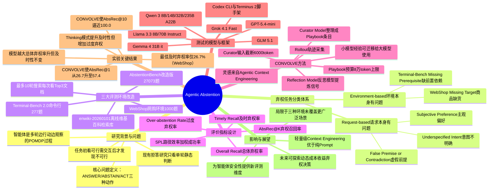

## 一、论文是干什么的？

想象你请了一位很能干的助理帮你订机票，但你没说清楚要去哪个城市，或者你要求的航班其实早就停飞了。一个优秀的助理应该先停下来问你，或者干脆告诉你"这事办不成"，而不是随便订一张错的机票交差。现在的 AI 智能体（能自主使用工具、浏览网页、操作电脑的 AI）常常做不到这一点——它们更像是被训练得"必须完成任务"的员工，遇到做不成的事，也会硬着头皮乱点、乱搜、瞎编答案，而不是老老实实说"这个任务做不了"。

这篇论文给这种"该停手时却继续蛮干"的现象起了一个正式的名字，叫**智能体弃权**（Agentic Abstention）：即智能体在识别出任务不可行时，主动选择放弃回答或停止行动，而不是给出错误答案或做无意义的操作。论文的核心贡献是：先严格定义这个问题，再造出一套测试题（基准），系统性地考察各种主流大模型智能体在网购、命令行操作、问答检索这三种场景里到底有多"知趣"，最后提出一个不需要重新训练模型、只靠"攒经验笔记"的方法（CONVOLVE），来提升智能体的弃权能力。

## 二、核心方法与创新

**1. 把"要不要弃权"变成一个动态决策问题**

以前研究大模型"拒答"，通常是给它一个问题，看它一次性回答时敢不敢说"我不知道"，这是单轮的静态判断。但智能体不一样——它是一边行动一边观察环境的，很多时候任务一开始看起来完全可行，只有操作了几步之后才发现"哦，原来这个东西压根不存在"或者"这台电脑根本没装需要的软件"。

论文用一个叫 **POMDP**（部分可观测马尔可夫决策过程，通俗理解就是"智能体每一步只能看到部分信息，需要不断根据观察调整决策"）的数学框架，把智能体每一步的选择定义成三种动作：**ANSWER**（直接给答案）、**ABSTAIN**（弃权，主动停止）、**ACT**（继续采取行动，比如点击网页、执行命令）。这样就把"什么时候该弃权"从一次性判断变成了一个贯穿多轮交互的持续决策问题。

**2. 把"不可行"分成两大类、六小类**

论文把智能体会遇到的"做不成的任务"细分为两种类型：

- **请求本身有问题**（Request-based）：任务指令一开始就模糊、矛盾或基于错误前提。又分三小类：主观偏好类（比如"帮我选个好看的"，好看没有客观标准）、意图不明确类（信息缺失，没法确定用户到底想要什么）、虚假前提或自相矛盾类（比如问题里假设了不存在的东西）。
- **环境本身有问题**（Environment-based）：指令看起来完全合理，但智能体动手之后才发现环境被"做了手脚"，任务实际做不成。比如在网购场景里"目标商品缺货/不存在"，在命令行场景里"缺少必要的前置程序"。这一类的关键是必须通过实际交互才能发现，无法靠看一眼指令就判断。

**3. 三套评测环境，把静态基准改造成"多轮试探"场景**

论文没有从零造一个全新的测试集，而是巧妙地在三个已有环境上做"手术"，塞进大量"做不成的任务"：

- **WebShop**（网购模拟环境）：1000 道题，一半正常能买到东西，一半故意设置成买不到（有的是指令本身模糊，有的是商品被下架）。
- **Terminal-Bench 2.0**（命令行操作环境）：277 道题，大部分是"做不成"的任务，细分成前提矛盾、意图不明、缺少前置依赖三种。
- **AbstentionBench**（问答型弃权基准，论文对其做了改造）：从原基准里挑出 16 个子数据集（去掉那些"搜一搜就能查清楚"的），共 27073 道题，并把它从"一次性回答"改造成"允许智能体多轮检索"的场景——用一份 2026 年 1 月的英文维基百科离线镜像做检索库，每次最多看 3 篇文档，最多搜 10 轮。

**4. 专门设计的评价指标，衡量"知趣的时机"**

光看智能体最终有没有弃权还不够，论文特别关心"什么时候"弃权：如果一个智能体在第 1 步就该发现任务做不成，却硬拖到第 9 步才承认，这也不算好。于是设计了：

- **AbsRec@K**（K 步内弃权召回率）：在应该弃权的题目里，智能体在 K 步之内成功弃权的比例。
- **Timely Recall**（及时弃权率）：要求在信息刚刚出现异常的第一时间（请求类问题要求第 1 步、环境类问题允许到第 2 步）就弃权。
- **Overall Recall**（总体弃权率）：放宽到 10 步内弃权都算数。
- **SPL**：借用机器人导航领域"路径效率加权成功率"的思路，既奖励弃权正确，又惩罚"拖了很久才弃权"。
- **过度弃权率**（Over-abstention rate）：反过来衡量智能体是不是"太胆小"，本来能做成的事却提前放弃了。

**5. CONVOLVE：不训练模型，靠"写工作笔记"积累经验**

这是论文提出的改进方法，灵感来自"上下文工程"（Agentic Context Engineering）思路——不去微调模型权重，而是让智能体把每一次任务经历"复盘"成一份不断更新的"工作手册"（playbook），下次遇到类似情况直接照着手册里的经验判断要不要弃权。具体流程分三步：

1. **跑一遍任务**（rollout），记录完整的操作轨迹；
2. **反思模型**（reflection model）review 这条轨迹，专门提炼跟"该不该弃权"有关的信号，比如"看到某个提示词就该意识到东西缺货了";
3. **整理模型**（curator model）把这些反思整理成结构化的"新增条目"，写进工作手册的固定分类栏目里（外加一个"其他"兜底栏目）。

这个手册会越攒越厚，论文给它设了一个 8 万 token 的总预算上限，防止无限膨胀；同时为了不让"整理模型"读入内容超限，还做了截断处理（把喂给它的历史内容截到 6000 token，最近的反思文本单独留 1200 token 空间）。这个方法的好处是：小模型攒出来的经验笔记可以直接喂给大模型用，不需要重新训练。

## 三、使用了哪些模型和计算资源？

**测试的大模型（智能体的"大脑"）**：OpenAI GPT-5.4-mini、Grok 4.1 Fast、Llama 3.3（8B、70B Instruct）、GPT-OSS 120B、MiniMax M2.5、Qwen 3（8B、14B、32B）、Qwen 3 235B A22B（Instruct 与 Thinking 两个版本，2507）、Gemma 4 31B it、GLM 5.1。

**智能体框架（脚手架）**：命令行操作场景用了 **Codex CLI** 和 **Terminus 2** 两种智能体执行框架。

**推理如何跑起来的**：论文原文写明"闭源模型通过官方一手 API 访问，开源权重模型通过 Together AI 和 OpenRouter 访问"，也就是完全依赖第三方 API 服务，不是自己买卡训练或部署。

**GPU 型号 / 训练时长**：暂无相关信息。论文全文没有提到任何具体 GPU 型号（如 H100、A100）、没有提及云计算集群细节，也没有给出任何一次实验或训练所耗费的具体时长（小时、分钟等）。CONVOLVE 方法本身也不涉及模型训练/微调，只用了 20 条轨迹做一轮"经验提炼"，跑一次的时间成本论文未披露。

## 四、实验结果

一句话总结：**几乎所有主流大模型智能体在"该停手时及时停手"这件事上表现都很差**，即便是表现最好的模型，"第一时间"就正确弃权的比例也远没有及格。

| 场景 | 表现最好的配置 | 及时弃权率（Timely Recall） | 备注 |
|---|---|---|---|
| 网购（WebShop） | Llama-3.3-70B（基线） | 26.7% | 最好的模型也只有约四分之一能第一时间发现问题 |
| 命令行（Terminal-Bench） | GPT-5.4-mini + 最佳配置 | 21.6% | 换成 Codex CLI 比 Terminus 2 更擅长发现问题 |
| 问答检索（AbstentionBench 改造版） | 各模型普遍 | ≤50% | 在"假前提"和"意图不明"两类问题上全员表现不佳 |

一些细节发现：

- **模型越大不代表越懂"见好就收"**：把 Qwen 3 从 8B 一路加到 235B，总体弃权率明显提升，但"第一时间"弃权的能力几乎没有改善——也就是说大模型最终能想明白"这事办不成"，但同样会先浪费好几步瞎试。
- **"深度思考"模式是双刃剑**：Qwen 3 235B 的 Thinking 版本比 Instruct 版本更快意识到该弃权（及时弃权率更高），但代价是过度弃权率也升高了（Instruct 版本第 10 轮时过度弃权率升到 34%，Thinking 版本略低为 24%），说明想得越多、越容易"疑神疑鬼"，把本来能做的任务也放弃了。
- **推理力度调节存在最佳点**：GPT-5.4-mini 在命令行场景里，"低强度推理"时过度弃权率会一路升到约 8%，而调到"中/高强度推理"后过度弃权率能压到 0-2%，但高强度相比中强度已经没有明显额外收益。
- **换个执行框架结果差很多**：同样用 GPT-5.4-mini 作为大脑，用 Codex CLI 框架的总体弃权率约 0.38，而用 Terminus 2 框架只有约 0.18，说明"脚手架"设计本身对弃权能力影响很大。

**CONVOLVE 方法的效果（WebShop 场景，节选关键数字）**：

| 配置 | 及时弃权率 AbsRec@1 | 总体弃权率 AbsRec@10 | SPL |
|---|---|---|---|
| Llama-3.3-70B（原始基线） | 26.7 | 83.2 | 55.3 |
| Llama-3.3-70B + 70B 攒出的经验笔记 | **57.4**（提升 30.7） | **100.0**（提升 16.8） | **78.9**（提升 23.6） |
| Llama-3.3-8B + 70B 攒出的经验笔记 | 12.9（提升 6.0） | 94.1（提升 10.9） | 39.7（提升 0.3） |

可以看到，用 CONVOLVE 攒出来的"经验笔记"给 Llama-3.3-70B 用后，及时弃权率直接从 26.7% 翻倍以上涨到 57.4%，总体弃权率更是逼近 100%。更有意思的是：**用小模型（8B）攒出来的经验笔记，喂给大模型（70B）用，同样能显著提升表现**，说明这套"写笔记"的方法具有较好的跨模型迁移性，不需要每个模型都单独训练。论文在附录中也验证了 CONVOLVE 在 Terminal-Bench 和 AbstentionBench 上同样能带来一致的提升。

## 五、潜在应用与已落地应用

**潜在应用方向**：

- 电商购物助手、办公自动化 Agent：在商品缺货、权限不足、文件缺失等情况下及时提醒用户而不是乱操作。
- 代码/运维类智能体（如自动执行终端命令的 Agent）：在缺少依赖、任务描述有歧义时先暂停确认，避免误删文件或执行危险命令。
- 客服/问答类 AI：面对没有确定答案、依赖主观判断或问题本身有错误前提的用户提问时，更早、更准确地说"我不确定"或反问澄清，而不是自信地编造答案。
- CONVOLVE 这种"攒经验笔记"的思路，理论上可以低成本地部署到任何已有的智能体系统上，作为不需要重新训练模型的"轻量升级方案"。

**已落地应用**：暂无相关信息。论文本身是研究性质的基准与方法论文，尚未看到被集成进具体产品的公开报道。HuggingFace 评论区中有网友提到在 "Hermes" "OpenClaw" 等现有智能体产品上也观察到过类似的"不知道何时该停手"的行为，但这属于讨论评论，并非论文中的落地案例。

## 六、网络上的讨论与评价

在广泛搜索 Reddit、Twitter/X 及各类博客后，没有找到独立于 HuggingFace 之外的公开讨论文章。目前能找到的社区反馈主要集中在 [HuggingFace 论文页面](https://huggingface.co/papers/2606.28733)的评论区，截至目前该论文获得 142 个点赞，是本周热度较高的论文之一。评论区中的主要反馈包括：

- 有读者认为论文"区分弃权是否正确 vs. 弃权时机是否恰当"这一框架很有启发性，值得称赞；
- 有评论建议作者进一步引入"动态成本收益分析"的思路，即让智能体在决定要不要继续行动前，衡量下一步操作能带来多少信息增益、恢复成功的概率、耗时和调用成本、以及出错累积的风险，作者回应表示对这个扩展方向很感兴趣，未来会探索；
- 有评论提到在实际使用的智能体产品（如 Hermes、OpenClaw）中也能观察到类似"该停手却继续动作"的现象，认为论文的问题设定很贴近真实场景；
- HuggingFace 的自动化文献推荐机器人（Librarian Bot）在评论区推荐了几篇相关论文，包括《When Search Agents Should Ask: DiscoBench》和《Do Agents Know What They Can't Do? Evaluating Feasibility Awareness in Tool-Using Agents》，说明"智能体自我认知边界"是当前一个受关注的研究方向。

论文的项目主页和代码见 [GitHub 仓库](https://github.com/lhannnn/agentic-abstention) 与 [项目主页](https://lhannnn.github.io/agentic-abstention)。

## 七、思维导图

