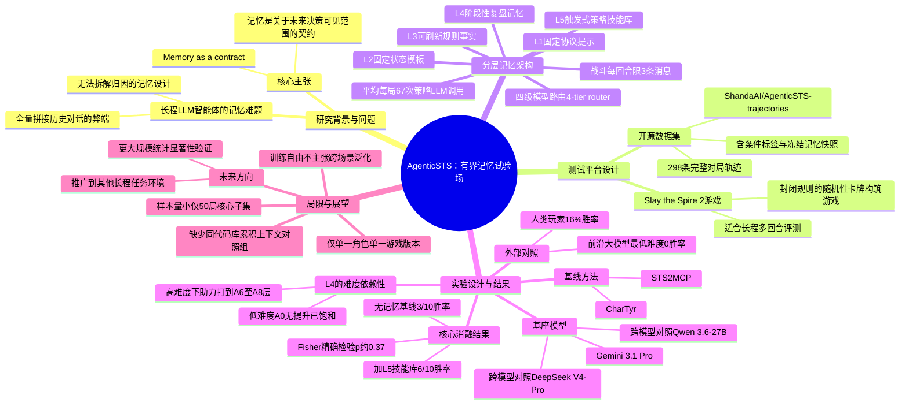

## 一、论文是干什么的？

想象一个需要连续工作几百步才能完成任务的AI助手，比如帮你打通一整局策略游戏，或者帮你完成一个跨越几天的复杂项目。它每做一步决策，都需要知道"之前发生了什么"。最简单的做法是把从头到尾的所有对话记录原封不动地塞给它看——但这样做有两个问题：一是记录太长，AI看不过来（上下文窗口装不下）；二是根本分不清楚，AI表现好或差，到底是因为记住了什么、还是因为别的原因。

AgenticSTS这篇论文要解决的就是这个"记忆到底怎么设计、怎么测"的问题。作者们没有做一个新的记忆算法然后自卖自夸，而是先搭了一个"实验室"——一个可以把AI智能体的记忆拆成一层一层的模块、每层都可以单独拔掉再看效果的测试平台。这个测试平台用的是一款叫《杀戮尖塔2》（Slay the Spire 2）的卡牌构筑类游戏：规则封闭、有随机性、需要玩很多个回合才能分出胜负，非常适合用来检验"AI记不记得住东西、记住了有没有用"。

打个比方，这就像是给一个新员工设计培训手册。你可以给他一整本从入职到现在的所有会议记录（等于什么都不筛选地塞给AI），也可以给他分门别类的资料：岗位说明书（写死不变的规则）、当前项目状态表（会刷新的信息）、上次犯错的复盘笔记（阶段性记忆）、以及一本"内部诀窍手册"（提炼出来的策略技能）。这篇论文做的事情，就是把这些"资料类型"一层层拆开，然后一层一层地做"拿走这一层资料，员工表现会不会变差"的实验。

## 二、核心方法与创新

论文提出了一个核心概念："记忆是一份关于未来每一次决策允许看到什么的契约"（memory as a contract about what each future decision is allowed to see）。这句话听起来抽象，但其实是在纠正业界一个很常见的偷懒做法——很多智能体系统直接把整个历史对话记录（transcript）原样拼接进提示词里，让AI自己去里面找有用信息。这篇论文认为，这种"全量堆叠"式记忆既浪费上下文，又没法拆解分析，因为你根本说不清楚AI是靠哪部分记忆做出的好决策。

AgenticSTS的做法是把记忆做成「**有界**（bounded）、**有类型**（typed）、**可消融**（ablatable）」的契约，具体拆成了五层：

- **L1 固定协议提示**：相当于游戏规则说明书里那些永远不变的操作规范，比如"你必须按这个格式输出动作"。
- **L2 固定状态模板**：描述当前游戏局面该用什么格式呈现，比如血量、手牌、敌人信息该怎么展示给AI看。
- **L3 可刷新的规则事实**：会随游戏进展更新的规则性知识，比如某张卡牌这局遇到后的效果说明。
- **L4 阶段性复盘记忆（episodic postrun memory）**：每打完一局或一个阶段后，AI对自己表现的总结笔记，类似于"上次这样打输了，这次要注意"。
- **L5 触发式策略技能库**：从多次对局中提炼出来的、可以被特定情境触发调用的策略技巧，类似于"老手秘籍"。

每一层记忆都可以单独打开或关掉，这样就能像做科学实验的对照组一样，测出每一层记忆到底对最终表现贡献了多少，而不是笼统地说"加了记忆就变强了"。

另外，论文设计了一个**四级模型路由（4-tier model router）**：不同难度、不同重要性的决策交给不同档次的模型去处理，同时把战斗环节的调用次数限制在每回合不超过3条消息，整局游戏平均下来大概需要67次策略性的大模型调用。这种设计的用意，是在控制成本和效率的同时，避免让AI在细枝末节上过度"啰嗦"。

论文还开源了298条完整对局的轨迹数据，每条轨迹都打上了实验条件标签（比如"用了L5技能库"还是"没用"），并且把当时的记忆快照、技能库快照、每一次提示词记录都完整保留了下来，方便别人复现或者拿去做进一步分析。

## 三、使用了哪些模型和计算资源？

- **主力基座模型**：Gemini 3.1 Pro（预览版），用作智能体的主要决策模型。
- **跨模型对照实验**：另外测试了 Qwen 3.6-27B 和 DeepSeek V4-Pro，用来看结论是不是只在某一个模型上成立。
- **对照基线方法**：STS2MCP 和 CharTyr 两个基线系统，为了公平比较，都统一跑在同样的Gemini基座模型上。
- **GPU型号、具体训练/推理耗时、API费用**：论文全文中暂无相关信息，未提及具体的硬件配置或每局游戏、每次实验的具体耗时。
- 训练方式：论文强调是"training-free"（免训练）的方法，即没有对大模型本身做微调训练，而是通过设计记忆结构和提示词来改变智能体行为。

## 四、实验结果

论文的核心实验是在固定难度A0下，对比"完全不存储记忆"和"加上第5层技能库记忆"这两种设定下打10局游戏的胜率：

| 实验条件 | 胜场（共10局） |
|---|---|
| 不存储记忆（no-store基线） | 3胜 |
| 加上L5技能库记忆 | 6胜 |

统计检验（Fisher精确检验）算出来的p值约为0.37，论文自己也坦诚地说这个结果"只能说明一个方向性趋势，还不能算统计上确凿的证据"（directional rather than statistically decisive），这在只有10局对照的小样本实验里是可以理解的。

作为参照系，论文还引用了外部基准的数据：公开榜单上，前沿大模型在这款游戏最低难度下的胜率是**0**，而开发者报告的人类玩家在同一难度下的胜率约为**16%**。这说明哪怕是最强的大模型智能体，目前打这类需要长程规划的游戏依然远不如人类。

消融实验还发现一个有意思的现象：单独看L4阶段性复盘记忆，在最低难度A0下**并没有**带来胜率提升，作者认为这是因为该难度下表现已经"饱和"了；但如果把难度拉高，L4能帮助智能体打到更高的难度阶梯（A6至A8层），而没有L4的话只能打到A2至A4层。也就是说，同一层记忆在简单任务上看不出用处，但在难任务上能看出差别——这提醒我们做AI评测时，任务难度选得不合适可能会让某些设计的价值被完全掩盖。

## 五、潜在应用与已落地应用

这篇论文本身更偏向"方法论/评测基础设施"性质，作者明确表示这是一个**单一游戏、免训练**的探索性研究，没有宣称能直接推广到其他场景。但它提出的思路对以下方向有启发意义：

- **长期运行的AI助手**：比如需要连续几天甚至几周跟踪一个项目进度的智能体，可以借鉴这种"分层记忆契约"的思路，而不是把所有历史都塞进上下文。
- **智能体评测方法论**：为其他研究长程记忆、长程规划的团队提供了一套可复现、可拆解分析的测试范式，而不只是一个"跑分榜单"。
- **游戏AI/自动化测试**：这套框架和开源的298条对局轨迹数据，可能被其他研究者用来训练或评测游戏智能体。

目前没有搜到该方法已经被产业界采用或落地到实际产品中的公开报道。

## 六、网络上的讨论与评价

除了HuggingFace论文页面显示的45个赞之外，没有搜索到Reddit、Twitter/X或独立博客上的相关讨论，暂无相关讨论。该论文目前处于EMNLP 2026 ARR审稿阶段。

## 七、思维导图

