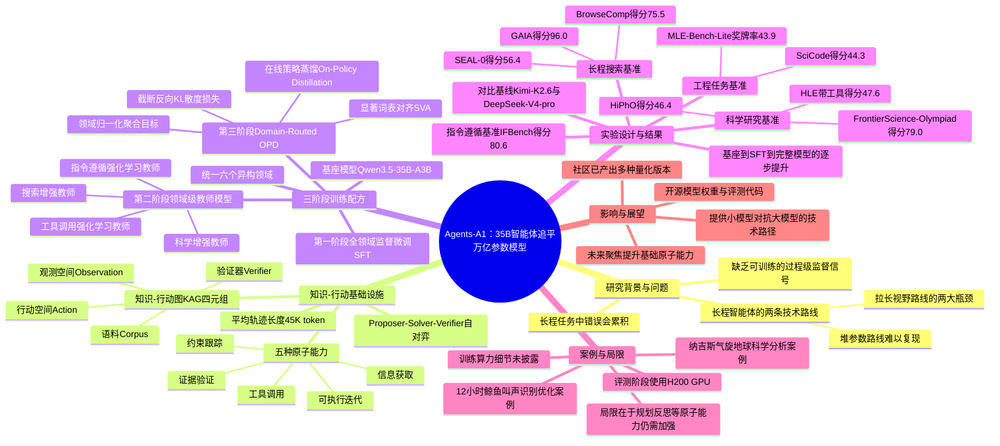

## 一、论文是干什么的？

现在很多顶尖的AI大模型，比如动辄万亿参数的超级模型，靠的是"堆料"——把模型做得越来越大，让它记住更多知识、掌握更多技能。这就像请一个博览群书的全科状元来做所有事情，样样精通但也样样都要花巨额成本去培养。

这篇论文换了一个思路。作者们提出了一个只有350亿（35B）参数的智能体模型，名字叫 **Agents-A1**，用一种"以小博大"的方式，在多项需要长时间、多步骤才能完成的任务上，做到了和万亿参数模型（比如 Kimi-K2.6、DeepSeek-V4-pro）差不多甚至更好的水平。

打个比方：与其培养一个什么都会的全科状元（拼参数规模），不如培养一个专注于"把一件复杂事情拆解成很多步骤、一步步扎扎实实做完"的实习生（拼任务的时间跨度和执行深度）。这个实习生虽然脑子里存的知识没有状元多，但他更擅长长时间专注、按部就班地查资料、写代码、验证结果、纠错重来——这种"拉长任务视野"的能力，反而能让小模型在真正需要多轮操作的复杂任务（比如科研分析、写代码调优、网页深度搜索）中表现得不逊色于大模型。论文标题"Scaling the Horizon, Not the Parameters"（拓展视野，而非堆参数）说的就是这个核心思路。

## 二、核心方法与创新

### 2.1 问题出在哪里：现有的两条路

论文指出，让智能体（Agent）具备处理复杂长任务的能力，业界通常走两条路：

- **堆参数路线**：把模型做得巨大，靠海量参数"记住"各种推理模式、工具调用套路和领域知识。效果好，但普通团队难以复现，因为需要天量的算力和数据。
- **拉长视野路线**：不扩大模型体积，而是把解决问题的中间过程（查资料、执行动作、看结果、验证对错）都变成可以训练的监督信号。但这条路会遇到两个瓶颈：一是缺少支撑"长链条"训练的基础设施，二是很难把分散在不同领域（比如搜索、写代码、做科研）的专项能力揉合成一个统一的模型。

Agents-A1 就是奔着解决这两个瓶颈去的。

### 2.2 创新一：知识-行动基础设施（Knowledge-Action Infrastructure）

要训练一个能"长跑"的智能体，光靠网上扒来的文本数据是不够的——因为普通网页文字很少记录"我是怎么一步步查到这个答案的""中途走错了哪一步""最后怎么验证结果对不对"这些过程信息。

于是作者构建了一个叫 **知识-行动图**（Knowledge-Action Graph，简称 KAG）的结构，把每个任务领域的知识拆成四个部分：

- **语料（Corpus）**：证据片段、事实、约束条件等背景资料；
- **行动空间（Action）**：可以采取的操作，比如调用搜索工具、写代码、执行推理步骤；
- **观测空间（Observation）**：执行某个行动后得到的返回结果，比如网页内容、代码执行日志；
- **验证器（Verifier）**：用来自动检查某一步或最终答案对不对的规则或程序。

这四者之间通过一条条"状态-行动-观测-验证结果"的记录相互串联，就像给智能体的每一次"尝试"都拍了一张带有对错标签的快照，而不是只给它一个孤零零的最终答案。

为了让这个图不断变得更丰富、质量更高，团队还设计了一个 **"出题人-解题人-裁判"自对弈机制**（proposer-solver-verifier self-play）：一个角色负责从图里挑资料出题，一个角色负责用检索和工具解题，另一个角色负责严格审核——答案是否可验证、过程是否有意义、证据是否真的被用到、题目是否没有捷径可走。只有通过审核的题目才会被纳入正式训练数据，没通过的会被打回去重新扩展。

通过这套基础设施生产出来的训练轨迹，平均长度达到了 **4.5万（45K）个token**——这意味着模型学习的不是一问一答的"快问快答"，而是需要几十步、上百步操作才能完成的"长跑"过程。

### 2.3 创新二：三阶段训练配方

Agents-A1 的训练分三步走，基座模型选用的是 **Qwen3.5-35B-A3B**（阿里通义千问系列的一个35B总参数、约3B激活参数的混合专家模型，MoE架构）：

**第一阶段：全领域监督微调（SFT）**
先用来自搜索、科研、工程（写代码/机器学习竞赛）、指令遵循、工具调用等多个领域的长程数据，对基座模型做一次"通才式"的监督微调，让它先具备广泛的、看得懂长任务的基本功。

**第二阶段：训练领域级"专科老师"模型**
在通才模型的基础上，针对每个具体领域（比如"擅长深度搜索"、"擅长科学推理"、"擅长严格遵守指令"）分别用监督微调或强化学习训练出一个专精该领域的"教师模型"。这就像给全科医生额外请了心内科、骨科、神经科的专家来带教。

**第三阶段：多教师领域路由式在线策略蒸馏（Domain-Routed On-Policy Distillation, OPD）+ 显著词表对齐（Salient Vocabulary Alignment, SVA）**
最难的一步是把这几位"专科老师"的本事揉进同一个学生模型里，还不能互相打架、互相削弱。作者的做法是：

- 让学生模型自己先生成一段回答（这叫"在线策略"，即用学生自己的输出做训练素材，而不是老师提前写好的标准答案）；
- 根据这段回答所属的领域，把它交给对应的那位"专科老师"打分指导（领域路由，"路由"就是按科目分诊）；
- 传统蒸馏方法只对学生实际选中的那一个词打分，容易导致"以偏概全"、指导信号不稳定。作者提出的 **显著词表对齐（SVA）** 改进了这一点：不只看学生选中的词，而是看老师认为最可能的一批候选词（Top-k），把学生和老师在这批候选词上的概率分布重新归一化后对齐，用一种叫"截断反向KL散度"的数学方法衡量两者差距并作为训练信号。这样能让学生学得更细致，不容易被单一token的噪声带偏。
- 另外为了避免某些"话多"的领域（生成token多）或者难度大的领域主导训练方向，损失函数会先在每个领域内部求平均，再对所有出现过的领域求平均，保证各领域"雨露均沾"。

最终，这套方法把 **六个异构领域** 的能力统一进了一个可以直接部署使用的模型里。

### 2.4 一个类比帮助理解

如果把大模型训练比作培养员工：堆参数路线是"招一个记忆力超群、什么都懂一点的天才"；Agents-A1 的路线则是"招一个记忆力一般但特别能扛长时间任务的员工，再给他配齐详细的工作手册（知识-行动图）和几位分科目的资深带教老师（领域教师模型），最后用一套聪明的方法（SVA蒸馏）把几位老师教的东西融会贯通到他一个人身上"，让他不需要天才的脑子，也能把长周期、多步骤的复杂任务处理得像专家一样好。

## 三、使用了哪些模型和计算资源？

- **基座模型**：Qwen3.5-35B-A3B（阿里通义千问系列的MoE模型，35B总参数、约3B激活参数）。论文的"局限性"部分也明确提到，Agents-A1 的能力有三个来源：Qwen3.5-35B-A3B 基座本身的能力、团队搭建的知识-行动基础设施，以及领域路由式在线策略蒸馏方法。
- **对比的万亿参数基线模型**：Kimi-K2.6、DeepSeek-V4-pro（论文摘要中明确点名对标的两个1T参数级模型），部分评测中还用到 GPT-5.5（以"xhigh"推理强度设置）、Qwen3.6-35B-A3B 作为参照。
- **推理/评测阶段的计算资源**：论文在描述 MLE-Bench-Lite（机器学习工程类基准）评测设置时明确写道，每个任务都在一块独立的 **H200 GPU** 上运行，给予 **12小时** 的挂钟时间预算。这是评测阶段的算力配置，论文中有明确说明。
- **训练阶段的计算资源**：论文全文没有披露训练所用的GPU型号、GPU数量、训练集群规模或具体训练时长，因此这部分**暂无相关信息**，不做编造。
- **训练数据规模/token量**：论文提到训练轨迹平均长度为45K token，但没有披露训练数据总token数或总训练步数，这部分**暂无相关信息**。
- **模型权重与代码开源情况**：论文注明模型权重发布在 [Hugging Face 的 InternScience/Agents-A1 合集](https://huggingface.co/collections/InternScience/agents-a1)，评测代码开源在 [GitHub 的 InternScience/Agents-A1 仓库](https://github.com/InternScience/Agents-A1)，网络资料显示模型以 Apache-2.0 协议开源。

## 四、实验结果

论文在长程搜索、工程任务、科学研究、指令遵循与长文本理解、通用智能体任务等多个类别上做了评测，并与 Qwen3.5-35B-A3B（未经过论文方法训练的原始基座）以及只做完第一阶段全领域SFT的"Agents-A1-SFT"版本做了对比，相当于一份循序渐进的"进化对照表"：

| 基准（任务类型） | Qwen3.5-35B-A3B（原始基座） | Agents-A1-SFT（仅第一阶段） | Agents-A1（完整三阶段） |
|---|---|---|---|
| BrowseComp（浏览搜索） | 61.0 | 74.6 | 75.5 |
| XBench-DS-2510（深度研究搜索） | 77.0 | 88.0 | 86.0 |
| SEAL-0（长程检索问答） | 41.4 | 52.3 | 56.4 |
| GAIA（通用智能体任务） | 59.8 | 95.2 | 96.0 |
| SciCode（科研代码生成，288道子题） | 37.1 | 42.3 | 44.3 |
| MLE-Bench-Lite（22个Kaggle竞赛，奖牌率） | 24.2 | 39.4 | 43.9 |
| HLE 带工具（专家级推理） | 47.4 | 41.6 | 47.6 |
| HiPhO（物理奥赛，13场比赛平均分） | 37.0 | 42.9 | 46.4 |

可以看到，几乎每一项指标都是随着训练阶段推进逐步提升的，说明论文提出的三阶段方法确实在起作用，而不只是靠基座模型本身的实力。

论文摘要中给出的与万亿参数模型（Kimi-K2.6、DeepSeek-V4-pro）对比的关键结果是：Agents-A1 在 **SEAL-0（56.4分）、IFBench（80.6分）、HiPhO（46.4分）、FrontierScience-Olympiad（79.0分）、MolBench-Bind（56.8分）** 上取得领先成绩，在 **SciCode（44.3分）、HLE（47.6分）、BrowseComp（75.5分）** 上也具备很强的竞争力。用大白话说：一个只有35B参数（大约是1T参数模型的1/30体量）的模型，在这些需要多步骤、长链条操作的任务上，做到了不输、甚至反超"庞然大物"的效果。

论文还展示了两个具体的案例研究，很能说明"拉长视野"到底有什么用：

- **12小时机器学习工程优化实验**：让 Agents-A1 从一个很粗糙的CNN基线模型出发，独立完成鲸鱼叫声识别任务的优化。经过12小时、多轮"分析数据-做数据增强-调整模型结构-再评估"的迭代，模型把验证集AUC指标从0.58一路提升到0.9935，达到了"金牌级"的竞赛水平。
- **地球科学案例：重建2008年"纳吉斯"热带气旋路径**：Agents-A1自主找到IBTrACS气象数据源，独立完成了数据提取、清洗、计算衍生指标、绘制可视化图表、撰写分析报告的全流程，较为准确地还原了这场风暴从孟加拉湾生成、转向东北、最终在缅甸南部登陆的完整过程。

这两个案例说明，Agents-A1 不只是在标准化考试题上刷分,更能在真实、开放式的长周期任务里独立完成"侦查-动手-检查-再改进"的完整闭环。

论文本身没有给出单独的"消融实验"章节，但上表中"基座模型 → 仅SFT → 完整三阶段"的逐步对比，实际上起到了类似消融实验的作用，说明了每个训练阶段带来的增量价值。

## 五、潜在应用与已落地应用

**潜在应用方向：**

- 科学研究助理：能自主完成文献检索、数据分析、绘图、撰写报告的科研流程自动化；
- 机器学习工程自动化：像案例中展示的那样，自动做数据竞赛/模型调优，减少工程师的重复劳动；
- 深度网页搜索与信息核实：适合需要多步骤跳转查证的复杂检索任务（如新闻核实、市场调研）；
- 长文本/指令遵循场景：适合需要严格遵守复杂约束条件的客服、合规审查等应用；
- 由于参数量远小于万亿级模型，也更适合在成本敏感或对推理延迟、部署硬件有限制的场景中使用。

**已落地情况：**

根据网络检索到的信息，模型权重已经在 Hugging Face 上开源（[InternScience/Agents-A1](https://huggingface.co/InternScience/Agents-A1)），并且社区已经自发做出了多个量化版本（如 FP8、GGUF、NVFP4、MLX 等格式），说明已经有开发者在尝试将其部署到本地环境或更低成本的推理硬件上运行。目前没有检索到该模型已被集成进某个具体商业产品或工作流平台的公开报道。

## 六、网络上的讨论与评价

通过网络搜索，找到了一些围绕该论文/模型的讨论内容（多为科技资讯类文章，未检索到 Reddit 或 X/Twitter 上的深入技术讨论帖）：

- 科技媒体 [36Kr 欧洲版](https://eu.36kr.com/en/p/3877948838244353) 报道了这次开源，标题大意为"35B智能体能否跑赢万亿参数模型？上海AI实验室开源Agents-A1以拓展视野"，将其定位为中国科技媒体关注的一次重要开源事件。
- 技术博客 [explainx.ai](https://explainx.ai/blog/agents-a1-internscience-35b-moe-agent-model-2026) 认为该模型的看点在于用更低的推理成本（相比万亿参数模型可能有数量级的成本优势）覆盖搜索、科学工具调用、指令评测、函数调用等多种智能体场景，并支持较长的上下文窗口。
- 技术资讯站 [ai-tldr.dev](https://ai-tldr.dev/releases/internscience-agents-a1/) 将其核心创新总结为"横向扩展"（延长和复杂化任务序列）而非"纵向扩展"（堆参数），并提到该模型可以在单个8卡GPU节点上运行推理。
- Medium 上的技术博主也发文讨论该模型，认为如果这些结果能被广泛复现，可能会改变未来智能体模型的训练思路。
- 加密货币/金融资讯类网站（如 cryptobriefing.com、KuCoin 新闻快讯）也转载报道了这一开源事件，属于二次传播性质的报道，技术深度有限。

总体来看，目前的讨论以科技媒体的介绍性报道为主，尚未检索到经过同行严格复现验证或深入技术争议的讨论，因此对论文声称的效果，建议读者保持"已开源、可自行验证"的审慎态度看待。

## 七、思维导图

