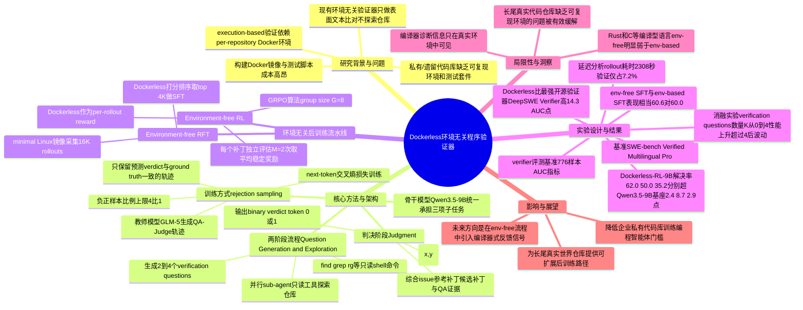

## 一、论文是干什么的？

想象你是一个编程老师，要批改一千个学生交上来的代码修复作业。每个学生用的项目环境都不一样：有的用Python某个特定版本，有的依赖一堆第三方库，有的甚至要连数据库。传统做法是，你要为每一个学生的项目单独搭建一套一模一样的运行环境（这在计算机里通常靠 Docker 容器实现），然后跑单元测试，测试通过就说明改对了。这个过程被称为「execution-based verification」（基于执行的验证）。

问题是，搭建这些环境非常费时费力，甚至有些私有的、老旧的企业代码库根本没有可复现的环境，也没有像样的测试用例——你压根没法用「跑一下测试」这种方式来批改作业。这篇论文要解决的正是这个问题：能不能不用真的跑代码、不用给每个仓库搭建环境，也一样能准确判断一个代码补丁到底改得对不对？

论文提出的方法叫 **Dockerless**（意为「不需要 Docker」），它是一个专门给「编程智能体」（coding agents，也就是能自动读代码、写代码、修 Bug 的 AI 系统）当裁判的验证器。它不执行代码，而是像一个真正的资深工程师审查代码一样，主动去翻阅代码仓库、查找证据，再给出判断。这个验证器不仅可以用来单独评判一个补丁好坏，还能被用来筛选高质量的训练数据、给强化学习提供打分奖励，从而让整个「训练编程智能体」的流程完全不需要再依赖 Docker 环境。

## 二、核心方法与创新

### 现有验证方式的两难

论文开头指出了业内两种常见的验证器都有明显缺陷（对应论文的图1）：

- **基于 Docker 执行的验证**：准确，但成本极高，且很多仓库根本没法搭建环境。
- **纯文本比对的 LLM 打分器**：不需要环境，但只是「隔着玻璃看代码」，仅仅根据补丁的文字表面信息打分，从不真正深入代码仓库去核实，遇到复杂情况容易判断错误（比如两个补丁写法不同，但其实都对；或者写法相似，但其实一个引入了新 Bug）。

### Dockerless 的核心思路：让验证器自己去「查案」

Dockerless 的关键创新是把验证过程变成一次「侦探破案」式的智能体探索，而不是简单的比对。具体分为两个阶段（对应论文图2）：

**第一阶段：提问与探索。** 给定一个问题描述（issue）、一份参考答案补丁（reference patch）和一份待验证的候选补丁（candidate patch），Dockerless 首先像一个善于提问的审阅者一样，自己生成几个（论文中是2到4个）「验证问题」，比如：「这个修复应该在代码仓库的哪个地方生效？」「补丁改动的代码本来是干什么用的？」「什么样的测试才能证明这个修复是对的？」「仓库里其他地方会不会因为这个改动而出问题？」

针对每一个问题，Dockerless 会派出一个专门的「子智能体」（sub-agent），用只读的命令行工具（比如 find、grep、rg 这类文本搜索工具）去仓库里翻找证据，然后给出一个有理有据的简短回答。这些子智能体是并行运行的，就像同时派好几个调查员分头去查不同的线索，提高效率。

**第二阶段：综合裁决。** 收集完所有问题的答案后，Dockerless 把issue描述、参考补丁、候选补丁，以及所有问题-答案对，一起交给同一个模型，让它输出一个「0」或「1」的判决 token，1代表补丁修复正确。为了得到一个更细腻的连续打分（而不是非黑即白），论文把这两个token的输出概率（通过softmax）转换成一个0到1之间的连续分数，这样既能当「是否通过」的二元判断，也能当强化学习里的奖励信号使用。

用一个数学表达式来说，这个连续分数是：

$$r_{\phi}(x,y)=\frac{\exp(\ell_{1})}{\exp(\ell_{0})+\exp(\ell_{1})}$$

其中 $\ell_0$ 和 $\ell_1$ 分别是模型输出「0」和「1」这两个判决token的对数几率（logits）。

### 怎么训练这个验证器

Dockerless 本身也是一个需要训练的模型。训练方法是「拒绝采样」（rejection sampling）：先用一个更强的「教师模型」（论文中用的是 GLM-5）在一批已经知道标准答案（通过真实跑测试得到）的历史补丁上，走一遍「提问-探索-判决」的完整流程，生成很多条推理轨迹；然后只保留那些教师模型自己判断的结果与真实测试结果一致的轨迹，用这些「靠谱」的轨迹去做常规的下一个词预测（next-token）的交叉熵训练，教会学生模型（也就是最终的Dockerless）学会怎样一步步推理、给出正确判决，而不是靠瞎猜蒙对。训练语料来自 SWE-Gym 和 Multi-SWE-RL 数据集里的3700个issue。

### 由此打通的「全环境无关」训练流水线

有了这个可靠的验证器之后，论文进一步展示了它能撑起整个编程智能体的训练流程，完全不需要为每个代码仓库单独搭建环境（图4）：

- **环境无关的拒绝采样微调（RFT）**：让智能体在一个「最简版」的通用 Linux 系统镜像里（不针对任何具体仓库配置）大量尝试解决问题，生成候选补丁池，再用 Dockerless 给这些候选打分，只挑出打分最高的一批用来做监督微调（SFT）。
- **环境无关的强化学习（RL）**：在微调后的模型基础上，继续用 Dockerless 的打分作为奖励信号，通过 GRPO（一种流行的强化学习算法）算法继续训练。为了让打分更稳定，每个补丁会独立评估 2 次（M=2）取平均值作为最终奖励。

这套组合拳意味着：从收集训练数据、筛选高质量样本，到强化学习打分，全程都不需要给每一个代码仓库单独搭建运行环境，大大降低了训练编程智能体的门槛和成本。

## 三、使用了哪些模型和计算资源？

- **主干模型（backbone）**：Dockerless 验证器本身和最终的编程智能体，都是基于 **Qwen3.5-9B** 微调训练的（约90亿参数）。
- **教师模型**：用于生成 Dockerless 训练数据的更强模型是 **GLM-5**。
- **验证器评测中的对比模型**：论文还拿四个前沿闭源/开源大模型直接做「零样本裁判」对比，包括 DeepSeek-V3.2、Kimi-K2.5、GLM-5、GPT-5.4，以及四个已有的训练过的开源验证器（SWE-Gym Verifier、R2E-Gym Verifier、OpenHands Critic、DeepSWE Verifier）。
- **推理部署**：训练好的验证器通过 vLLM 以 OpenAI 兼容接口的方式提供服务。
- **智能体运行环境**：论文中"无环境"设定下用的是一个极简的 Ubuntu 22.04 LTS 镜像（具体版本号为 ubuntu:jammy-20260109），智能体在其中最多跑150轮工具调用；智能体框架用的是开源的 OpenHands。
- **训练超参数**：验证器训练用 AdamW 优化器，学习率 1.0e-5（余弦衰减到1.0e-6），批大小256，最长序列长度32768，训练到150步时的验证集效果最好。强化学习阶段用 GRPO，每组8条rollout（G=8），训练总共50步，actor学习率2.0e-6，训练批大小64。
- **GPU型号、具体训练/实验耗时**：论文正文和附录中**没有提及**具体使用了哪种GPU型号（如A100、H100等），也没有说明训练一次完整流程总共花费了多少小时/天，因此这里如实注明「暂无相关信息」。不过论文在"延迟分析"部分给出了单次强化学习rollout的耗时细节：平均每次智能体自主探索（rollout）耗时约2308秒，而 Dockerless 完成一次打分只需要额外41到180秒，只占总耗时的7.2%左右，说明验证环节本身并不是训练流程中的性能瓶颈。

## 四、实验结果

论文在三个知名的编程智能体测试基准上评估：SWE-bench Verified（经过人工验证的英文修Bug任务集）、SWE-bench Multilingual（多语言版本）和 SWE-bench Pro（更难的专业版本），指标是「解决率」（resolve rate，即智能体最终提交的补丁真的把问题解决了的比例）。

**验证器本身的准确度对比**（用 AUC 指标衡量，即判断补丁对错的分辨能力，越高越好）：

| 验证器/模型 | SWE-bench Verified AUC | Multi-SWE-bench Flash AUC |
|---|---|---|
| DeepSeek-V3.2（零样本裁判） | 69.4 | 58.5 |
| Kimi-K2.5（零样本裁判） | 70.7 | 63.9 |
| GLM-5（零样本裁判） | 73.2 | 62.5 |
| GPT-5.4（零样本裁判） | 75.9 | 59.5 |
| SWE-Gym Verifier | 61.0 | 53.7 |
| R2E-Gym Verifier | 64.3 | 55.1 |
| OpenHands Critic | 48.6 | 52.2 |
| DeepSWE Verifier（此前最强的开源验证器） | 66.7 | 62.9 |
| **Dockerless（本文方法）** | **81.0** | **72.1** |

可以看到，Dockerless 比此前最强的开源验证器（DeepSWE Verifier）高出14.3个AUC点，比表现最好的前沿大模型裁判（GPT-5.4）也高出5.1个点。

**用 Dockerless 打通全流程训练后的智能体表现**（解决率，%）：

| 模型 | 是否完全不用环境 | Verified | Multilingual | Pro |
|---|---|---|---|---|
| Qwen3.5-9B（未经训练的基座模型） | - | 59.6 | 41.3 | 32.3 |
| SWE-Lego-8B（此前最强的同规模开源专用模型） | 否 | 41.2 | 19.0 | 16.1 |
| Env-SFT-9B（用传统Docker环境筛选数据训练） | 否 | 60.0 | 48.3 | 33.9 |
| Dockerless-SFT-9B（用Dockerless筛选数据训练） | 是 | 60.6 | 47.7 | 35.3 |
| **Dockerless-RL-9B（全流程完全不用环境，本文最终模型）** | **是** | **62.0** | **50.0** | **35.2** |

最终模型 Dockerless-RL-9B 比基座 Qwen3.5-9B 提升了2.4、8.7、2.9个点，效果和传统"必须搭建环境"的训练方式（Test-Execution RL：62.4、51.3、35.7）几乎持平，证明了「完全不用为每个代码仓库单独搭建环境」这条路是可行的。

此外，论文还发现：验证器每次生成的「验证问题」数量并非越多越好——从0个问题提升到4个问题时，AUC从78.3一路涨到81.0，但超过4个之后（比如6个、8个）反而会因为引入冗余或嘈杂的证据而效果波动，所以最终选择每次生成2到4个问题作为平衡点。

论文附录里还提到一个值得注意的局限：在类似 Rust、C 这种需要编译的语言上，「不用环境」的训练方式明显弱于传统方式（分别相差7.0和13.3个点），原因是编译器给出的类型错误、链接失败等信息，只有在真实环境里才能看到，纯靠阅读源码是推断不出来的；而在 Python、Go、JavaScript 等主流语言上，两种方式的差距很小（2.5个点以内）。

## 五、潜在应用与已落地应用

**潜在应用方向：**
- 让企业能够低成本地把内部私有代码库、遗留系统（很多这类代码没有可复现的运行环境或完整测试）也纳入到编程智能体的训练与评测中，扩大可用训练数据的覆盖范围。
- 降低训练和迭代编程智能体的基础设施门槛，中小团队不必再为每个代码仓库单独维护一套Docker镜像。
- 作为通用的「代码补丁质量打分器」，除了训练场景，也可能用于代码评审辅助、自动化代码质量检测等下游场景。

**已落地应用：** 根据目前搜集到的资料，本论文属于最新研究成果（2026年6月26日提交），暂无公开资料显示该方法已经被产品化或集成到具体商业产品中，如实注明「暂无相关信息」。

## 六、网络上的讨论与评价

经过检索 Hugging Face 论文页面、Google/网页搜索等渠道，除了 Hugging Face 页面上一条自动化的「Librarian Bot」推荐相似论文的评论外，没有找到 Twitter/X、Reddit、技术博客等渠道针对本文的实质性讨论或评价，如实说明「暂无相关讨论」。该论文在 Hugging Face 上获得了103个赞（截至本综述撰写时），说明在关注编程智能体训练方向的社区中有一定的关注度，但尚未形成可查证的公开讨论内容。

## 七、思维导图

