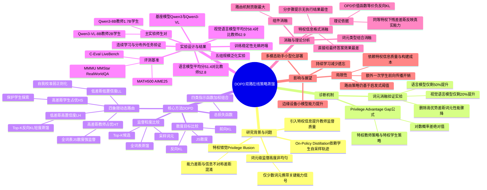

## 一、论文是干什么的？

现在很多人都在用"小模型"（省钱、跑得快，比如手机上的AI助手），但小模型能力往往不如"大模型"（更聪明但更贵更慢）。一个自然的想法是：让小模型跟着大模型学习，也就是"蒸馏"（distillation）——类似让一个刚入门的学徒去模仿一位老师傅的一举一动。近些年比较流行的一种蒸馏方式叫"在线策略蒸馏"（On-Policy Distillation，简称OPD）：让学生自己先尝试做题、写句子，然后老师针对学生写出的每一个字（词元，token）给出打分和指导，这比传统的"老师写好范文让学生抄"要更有效，因为学生是在自己实际会犯错的地方得到纠正。

但这篇论文发现了一个新问题。为了让老师的指导质量更高，人们常常会给老师（有时也给学生）一些"特权信息"——比如数学题的解题步骤提示，或者图片里物体的精确坐标框。问题是：这样一来，老师看起来比学生"强"，到底是因为老师真的更聪明（学生应该学会的真本事），还是仅仅因为老师偷看了提示（学生学不会、也不该硬学的"作弊优势"）？论文把这种真假难辨的现象叫作"特权错觉"（privilege illusion）。如果学生错把"老师偷看提示"当成"老师更厉害"去模仿，反而会学坏——后期性能会下降，甚至变得不稳定。DOPD这篇论文，就是要设计一套方法，把这两种情况精准地区分开，只学真本事，不被表面的信息优势忽悠。

## 二、核心方法与创新

### 2.1 先诊断：给老师和学生"同等特权"，看谁真的更强

DOPD的第一个关键设计，是构造一个"特权优势差距"（Privilege Advantage Gap）指标。做法很巧妙：不是直接比较普通老师和普通学生，而是让老师和学生**同时**都拿到那份特权提示信息，然后看它们对同一个词元的预测概率差了多少（取对数概率差的绝对值）。这就好比让老师傅和学徒同时看一眼答案提示，再让两人各自作答——如果两人给出的答案还是差很多，说明这确实是师傅的真本事；如果两人给了特权提示后表现差不多，就说明之前老师看起来厉害只是因为多看了一眼提示，并不是真功夫。

论文还做了一个验证实验：故意把训练数据中"差距大"的词元删掉20%，结果模型性能大幅下降（语言模型上只剩约50%的提升效果，多模态模型上只剩约20%）；而删掉"差距小"或随机的词元，几乎没什么影响。这证明了差距大的词元才是真正携带能力信息的关键词元，而大部分词元其实没那么重要。

### 2.2 核心创新：四种情况，四套不同的"教学策略"

基于上述诊断，DOPD不再对所有词元用同一种方式蒸馏，而是把每个词元按照两个维度分类：一是"优势差距"是大是小，二是"老师和学生给特权信息后的置信度"是高是低。这样组合出四种情况，分别对应不同的教学策略（可以类比成因材施教）：

1. **差距小 + 双方都很自信**：说明学生和老师能力其实差不多，只是学生没拿到提示信息。这种情况下用比较温和的方式，从老师那里学一点点（只看老师给出的概率最高的128个候选词，做轻度模仿）。
2. **差距小 + 双方都不自信**：这个词元本身就模棱两可，谁都说不准，属于"灰色地带"。这种情况不去学老师，而是让学生参考"自己戴了特权眼镜后的样子"进行温和的自我校准，权重给得更轻，避免瞎学。
3. **差距大 + 老师更强**：这才是真正值得大力学习的"硬核知识点"。这种情况给出最强力度的监督——用JS散度对整个词表（而不是只看几个候选词）进行全面细致的对齐，权重给满。
4. **差距大 + 学生反而更强**：说明学生在这里已经很自信，老师的特权提示反而没帮上忙或不可靠。这种情况保护学生自己的判断，只做轻度的自我一致性校准，避免被老师带偏，保留学生的探索能力。

用一个比喻理解：这就像一个经验丰富的教练在带徒弟训练时，不是每个动作都用同一套标准纠正——对于徒弟和自己在同等条件下表现差不多的动作，随便点拨一下就行；对于连自己都拿不准的高难度动作，让徒弟按自己的节奏摸索；对于自己确实比徒弟强很多的核心动作，倾尽全力手把手教；而对于徒弟已经做得比自己还好的动作，就退后一步，别瞎指挥。

### 2.3 其他技术细节

论文还系统比较了三种散度损失函数（前向KL散度、反向KL散度、JS散度）和三种监督粒度（只看采样出的那个词、看概率最高的K个候选词——即Top-K、看全部词表）。实验发现监督范围越广效果越好，但计算代价也越高；JS散度配合全词表监督在固定配置里表现最好，这也是DOPD在"差距大、老师更强"这一档采用的组合。

关于"特权信息"具体怎么给，论文也做了细致的消融：直接把最终答案当提示反而是最差的做法（学生会走捷径、直接抄答案而不学推理过程），效果甚至不如完全不给提示；而给出"抽象的分步骤提示但不透露最终执行和答案"效果最好——这个发现很有启发性，说明"授人以渔"比"授人以鱼"重要得多。

## 三、使用了哪些模型和计算资源？

- **基座模型系列**：Qwen3（非思考版本）和 Qwen3-VL（非思考版本，用于视觉语言模型实验）。
- **主实验的师生模型对**：
  - 语言模型：教师 Qwen3-8B，学生 Qwen3-1.7B。
  - 视觉语言模型：教师 Qwen3-VL-8B，学生 Qwen3-VL-2B。
- **额外的泛化实验模型对**：Qwen3-8B→0.6B、Qwen3-4B→0.6B、Qwen3-4B→1.7B、Qwen3-1.7B→0.6B，共五组师生规模组合验证方法的普适性。
- **特权信息生成/校验模型**：论文使用了 GPT-5.4（OpenAI，论文中标注日期为2026-03-05）来生成分步骤提示（用于语言模型任务）和结构化的视觉边界框标注（用于视觉语言模型任务），并再次用它对生成内容做质量过滤。
- **计算硬件**：论文第4.1.4节明确写明，全部实验在 **8张 NVIDIA H200 141GB GPU** 上完成。
- **训练配置**：优化器为AdamW，采用余弦学习率调度，学习率为5×10⁻⁶；批大小为128（语言模型）/64（视觉语言模型），每个样本采样4条轨迹；语言模型最多训练200步，视觉语言模型最多训练300步；Top-K蒸馏中K取128，权重系数β_w=0.3，β_l=0.6。
- **训练/实验总耗时（墙钟时间）、GPU小时数、是否使用云服务**：暂无相关信息，论文原文未给出具体时长数据。

## 四、实验结果

DOPD在语言模型和视觉语言模型两大类任务上，与多种同类"在线策略蒸馏"方法（Vanilla OPD、OPCD、ExOPD、Uni-OPD、SDFT、OPSD、SDPO、EOPD、TIP、Vision-OPD、VA-OPD等）进行了对比，均取得最好成绩。

**语言模型（教师Qwen3-8B → 学生Qwen3-1.7B，8个基准测试平均分）：**

| 方法 | 平均分 | 说明 |
|---|---|---|
| 教师模型 | 52.8 | 理论上限 |
| 学生模型（未蒸馏） | 39.1 | 起点 |
| Vanilla OPD | 43.9 | 基础方法 |
| 此前最强基线（ExOPD/Uni-OPD/EOPD） | 46.1–47.0 | 已发表的改进方法 |
| **DOPD（本文方法）** | **51.4** | 最优 |

DOPD比学生原始水平提升12.3分，弥补了师生差距的89.8%，甚至在8个测试中的4个上超过了教师模型本身。

**视觉语言模型（教师Qwen3-VL-8B → 学生Qwen3-VL-2B，8个基准测试平均分）：**

| 方法 | 平均分 |
|---|---|
| 教师模型 | 62.9 |
| 学生模型 | 48.3 |
| Vanilla OPD | 52.4 |
| 此前最强基线（VA-OPD，非官方复现） | 56.3 |
| **DOPD（本文方法）** | **58.4** |

DOPD比学生提升10.1分，弥补师生差距69.2%。

**规模泛化性（5组不同大小的师生组合）：** 无论师生模型体量差距多大，DOPD相比Vanilla OPD的提升幅度都在11.1到14.1分之间（约为Vanilla OPD提升幅度的2到3倍以上），而且师生模型体量差距越大，DOPD相对优势反而越明显——这说明DOPD在"以小博大"（用差距很大的教师去教很小的学生）场景下依然稳健，而传统方法在这种场景下反而表现更差。

**其他实验：** 在连续学习（先学通用知识，再学推理，最后学编程）场景下，DOPD遗忘更少、新知识积累更稳；在训练稳定性上，DOPD只需要80步训练就能超过其他基线方法200步的效果，且没有出现"熵坍塌"（模型变得过度自信、失去多样性）的问题，而对比的自蒸馏方法在训练到95步左右出现了明显的熵坍塌和性能下滑。

消融实验进一步证实：拿掉特权信息、拿掉师生任一路信号、拿掉"按优势差距动态路由"机制，都会导致性能明显下降，其中"动态路由机制"本身贡献了最大的一部分收益，说明DOPD的核心创新确实起到了关键作用，而不只是靠更多计算量堆出来的效果。

## 五、潜在应用与已落地应用

**潜在应用方向：**
- 手机、汽车、机器人等边缘设备上的小模型能力提升——用云端大模型对本地小模型做更高效的知识蒸馏，让小模型在有限算力下逼近大模型效果。
- 多模态助手（能看图能说话的AI）的小型化部署，比如让视觉语言小模型更好地继承大模型的图像理解和推理能力。
- 需要持续学习新技能（如先学通用对话、再学数学、再学编程）而不希望模型"学新忘旧"的场景。
- 数学、代码等需要精确步骤推理的任务中，用高质量的教师提示信息更高效地培养小模型的推理能力。

**已落地应用：** 暂无相关信息，论文中未提及产品化或工业落地案例，本论文目前为学术研究成果，发布仅一周左右。

## 六、网络上的讨论与评价

经检索，本论文在HuggingFace论文页面获得93个赞，但目前只有两条评论：一条是用户简单转发了论文标题，没有实质性讨论内容；另一条来自自动化的"Librarian Bot"，罗列了几篇相关的同期"在线策略蒸馏"论文（如Asymmetric On-Policy Distillation、Trust Region On-Policy Distillation、Uni-OPD等），供读者参考相关工作，同样不含具体的评价观点。

通过网络搜索，未发现Twitter/X、Reddit等平台上有实质性的独立讨论帖或博客深度解读；也没有找到官方公开的代码仓库或视频讲解。目前该论文主要还是在arXiv和HuggingFace论文列表中被收录和索引，暂无相关的广泛社区讨论。

## 七、思维导图

