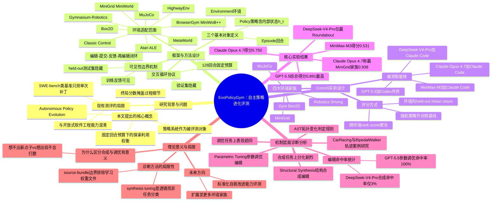

## 一、论文是干什么的？

想象一下,你请一个实习生帮你反复改进一份"游戏攻略脚本"——脚本控制一辆赛车怎么过弯、一个机器人怎么走路。每次实习生改完脚本,你会让他跑几局游戏看效果,并把结果反馈给他，然后他再继续改。这个过程重复很多次，最终你要看他交出的"最终版脚本"在你没给他看过的新关卡上表现如何。这篇论文要问的问题就是：现在的AI编程智能体（比如接入了GPT、Claude等大模型的编程助手），在扮演这个"实习生"角色时，到底做得怎么样？

现在的AI智能体已经能自己写代码、跑测试、看报错、改代码，这种"自我改进"的能力被认为是很重要的下一代AI能力。但作者发现，以往的测评方式有问题：要么只看一个最终得分，把整个改进过程压缩成一个数字，看不出智能体是怎么一步步进步的；要么把这种"策略改进"能力和"开放式软件工程"能力混在一起测，分不清智能体到底是擅长写代码还是擅长在有限信息下摸索出好策略。因此，作者提出了一个新概念——「自主策略进化」（Autonomous Policy Evolution），并造了一个配套的测评工具箱，叫作 **EvoPolicyGym**，专门用来精确测量这种能力。

## 二、核心方法与创新

EvoPolicyGym 的核心设计可以类比成一场"闭卷改进考试"：

**1. 明确的三个基本对象。** 论文先把整个任务拆成三个零件：「环境」（比如一个赛车游戏或机械臂抓取任务，遵循标准的 reset/step 接口）、「策略」（智能体写的一段可执行代码，输入是观测、输出是动作，可以带记忆状态）、以及「回合」（一次完整的游戏过程）。这样定义之后，任何符合接口的任务都可以被塞进这个框架里评测，不局限于某一种游戏。

**2. 固定预算下的"边做边改"循环。** 智能体拿到一个策略工作区，每次修改后提交去跑一批"训练局"（visible train episodes），系统会把这些训练局的结果和轨迹反馈给它，智能体再据此修改代码。这个过程在一个固定的"回合预算"内进行（论文里用的是128回合）——预算用完就停，就像考试有时间限制，逼着智能体去权衡"多探索新方法"还是"死磕现有方案"。

**3. 训练可见、验证和最终测试完全隐藏（Visibility Boundary）。** 这是防止智能体"作弊"的关键机制：智能体能看到的只是训练局的反馈；而验证集（用来挑选"最佳版本"）和最终留出的测试集（用来打分）对智能体完全不可见，由服务器在后台悄悄跑。这就像老师不会把期末考题提前透露给学生，防止学生"死记硬背训练题的答案"而不是真正学会通用的解题方法。

**4. 覆盖多种环境家族，具备可扩展性。** 框架层面适配了 Classic Control、Toy Text、Box2D、MuJoCo、Atari/ALE、MiniGrid、MiniWorld、HighwayEnv、Gymnasium-Robotics、MO-Gymnasium、BrowserGym、MiniWoB++、MetaWorld 等十多种强化学习环境生态；但本篇论文实际做完整实验验证的是其中挑选出的16个环境组成的子集，称为 **Core16**，涵盖 Gym/Box2D（如 Acrobot、BipedalWalker、CarRacing 等）、MuJoCo（如 HalfCheetah、Ant、Pusher、Reacher 等）、MiniGrid（迷宫类导航任务）、以及机器人/驾驶任务（如 FetchPush、FetchPickAndPlace、Parking、Roundabout 等）四大类。

**5. 轨迹级别的"结构合成 vs 参数调优"诊断。** 这是本文一个很巧妙的分析创新：作者把智能体每次"提交并刷新最佳成绩"的代码修改，分成两类——「结构合成」（synthesis edit，代码的抽象语法树结构发生了根本性变化，相当于换了一套新的解题思路）和「参数调优」（parametric edit，只是调整了已有结构里的数值参数，比如把某个阈值从0.5改成0.7）。通过统计不同智能体在这两类修改上的"命中率"（即这次修改是否真的刷新了最佳成绩），作者能诊断出一个智能体到底是"想不出好点子"还是"想出了好点子但不会精细打磨"。

**6. 一套综合排名评分（rank score）。** 由于不同环境的原始得分（比如赛车游戏的分数和机械臂抓取的分数）量纲完全不可比，作者设计了一套基于排名的聚合评分方法，把16个环境上的表现汇总成一个可比较的总分，用来生成排行榜。

## 三、使用了哪些模型和计算资源？

论文评测了四组"模型+编程外壳（harness）"组合作为被测智能体：

| 被测模型 | 使用的编程外壳（Harness） |
|---|---|
| GPT-5.5 | Codex |
| Claude Opus 4.7 | Claude Code |
| MiniMax-M3 | Claude Code |
| DeepSeek-V4-Pro | Claude Code |

论文特别说明：模型和它所使用的编程外壳被绑定一起作为"评测对象的一部分"，因为不同外壳的上下文管理、工具调用方式会实质性影响结果，所以并未做跨外壳的归一化处理。

关于具体的计算资源（GPU型号、云服务商、单次实验或全部实验的总耗时等），论文全文（包括正文与附录）**没有提及任何GPU型号或本地算力配置**——因为整个实验都是通过调用上述大模型的API（配合Codex/Claude Code这类编程智能体外壳）来完成的，属于"调用云端模型API"的评测范式，而非自己训练模型。论文附录 C.2 报告了每个任务、每个智能体消耗的输入/输出/缓存 token 数量（用于成本核算），但没有给出以小时/天为单位的具体耗时或美元成本数字。因此，训练/推理具体耗时、GPU型号等信息：**暂无相关信息**。

## 四、实验结果

在 Core16 这16个环境、每个智能体获得128回合训练预算的统一条件下，主要结果如下（数值为论文中定义的 Core16 综合排名得分，1为满分）：

| 模型（+外壳） | Core16 综合得分 | 表现摘要 |
|---|---|---|
| GPT-5.5（Codex） | 0.891 | 9项环境第一，全部16个环境均进入前二名 |
| Claude Opus 4.7（Claude Code） | 0.750 | 5项第一，12项进入前二名；在 MiniGrid 迷宫类任务家族上单项得分最高（0.938） |
| MiniMax-M3（Claude Code） | 0.531 | 赢下 HalfCheetah 一项，在 Parking、FetchPickAndPlace 上进前二 |
| DeepSeek-V4-Pro（Claude Code） | 0.359 | 仅赢下 Roundabout 一项，全场只有一次进入前二名 |
| 随机策略（对照基线） | 0.109 | 主要靠 MiniGrid 上多方零分平局分摊排名分 |

几个值得注意的细节发现：

- **在"结构合成"型任务上智能体分化最剧烈。** 在需要智能体想出全新解决思路的任务（比如给赛车规划一套全新的视觉+控制策略）上，GPT-5.5 和 Claude Opus 4.7 几乎逼近场上最好水平（归一化得分0.98和1.00），而 MiniMax-M3 和 DeepSeek-V4-Pro 的表现接近"随机乱动"的基线水平（0.19和0.03），且三个"锁门迷宫"类 MiniGrid 任务一个都没解出来。
- **在"参数调优"型任务上大家水平比较接近**（归一化得分0.67～0.99区间），说明"微调已有想法"这件事对目前主流大模型来说门槛相对较低，真正拉开差距的是"能不能想出新点子"。
- **代码修改的"命中率"统计**（即一次代码修改是否真的刷新了最佳成绩）显示：GPT-5.5 在结构性修改上命中率41%，在参数调优修改上命中率高达100%；而 DeepSeek-V4-Pro 在结构性修改上的命中率只有3%，说明它经常做无效的大改动。
- 作者还专门放了一个"随机策略"（完全瞎动）作为对照基线，所有被测智能体在绝大多数任务上都显著优于随机策略，说明它们确实学到了有效行为，但彼此之间的差距同样很显著。

## 五、潜在应用与已落地应用

**潜在应用方向：**
- 作为评测新一代"自主编程智能体"（如未来版本的 Claude Code、Codex、Cursor 等）持续自我改进能力的标准化考场，帮助模型开发方在发布新模型前量化对比"自我迭代能力"这一维度。
- 为研究"智能体在预算受限下如何分配探索与利用"（exploration vs exploitation）提供了一个干净、可控、可复现的实验平台，可用于研究强化学习、自动化科学发现、自动调参等场景中智能体的元学习行为。
- 该框架被设计成可扩展的，除了已验证的16个任务，还预留了对 Atari、MiniWorld、BrowserGym、MiniWoB++、MetaWorld 等更多环境家族的适配接口，未来可以扩展出更大规模的评测集。

**已落地应用：** 目前该工作本身以论文和开源代码/数据集的形式发布，作者提供了 [GitHub 代码仓库](https://github.com/Linzwcs/EvoPolicyGym)、[HuggingFace 实验数据集](https://huggingface.co/datasets/linzw/EvoPolicyGym-Exp-data) 和 [项目主页](https://linzwcs.github.io/EvoPolicyGym/)，尚未发现被第三方产品或其他论文引用集成的落地案例（论文刚于2026年7月2日提交，属于非常新的工作）。

## 六、网络上的讨论与评价

经过检索，暂无相关讨论。目前没有找到该论文在 Twitter/X、Reddit 或技术博客上的公开讨论内容，仅确认其在 HuggingFace Papers 页面获得了43个赞（本周热度榜单收录）。

## 七、思维导图

