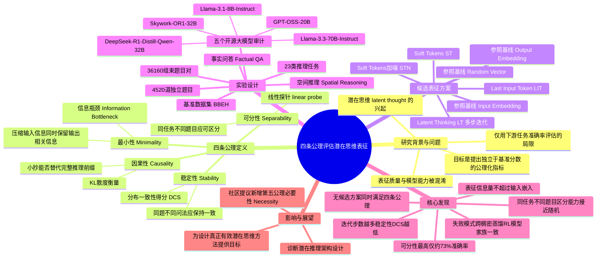

## 一、论文是干什么的？

现在很多大语言模型在回答难题之前会先"思考"一番，比如生成一长串思维链文字，或者在内部悄悄跑几轮隐藏的向量运算（这被称为"潜在思维"，latent thought）。后一种做法的卖点是：不需要把思考过程写成人类能读的文字，模型可以直接在向量空间里"想"，速度更快，理论上还能表达文字说不清楚的东西。

但这里有一个问题：模型内部那些看不见摸不着的向量，到底是不是在"思考"，还是只是把输入信息原样传递了一遍，看起来复杂实则什么有效计算都没做？以前大家判断"潜在思维好不好"的标准很单一——只看最终任务做对了没有（比如答题准确率）。这篇论文认为这种评价方式很片面，就像只看一个学生的考试分数，却不管他是真的理解了知识，还是蒙对的、抄的、或者压根没用大脑。于是作者们提出了一套独立于下游任务准确率的"体检指标"，专门检查这些潜在思维向量本身有没有一些"看起来像是真的在思考"该具备的基本属性。

## 二、核心方法与创新

论文的核心创新是提出了四条公理（axiom），也就是四个衡量"这段潜在思维表征是不是靠谱"的基本标准。可以把潜在思维表征想象成一个人在心里打的一份"思考小抄"——它应该满足下面四个条件，才能算是真正有用的思考过程，而不是摆设：

1. **因果性（Causality）**：这份小抄必须真的能帮你把题做对，而不是可有可无。具体做法是比较"看着小抄回答"和"看着完整的文字推理过程回答"这两种情况下，模型预测答案的概率分布差多少（用 KL 散度衡量，公式为 $D_{KL}(P(y_{suf}|y_{pre}) \| P(y_{suf}|T))$）。差距越小，说明这份小抄越能替代完整推理，因果性越强。

2. **最小性（Minimality）**：小抄应该言简意赅，只记录对得出答案真正有用的信息，而不是把题目原文抄一遍凑数。这里借用了信息论中的"信息瓶颈"思想（Information Bottleneck），目标是让小抄 $T$ 尽量少携带输入 $X$ 的冗余信息，但尽量多携带对答案 $Y$ 有用的信息，公式为 $\min_T I(X;T) - \beta \cdot I(T;Y)$。

3. **可分性（Separability）**：两道不同的题，即使属于同一类型（比如都是"空间推理"题），也应该在小抄上留下不同的痕迹——因为题目不同，正确的思考过程理应不同。论文用一个能力有限的线性探针（probe）去检验：给它两份小抄，它能不能分辨出这是不是同一道题、同一类型的题。

4. **稳定性（Stability）**：同一道题换一种问法（换几个词、换种表达方式），小抄的内容不应该发生大幅度的随机跳变，否则说明这个"思考"不稳定、不可靠。论文为此设计了一个叫作**分布一致性得分**（Distributional Consistency Score，简称 DCS）的指标，取值在 0.5（完全随机、和瞎猜没区别）到 1.0（完全一致、非常稳定）之间。

论文的巧妙之处在于，它不仅测了各种花哨的"潜在思维"实现方式（比如让模型在向量空间里反复迭代思考多轮、或者加入噪声扰动的"软标记"），还引入了几个非常朴素的参照组做对比，其中最关键的一个叫作**输入嵌入**（Input Embedding，即什么额外思考都不做，直接把输入的向量表示当作"思考结果"）。如果那些复杂的潜在思维方法还不如"什么都不做"的参照组，那就说明这些方法其实并没有产生真正有意义的思考。

## 三、使用了哪些模型和计算资源？

**基座模型（用于生成/评测潜在思维表征）：**
- Llama-3.1-8B-Instruct
- Llama-3.3-70B-Instruct
- DeepSeek-R1-Distill-Qwen-32B
- Skywork-OR1-32B
- GPT-OSS-20B（稀疏混合专家模型，MoE）

**辅助模型：**
- LLaMA-3.2-1B（用作冻结参数的探针骨干网络）
- nvidia/llama-embed-nemotron-8b（用于计算语义相似度的嵌入模型）

**计算资源：**
- 主要使用 NVIDIA H100 SXM 80GB GPU（承担全部数据生成和判别器训练工作），另有部分探针训练任务使用 NVIDIA A100 40GB GPU。
- 论文报告的总计算量约为 **3,700 个 H100 等效 GPU 小时**（覆盖全部五个模型的实验）。
- 软件环境：Python 3.12，CUDA 12.6。
- 代码已开源：[github.com/fard-lab/formalize-thoughts](https://github.com/fard-lab/formalize-thoughts)（MIT 协议），项目主页 [fard-lab.github.io/formalize-thoughts](https://fard-lab.github.io/formalize-thoughts)。

关于单次实验或单次训练具体耗时多久（比如几小时/几天跑完一个模型），论文原文未给出更细粒度的拆分数据，此处如实注明：暂无相关信息。

## 四、实验结果

论文在一个名为 **BBEH** 的推理基准上做了系统评测，涵盖 23 类推理任务，包括布尔表达式、Dyck 语言、多步算术、物体计数、时间算术、空间推理、几何形状、单词排序、消歧问答、时序推理、因果理解、洗牌物体、斑马谜题、棋盘游戏问答、电影推荐等等，总计 4,520 道独特题目，每题用 8 个候选束（beam）生成，共 36,160 组"束-题目"数据对。

| 公理 | 主要发现 |
|---|---|
| 因果性 | 各种潜在思维候选方案都比"随机向量"参照组强，但没有一个能稳定超过"输入嵌入"这个最朴素的参照组 |
| 最小性 | 没有任何候选方案能稳定地比原始输入提示（Input Embedding）压缩出更多"对答案真正有用"的信息 |
| 可分性 | 区分"不同类型任务"很容易（接近满分），但区分"同类型下的不同题目"却几乎和瞎猜差不多，表现最好的是"输出嵌入"参照组，准确率也只有约 **73%**；论文分析确认这是真实的几何塌缩（同类任务内的有效维度太少），而不是探针能力不够导致的假象 |
| 稳定性 | "输出嵌入"参照组的 DCS 得分最高；反而是那种反复迭代多轮的"潜在思考"方法，迭代步数越多，DCS 越低，表现最差；GPT-OSS-20B 是个例外，被归因于其特殊的生成机制 |

**总体结论（论文原话核心意思）**：把结果在所有大模型上取平均后，没有任何一种潜在思维表征方法在四条公理的任意一条上稳定超过"输入嵌入"这个最简单的参照基线。而且这个"不及格"的模式在稠密模型、推理蒸馏模型、强化学习训练模型这三类不同训练方式的模型家族中都一致出现，说明这不是某个模型太小或训练方法不对造成的偶然问题，而是一个结构性的普遍缺陷。

通俗地讲：目前流行的各种让大模型"在心里偷偷想"的方法，经过这套体检后发现，它们的"思考"很可能并没有比"什么都不想、直接把题目本身的信息传下去"强多少。

## 五、潜在应用与已落地应用

**潜在应用方向：**
- 作为一套通用的诊断工具，帮助研究者在设计新的潜在推理（latent reasoning）模型架构时，提前判断这种设计是否真的在产生有效思考，而不必等到跑完昂贵的下游任务评测才发现问题。
- 为未来设计"真正满足四条公理"的潜在思维表征方法提供明确的优化目标和评价标准。
- 可用于审计和比较不同厂商、不同训练方式（稠密、蒸馏、强化学习）的大模型在"内部推理质量"上的差异，而不仅仅是看最终跑分。

**已落地应用：** 论文发布不久，暂无相关信息表明已有产品或工业界系统直接采用这套评价框架；从 HuggingFace 评论区看，已有社区成员在讨论基于该框架扩展新的公理（见下节），说明学术圈已经开始关注和跟进这一评价体系，但尚未看到落地应用的报道。

## 六、网络上的讨论与评价

在论文的 HuggingFace 讨论区中，用户 "urroxyz" 提出了一个补充性的第五条公理设想，暂称为"必要性"（Necessity），涉及潜在向量的消融必要性、反事实潜在干预、多窗口因果性等概念，发布于 2026 年 6 月 29 日；论文作者之一 "FahdSeddik" 对此评论给予了点赞回应。讨论区中还有一条关于 HuggingFace 评论区不支持 LaTeX 公式渲染的调侃留言，以及一条自动生成的"Librarian Bot"推荐相关论文的常规评论。

除此之外，在 Reddit、Twitter/X 等平台以及独立技术博客上，暂无相关讨论，未搜索到进一步的社区评价或转载分析。

## 七、思维导图

