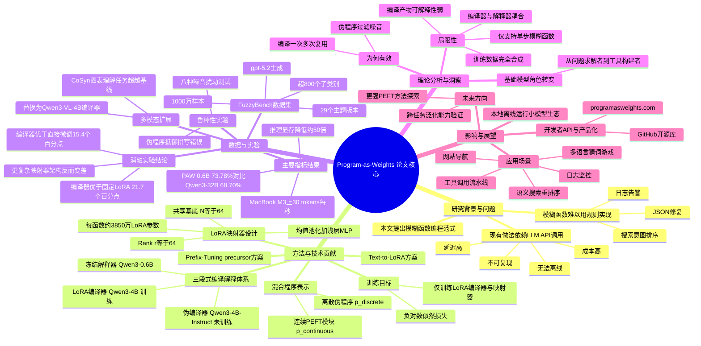

## 一、论文是干什么的？

想象你在写代码时经常遇到这样的需求：判断一条日志是不是需要马上处理、修复格式不规范的 JSON、按用户意图给搜索结果排序。这些任务没法用一条条死板的规则写清楚，因为现实世界的输入总是充满例外和噪音。现在很多程序员的做法是，每次遇到这种模糊的判断，就打一个 API 调用，让 ChatGPT 之类的大模型帮忙处理一下。这种做法方便，但代价不小：慢、贵、离不开网络，而且服务商随时可能悄悄升级模型导致程序行为改变，程序也没法做到完全自包含。

这篇论文提出了一种全新的思路，叫做「模糊函数编程」。简单来说，就是把这种模糊判断任务像写普通程序一样「编译」一次，编译的产物不是传统意义上的源代码，而是一小块神经网络的参数（也就是论文标题里说的「程序即权重」，Program-as-Weights，简称 PAW）。编译只需要做一次，之后这个小小的参数文件就可以像调用一个普通函数一样，在用户的电脑或手机上离线运行，不再需要联网、不再需要调用昂贵的大模型接口。这就好比给一个爱因斯坦一样博学的老师，一次性把某个具体技能（比如「判断邮件是否紧急」）浓缩教给一个小学生，之后这个小学生自己就能又快又便宜地处理同类问题，不需要每次都去请教爱因斯坦。

## 二、核心方法与创新

PAW 的核心是一套「编译器-解释器」体系，类似于我们熟悉的编程语言工具链，只不过这里的编译器和解释器都是神经网络。

**第一步，伪编译器（Pseudo Compiler）。** 开发者用一句自然语言描述想要的功能，比如「判断这封邮件是否需要立即处理」。系统先用一个现成的、不需要额外训练的 4B 参数 Qwen3 模型，把这句话改写成一段更规范的「伪程序」：包含清晰的任务复述，加上几个示例输入输出。这一步的作用类似于给模糊、可能有错别字的需求先「消消毒」，生成一份干净的说明书。

**第二步，LoRA 编译器（LoRA Compiler）。** 这是真正需要训练的部分，它同样基于一个 4B 参数的 Qwen3 模型。它读入用户的原始描述和上一步生成的伪程序，通过一次前向传播提取出隐藏状态，再交给一个叫「LoRA 映射器」的小模块，把这些隐藏状态转换成一组 LoRA（低秩适配器）参数。LoRA 是一种参数高效微调技术，可以理解成给一个大模型「打个小补丁」，不需要改动整个模型就能让它学会新技能。论文里 LoRA 映射器采用了「共享基底」设计：预先准备 64 组可学习的基础矩阵，编译器只需要学习如何用不同权重去组合这些基底，就能为每一个新的模糊函数生成专属的 LoRA 补丁，每个函数大约包含 3850 万参数。

**第三步，解释器（Interpreter）。** 这是一个体积很小、完全冻结（不训练）的语言模型，默认用的是 Qwen3 0.6B。运行时，系统把上一步生成的 LoRA 补丁「挂载」到这个小模型上，再把伪程序和用户的实际输入一起喂给它，让它自回归地生成结果。因为解释器本身不用改动，一台设备上安装一次解释器后，可以同时运行成千上万个不同的 PAW「小程序」，只要不断切换挂载的 LoRA 补丁即可。

这套设计还有一个巧妙之处：程序 P 其实是「离散 + 连续」的混合体——离散部分是那段自然语言伪程序，负责屏蔽掉原始描述里的错别字和歧义；连续部分是 LoRA 权重，负责提供文字难以说清楚的精细行为控制。论文的鲁棒性实验证实，这个离散的伪程序环节正是模型能扛住噪音（错别字、语法错误等）的关键：如果去掉伪程序、直接把原始描述喂给小模型，在「重度错别字」的测试里效果会明显下降 4.5 个百分点。

论文还比较了另一种更早期的实现方式——前缀微调（Prefix-Tuning），即把编译器生成的隐藏状态转换成一段附加在注意力机制里的「键值对前缀」。实验发现 LoRA 方案效果更好（65.7% vs 50.4% 的准确率），因此论文把 LoRA 作为主推方案，前缀微调只作为早期探索保留。

一个重要的支撑是数据集 **FuzzyBench**，这是论文随文发布的一个1000万条样本的数据集，由 gpt-5.2 生成，覆盖超过800个细分任务类别（分类、格式转换、解析、模糊匹配、自然语言指令、智能体工具调用等），用于训练 LoRA 编译器学会「如何把任意自然语言描述编译成有效的神经网络补丁」这件事本身，而不是针对某个具体任务微调。

## 三、使用了哪些模型和计算资源？

- **基座/组件模型：** 伪编译器和 LoRA 编译器都基于 `Qwen3-4B-Instruct-2507`；默认解释器是 `Qwen3-0.6B`，另外还实验了 `Qwen3.5-0.8B` 和 `GPT-2 124M` 作为解释器；多模态扩展中把编译器换成了 `Qwen3-VL-4B`。
- **训练数据生成模型：** 使用 `gpt-5.2` 生成 FuzzyBench 的1000万条训练样本，并用 `gpt-5-mini` 与 `gpt-5.2` 互相验证筛选出「可信」的测试集。
- **GPU / 硬件：** 论文附录 G 明确写到，训练早期阶段使用单张 B300 GPU，后期阶段使用 8×H200 GPU；其中 Qwen3-0.6B 版本的完整训练（3 个 epoch，覆盖1000万样本）在 3 张 GPU 上耗时约 72 小时。
- **本地推理硬件：** 论文测试了在 MacBook M3（配合 Metal 加速）上的推理表现，量化后的模型（Q5_K_M 基座 + Q4_0 LoRA 适配器）运行速度约为每秒 31.6 个 token，冷启动加载时间约 0.48 秒。
- **计算资源提供方：** 论文致谢中提到计算资源由 Compute Ontario 和 Digital Research Alliance of Canada 提供，另外还使用了 OpenAI 的 Research Access Program 提供的 API 额度。
- 关于 FuzzyBench 数据生成本身用了多少 GPU/API 调用时长，论文没有具体给出，暂无相关信息。

## 四、实验结果

论文的核心对比是：在 FuzzyBench 测试集（精确匹配准确率）以及四个公开分类数据集（YouTube 垃圾评论识别、SMS 垃圾短信识别、Yelp 情感分类、IMDB 情感分类）上，比较 PAW 与直接调用各种大小模型的效果。

| 方法 | 解释器/模型规模 | FuzzyBench 准确率 | 推理显存占用（约） |
|---|---|---|---|
| 直接提示 Qwen3-32B | 32B | 68.70% | 约 60 GB |
| 直接提示 Qwen3-0.6B | 0.6B | 9.84% | 很小 |
| PAW（Qwen3 0.6B 解释器） | 0.6B | 73.78% | 约 1.2 GB |
| gpt-5.2（API 上限） | — | 96.09% | — |
| gpt-5-mini（API 上限） | — | 91.87% | — |

可以看出：一个只有 0.6B 参数、挂载了 23MB 大小 LoRA 补丁的小模型，效果反而超过了直接调用 32B 大模型（提升约 5 个百分点），而所需推理显存只有后者的约五十分之一。在其他四个数据集上（YouTube、SMS、Yelp、IMDB），PAW 的表现也普遍优于或接近直接使用大模型。

论文还做了严格的对照实验来证明「编译器」这个环节确实有价值，而不只是普通微调的功劳：在相同数据、相同 0.6B 基座、相同训练预算下，PAW 比对基座做完整微调（Full Fine-tuning）高出 15.4 个百分点，比固定不变的 LoRA（不经过编译器生成）高出 21.7 个百分点。

鲁棒性方面，即使把任务描述加入严重的错别字、语法错误、表达含糊等各种噪音，PAW 的准确率最多也只下降约 3.7 个百分点（「综合噪音」情形），显示出较强的抗干扰能力。

多模态扩展实验里，只替换编译器为视觉语言模型（Qwen3-VL-4B），保持同一个纯文本小型解释器不变，PAW 在电路图、化学结构图、乐谱识别等图表理解任务上也超过了参数量相近甚至更大的视觉语言模型基线。

量化方面，把 0.6B 解释器压缩成 4-6 位的 GGUF 格式（配合 llama.cpp 推理框架）后，准确率几乎没有损失（不到1.3个百分点），整体磁盘占用可以压缩到约 430MB～620MB。

## 五、潜在应用与已落地应用

论文本身给出了五个具体案例：

1. **事件驱动日志监控**：替代 Cursor 编辑器里那种笨拙的关键词等待方式，用本地小模型只在真正重要的日志行触发提醒。
2. **意图驱动的网站导航**：为网站提供自然语言的快速检索功能，不需要每次请求都调用大模型 API。
3. **语义搜索重排序**：在已有的关键词搜索索引基础上加入语义理解能力，无需把大模型放进请求链路。
4. **工具调用流水线**：用10个 PAW 小函数组成的流水线，在 ToolCall-15 基准上达到 93% 的准确率，捕捉到通常需要更大模型才能完成的工具路由行为。
5. **多语言猜词游戏（Alien Taboo）**：每一轮对话都由一个部署在小型服务器上的 0.6B PAW 解释器处理，大模型只在编译阶段被调用一次，使得这类游戏的运营成本大幅降低。

论文作者已经把项目做成了实际可用的产品，项目主页在 [programasweights.com](https://programasweights.com/)，Python 库开源在 [GitHub](https://github.com/programasweights/programasweights-python)（HuggingFace 页面显示已有约 126 个星标）。他们还提供了几个可以直接体验的 Demo：[Alien Taboo 猜词游戏](https://programasweights.com/alien)、[Avatar Director 用自然语言指挥3D角色动作](https://programasweights.com/avatar)，以及 [Website Helper 网站问答助手](https://yuntiandeng.com/#ask)。此外还支持配合编程智能体（coding agent）使用，作者提供了 [AGENTS.md 指南](https://programasweights.com/AGENTS.md)方便集成到自动化开发流程中。

潜在应用方向还包括：需要频繁做模糊判断但又要求低成本、低延迟、离线运行的场景，比如浏览器插件、移动端 App 里的轻量智能功能、边缘设备上的实时分类任务等。

## 六、网络上的讨论与评价

这篇论文在 HuggingFace 上获得了较高关注度（74 个赞，登上「每日论文」榜首），也被 Hacker News 收录并引发了一些讨论（截至查询时约 52 个点赞、7 条评论）。主要观点包括：

- 有评论者认为这个思路「非常有意思」，触及了符号化程序和连接主义（神经网络）方法之间的桥梁问题，并表示会考虑把类似能力加入自己的浏览器端 AI 工具集。
- 也有评论者提出质疑，担心训练时用的是 29 个大类、800多个子类的固定任务体系，如果编译器对全新、从未见过的任务类型泛化能力不足，那么它实际上可能只是在「预先准备好的几百个 LoRA 补丁里做路由选择」，而不是真正意义上的通用编译。
- 有人从直觉角度评价：这套方法相当于把一部分神经网络的运行过程缓存下来后导出复用，因此天然不太适合处理图像、视频生成这类连续生成型任务。
- 也有比较尖锐的反对声音，认为这种做法比传统符号规则更「让人不安」，因为最终得到的行为无法像传统算法（例如信号处理里的滤波器设计）那样被清晰地量化和理解，属于「黑箱」担忧的一种延伸。
- 还有评论指出一个替代思路：既然目标是「离线、低成本」，为什么不直接让大模型生成传统代码（普通函数），一样能做到离线运行、开销低；对此另一位网友回应说，对于足够复杂的模糊逻辑，生成的传统代码可能会变得像意大利面条一样难以维护，复杂到近似于一堆权重。

论文提交人 Yuntian Deng 本人也在 HuggingFace 评论区互动，介绍了如何在 Python 中调用 PAW，以及如何结合编程智能体使用该工具的方法。整体来看，社区反应偏向正面好奇，同时也伴随着对泛化能力和可解释性的合理担忧。

## 七、思维导图

